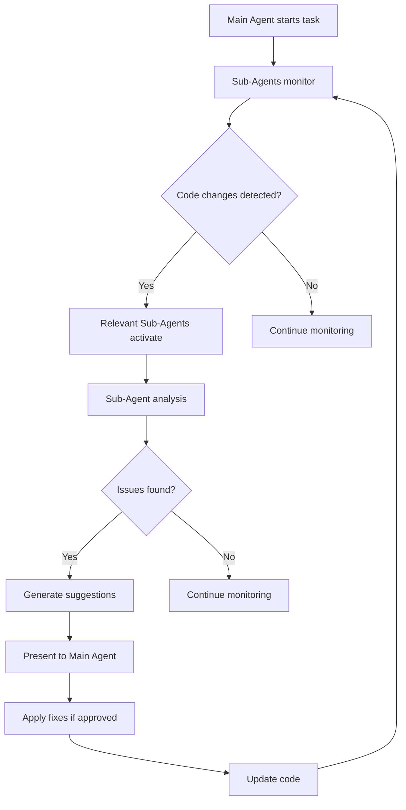

# Sub-Agent System Guide

> **🧠 Intelligent Sub-Agent Orchestration for Enhanced Development Workflow**  
> Hệ thống Sub-Agent thông minh tự động tích hợp vào workflow phát triển

## Overview

Sub-Agent System là một hệ thống AI phụ trợ thông minh được thiết kế để tự động hỗ trợ các Main Agent trong quá trình phát triển. Mỗi Sub-Agent có chuyên môn riêng và hoạt động song song với Main Agent để đảm bảo chất lượng code, hiệu suất và bảo mật.

## 🧠 Available Sub-Agents

### 1. Context Optimizer
**Chức năng**: Tối ưu hóa ngữ cảnh và hiệu suất code  
**Tự động kích hoạt**: Khi phát hiện code có thể tối ưu hóa  
**Capabilities**:
- Phân tích và tối ưu hóa performance bottlenecks
- Đề xuất cải thiện architecture
- Tối ưu hóa memory usage và resource allocation
- Code refactoring suggestions

### 2. Bug Hunter
**Chức năng**: Phát hiện và sửa lỗi tự động  
**Tự động kích hoạt**: Khi có lỗi compile, runtime hoặc logic  
**Capabilities**:
- Static code analysis để phát hiện potential bugs
- Runtime error detection và debugging
- Logic error identification
- Automated bug fixing suggestions

### 3. Test Executor
**Chức năng**: Thực thi và quản lý testing workflow  
**Tự động kích hoạt**: Sau mỗi code change hoặc khi được yêu cầu  
**Capabilities**:
- Automated test generation
- Test execution và result analysis
- Coverage analysis và reporting
- Test maintenance và optimization

### 4. Performance Analyzer
**Chức năng**: Phân tích và tối ưu hóa hiệu suất  
**Tự động kích hoạt**: Khi phát hiện performance issues  
**Capabilities**:
- Performance profiling và benchmarking
- Resource usage analysis
- Bottleneck identification
- Performance optimization recommendations

### 5. Security Auditor
**Chức năng**: Kiểm tra bảo mật và compliance  
**Tự động kích hoạ**: Khi có code changes liên quan đến security  
**Capabilities**:
- Security vulnerability scanning
- Compliance checking
- Security best practices enforcement
- Threat modeling và risk assessment

## 🚀 Usage Examples

### Example 1: Automatic Bug Detection and Fix

```typescript
// Main Agent tạo code
function calculateTotal(items: Item[]): number {
  let total = 0;
  for (let i = 0; i <= items.length; i++) { // Bug: off-by-one error
    total += items[i].price;
  }
  return total;
}

// Bug Hunter tự động phát hiện và đề xuất fix
// 🐛 Bug Hunter Alert: Array index out of bounds
// 💡 Suggested Fix:
function calculateTotal(items: Item[]): number {
  let total = 0;
  for (let i = 0; i < items.length; i++) { // Fixed: correct loop condition
    total += items[i].price;
  }
  return total;
}
```

### Example 2: Performance Optimization

```typescript
// Original code
function findUser(users: User[], id: string): User | null {
  for (const user of users) {
    if (user.id === id) {
      return user;
    }
  }
  return null;
}

// Performance Analyzer đề xuất tối ưu
// ⚡ Performance Analyzer: O(n) lookup can be optimized
// 💡 Suggested Optimization:
class UserService {
  private userMap = new Map<string, User>();
  
  constructor(users: User[]) {
    users.forEach(user => this.userMap.set(user.id, user));
  }
  
  findUser(id: string): User | null {
    return this.userMap.get(id) || null; // O(1) lookup
  }
}
```

### Example 3: Automatic Test Generation

```typescript
// Main Agent tạo function
function validateEmail(email: string): boolean {
  const emailRegex = /^[^\s@]+@[^\s@]+\.[^\s@]+$/;
  return emailRegex.test(email);
}

// Test Executor tự động tạo comprehensive tests
// 🧪 Test Executor: Generating tests for validateEmail
describe('validateEmail', () => {
  test('should return true for valid email', () => {
    expect(validateEmail('user@example.com')).toBe(true);
    expect(validateEmail('test.email+tag@domain.co.uk')).toBe(true);
  });
  
  test('should return false for invalid email', () => {
    expect(validateEmail('invalid-email')).toBe(false);
    expect(validateEmail('@domain.com')).toBe(false);
    expect(validateEmail('user@')).toBe(false);
    expect(validateEmail('')).toBe(false);
  });
  
  test('should handle edge cases', () => {
    expect(validateEmail('user@domain')).toBe(false);
    expect(validateEmail('user name@domain.com')).toBe(false);
  });
});
```

### Example 4: Security Audit

```typescript
// Potentially insecure code
app.post('/api/user', (req, res) => {
  const { name, email, password } = req.body;
  const query = `INSERT INTO users (name, email, password) VALUES ('${name}', '${email}', '${password}')`;
  db.query(query); // Security issue: SQL injection
});

// Security Auditor phát hiện và đề xuất fix
// 🔒 Security Auditor Alert: SQL Injection vulnerability detected
// 💡 Secure Implementation:
app.post('/api/user', async (req, res) => {
  const { name, email, password } = req.body;
  
  // Input validation
  const schema = Joi.object({
    name: Joi.string().min(2).max(50).required(),
    email: Joi.string().email().required(),
    password: Joi.string().min(8).required()
  });
  
  const { error } = schema.validate(req.body);
  if (error) {
    return res.status(400).json({ error: error.details[0].message });
  }
  
  // Hash password
  const hashedPassword = await bcrypt.hash(password, 12);
  
  // Parameterized query
  const query = 'INSERT INTO users (name, email, password) VALUES (?, ?, ?)';
  await db.query(query, [name, email, hashedPassword]);
});
```

## 🔄 Integration Workflow

### Automatic Integration Pattern



### Manual Invocation

```typescript
// Explicitly request Sub-Agent assistance
// @bug-hunter: Please analyze this function for potential issues
function processPayment(amount: number, cardNumber: string) {
  // Implementation here
}

// @performance-analyzer: Optimize this query
const users = await db.query('SELECT * FROM users WHERE active = 1');

// @security-auditor: Review this authentication logic
function authenticateUser(token: string) {
  // Implementation here
}

// @test-executor: Generate comprehensive tests
function calculateDiscount(price: number, discountPercent: number) {
  return price * (1 - discountPercent / 100);
}
```

## 🎯 Best Practices

### 1. Sub-Agent Coordination

```typescript
// Good: Let Sub-Agents work together
// Context Optimizer identifies performance issue
// Performance Analyzer provides detailed analysis
// Bug Hunter ensures fix doesn't introduce bugs
// Test Executor validates the optimization

class DataProcessor {
  // Original inefficient method
  processLargeDataset(data: any[]) {
    return data.map(item => {
      // Complex processing
      return this.heavyComputation(item);
    });
  }
  
  // Optimized version after Sub-Agent collaboration
  async processLargeDatasetOptimized(data: any[]) {
    const batchSize = 100; // Performance Analyzer suggestion
    const results = [];
    
    for (let i = 0; i < data.length; i += batchSize) {
      const batch = data.slice(i, i + batchSize);
      const batchResults = await Promise.all(
        batch.map(item => this.heavyComputation(item))
      );
      results.push(...batchResults);
    }
    
    return results;
  }
}
```

### 2. Proactive Monitoring

```typescript
// Sub-Agents continuously monitor for patterns

// Performance Analyzer detects N+1 query pattern
class UserService {
  // Problematic: N+1 queries
  async getUsersWithPosts() {
    const users = await User.findAll();
    for (const user of users) {
      user.posts = await Post.findByUserId(user.id); // N+1 problem
    }
    return users;
  }
  
  // Optimized: Single query with joins
  async getUsersWithPostsOptimized() {
    return await User.findAll({
      include: [{ model: Post }] // Single query with join
    });
  }
}
```

### 3. Contextual Assistance

```typescript
// Sub-Agents provide context-aware suggestions

// Security Auditor recognizes authentication context
class AuthController {
  async login(email: string, password: string) {
    // Security Auditor automatically suggests:
    // 1. Rate limiting
    // 2. Password hashing verification
    // 3. JWT token generation
    // 4. Audit logging
    
    const user = await User.findByEmail(email);
    if (!user || !await bcrypt.compare(password, user.hashedPassword)) {
      // Log failed attempt for security monitoring
      await AuditLog.create({
        action: 'LOGIN_FAILED',
        email,
        ip: req.ip,
        timestamp: new Date()
      });
      throw new UnauthorizedError('Invalid credentials');
    }
    
    const token = jwt.sign({ userId: user.id }, process.env.JWT_SECRET);
    return { token, user: user.toPublicJSON() };
  }
}
```

## 🔧 Configuration

### Sub-Agent Settings

```typescript
// .ai-system/config/sub-agents.config.ts
export const subAgentConfig = {
  contextOptimizer: {
    enabled: true,
    aggressiveness: 'moderate', // conservative | moderate | aggressive
    autoApply: false, // Require approval for changes
    triggers: ['performance_issue', 'code_smell', 'architecture_concern']
  },
  
  bugHunter: {
    enabled: true,
    autoFix: {
      simple: true, // Auto-fix simple issues like typos
      complex: false // Require approval for complex fixes
    },
    scanDepth: 'deep', // surface | moderate | deep
    triggers: ['compile_error', 'runtime_error', 'logic_error']
  },
  
  testExecutor: {
    enabled: true,
    autoGenerate: true,
    coverage: {
      minimum: 80,
      target: 95
    },
    types: ['unit', 'integration', 'e2e']
  },
  
  performanceAnalyzer: {
    enabled: true,
    thresholds: {
      responseTime: 200, // ms
      memoryUsage: 512, // MB
      cpuUsage: 70 // percentage
    },
    monitoring: 'continuous'
  },
  
  securityAuditor: {
    enabled: true,
    strictness: 'high', // low | medium | high
    compliance: ['OWASP', 'GDPR', 'SOC2'],
    autoBlock: true // Block deployment if critical issues found
  }
};
```

## 📊 Monitoring & Analytics

### Sub-Agent Performance Metrics

```typescript
// Sub-Agent effectiveness tracking
interface SubAgentMetrics {
  bugHunter: {
    bugsDetected: number;
    falsePositives: number;
    autoFixSuccess: number;
    timeToDetection: number; // ms
  };
  
  performanceAnalyzer: {
    optimizationsApplied: number;
    performanceGains: number; // percentage
    resourceSavings: number; // MB/CPU
  };
  
  securityAuditor: {
    vulnerabilitiesFound: number;
    criticalIssues: number;
    complianceScore: number; // percentage
  };
  
  testExecutor: {
    testsGenerated: number;
    coverageImprovement: number; // percentage
    testExecutionTime: number; // ms
  };
  
  contextOptimizer: {
    refactoringSuggestions: number;
    codeQualityImprovement: number; // percentage
    architectureOptimizations: number;
  };
}
```

## 🚨 Troubleshooting

### Common Issues

1. **Sub-Agent Conflicts**
   ```typescript
   // When multiple Sub-Agents suggest different solutions
   // Priority order: Security > Performance > Testing > Context > Bug fixes
   ```

2. **Performance Impact**
   ```typescript
   // If Sub-Agents slow down development
   // Adjust aggressiveness levels or disable non-critical agents
   ```

3. **False Positives**
   ```typescript
   // Train Sub-Agents with project-specific patterns
   // Use whitelist for known acceptable patterns
   ```

## 🎓 Advanced Usage

### Custom Sub-Agent Creation

```typescript
// Create project-specific Sub-Agent
class CustomDomainAgent extends BaseSubAgent {
  name = 'domain-expert';
  triggers = ['domain_logic', 'business_rules'];
  
  async analyze(code: string, context: CodeContext): Promise<Suggestion[]> {
    // Custom domain-specific analysis
    return this.generateDomainSpecificSuggestions(code, context);
  }
}
```

### Sub-Agent Chaining

```typescript
// Chain Sub-Agents for complex workflows
const workflow = new SubAgentChain()
  .add(bugHunter)
  .add(securityAuditor)
  .add(performanceAnalyzer)
  .add(testExecutor)
  .add(contextOptimizer);

const result = await workflow.execute(codeChanges);
```

---

**🎯 Next Steps**: Explore individual Sub-Agent documentation for detailed configuration and advanced features.

**📚 Related Documentation**:
- [Agent Coordination System](../workflows/coordination/agent-coordination-system.md)
- [Test Execution Framework](../workflows/development/test-execution-framework.md)
- [Performance Optimization Patterns](../rules/patterns/performance-optimization-patterns.md)
- [Security Patterns Advanced](../rules/patterns/security-patterns-advanced.md)