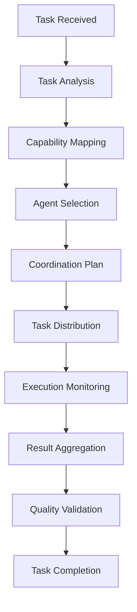

# Agent Coordination System

## 🎯 System Overview

**Purpose**: Orchestrate intelligent coordination between Sub-Agents for optimal task execution  
**Architecture**: Event-driven coordination with real-time communication and shared context  
**Integration**: Seamless coordination across Context Optimizer, Bug Hunter, Test Executor, Performance Analyzer, and Security Auditor

## 🏗️ Coordination Architecture

### Core Components

```typescript
interface CoordinationSystem {
  // Core coordination engine
  coordinator: AgentCoordinator;
  
  // Communication infrastructure
  eventBus: EventBus;
  messageQueue: MessageQueue;
  sharedContext: SharedContext;
  
  // Coordination strategies
  strategies: CoordinationStrategy[];
  
  // Monitoring and analytics
  monitor: CoordinationMonitor;
  analytics: CoordinationAnalytics;
}

interface AgentCoordinator {
  // Agent management
  registerAgent(agent: SubAgent): void;
  unregisterAgent(agentId: string): void;
  
  // Task coordination
  coordinateTask(task: Task): Promise<CoordinationPlan>;
  executeCoordinatedTask(plan: CoordinationPlan): Promise<TaskResult>;
  
  // Real-time coordination
  handleAgentEvent(event: AgentEvent): void;
  broadcastToAgents(message: CoordinationMessage): void;
  
  // Conflict resolution
  resolveConflicts(conflicts: AgentConflict[]): Resolution[];
}
```

### Sub-Agent Integration

```typescript
interface SubAgent {
  id: string;
  type: AgentType;
  capabilities: Capability[];
  status: AgentStatus;
  
  // Coordination interface
  receiveTask(task: AgentTask): Promise<AgentResult>;
  handleCoordinationMessage(message: CoordinationMessage): void;
  reportStatus(status: AgentStatus): void;
  
  // Collaboration methods
  requestAssistance(request: AssistanceRequest): void;
  provideAssistance(response: AssistanceResponse): void;
  shareContext(context: ContextData): void;
}

enum AgentType {
  CONTEXT_OPTIMIZER = 'context_optimizer',
  BUG_HUNTER = 'bug_hunter',
  TEST_EXECUTOR = 'test_executor',
  PERFORMANCE_ANALYZER = 'performance_analyzer',
  SECURITY_AUDITOR = 'security_auditor'
}

enum AgentStatus {
  IDLE = 'idle',
  BUSY = 'busy',
  WAITING = 'waiting',
  ERROR = 'error',
  OFFLINE = 'offline'
}
```

## 🔄 Coordination Workflows

### 1. Task Analysis & Assignment Workflow



**Implementation**:

```typescript
class TaskCoordinationWorkflow {
  async coordinateTask(task: Task): Promise<TaskResult> {
    // 1. Analyze task requirements
    const analysis = await this.analyzeTask(task);
    
    // 2. Map required capabilities
    const capabilities = this.mapCapabilities(analysis);
    
    // 3. Select optimal agents
    const agents = await this.selectAgents(capabilities);
    
    // 4. Create coordination plan
    const plan = this.createCoordinationPlan(task, agents);
    
    // 5. Execute coordinated task
    const result = await this.executeCoordinatedTask(plan);
    
    // 6. Validate and return result
    return this.validateResult(result);
  }
  
  private async analyzeTask(task: Task): Promise<TaskAnalysis> {
    return {
      complexity: this.assessComplexity(task),
      requiredCapabilities: this.identifyCapabilities(task),
      dependencies: this.findDependencies(task),
      priority: this.determinePriority(task),
      estimatedDuration: this.estimateDuration(task)
    };
  }
  
  private async selectAgents(capabilities: Capability[]): Promise<SubAgent[]> {
    const selectedAgents: SubAgent[] = [];
    
    for (const capability of capabilities) {
      const agent = await this.findBestAgent(capability);
      if (agent && !selectedAgents.includes(agent)) {
        selectedAgents.push(agent);
      }
    }
    
    return selectedAgents;
  }
}
```

### 2. Real-time Collaboration Workflow

```typescript
class CollaborationWorkflow {
  async handleCollaboration(initiator: SubAgent, task: AgentTask): Promise<void> {
    // 1. Identify collaboration needs
    const needs = await this.identifyCollaborationNeeds(task);
    
    // 2. Find suitable collaborators
    const collaborators = await this.findCollaborators(needs);
    
    // 3. Establish collaboration session
    const session = await this.createCollaborationSession(initiator, collaborators);
    
    // 4. Coordinate collaborative execution
    await this.coordinateCollaboration(session, task);
    
    // 5. Merge results
    await this.mergeCollaborationResults(session);
  }
  
  private async coordinateCollaboration(
    session: CollaborationSession, 
    task: AgentTask
  ): Promise<void> {
    // Real-time coordination logic
    const coordinator = new RealTimeCoordinator(session);
    
    // Set up event handlers
    coordinator.onAgentProgress((agent, progress) => {
      this.broadcastProgress(session, agent, progress);
    });
    
    coordinator.onConflict((conflict) => {
      this.resolveConflict(session, conflict);
    });
    
    coordinator.onAssistanceRequest((request) => {
      this.handleAssistanceRequest(session, request);
    });
    
    // Execute collaborative task
    await coordinator.execute(task);
  }
}
```

### 3. Conflict Resolution Workflow

```typescript
class ConflictResolutionWorkflow {
  async resolveConflict(conflict: AgentConflict): Promise<Resolution> {
    // 1. Analyze conflict type
    const conflictType = this.analyzeConflictType(conflict);
    
    // 2. Apply resolution strategy
    const strategy = this.selectResolutionStrategy(conflictType);
    
    // 3. Execute resolution
    const resolution = await strategy.resolve(conflict);
    
    // 4. Validate resolution
    await this.validateResolution(resolution);
    
    // 5. Apply resolution
    await this.applyResolution(resolution);
    
    return resolution;
  }
  
  private selectResolutionStrategy(type: ConflictType): ResolutionStrategy {
    switch (type) {
      case ConflictType.RESOURCE_CONTENTION:
        return new ResourceArbitrationStrategy();
      case ConflictType.CONFLICTING_RECOMMENDATIONS:
        return new ConsensusStrategy();
      case ConflictType.PRIORITY_CONFLICT:
        return new PriorityBasedStrategy();
      case ConflictType.CAPABILITY_OVERLAP:
        return new CapabilityOptimizationStrategy();
      default:
        return new DefaultResolutionStrategy();
    }
  }
}
```

## 🎛️ Coordination Strategies

### 1. Sequential Coordination

```typescript
class SequentialCoordinationStrategy implements CoordinationStrategy {
  async execute(plan: CoordinationPlan): Promise<TaskResult> {
    const results: AgentResult[] = [];
    
    for (const step of plan.steps) {
      // Execute step with assigned agent
      const agent = this.getAgent(step.agentId);
      const result = await agent.executeTask(step.task);
      
      // Validate step result
      await this.validateStepResult(result);
      
      // Pass context to next step
      if (step.nextStep) {
        step.nextStep.context = this.mergeContext(
          step.nextStep.context, 
          result.context
        );
      }
      
      results.push(result);
    }
    
    return this.aggregateResults(results);
  }
}
```

### 2. Parallel Coordination

```typescript
class ParallelCoordinationStrategy implements CoordinationStrategy {
  async execute(plan: CoordinationPlan): Promise<TaskResult> {
    // Group independent tasks
    const taskGroups = this.groupIndependentTasks(plan.steps);
    const allResults: AgentResult[] = [];
    
    for (const group of taskGroups) {
      // Execute group tasks in parallel
      const groupPromises = group.map(step => {
        const agent = this.getAgent(step.agentId);
        return agent.executeTask(step.task);
      });
      
      const groupResults = await Promise.all(groupPromises);
      
      // Validate group results
      await this.validateGroupResults(groupResults);
      
      allResults.push(...groupResults);
    }
    
    return this.aggregateResults(allResults);
  }
}
```

### 3. Pipeline Coordination

```typescript
class PipelineCoordinationStrategy implements CoordinationStrategy {
  async execute(plan: CoordinationPlan): Promise<TaskResult> {
    const pipeline = this.createPipeline(plan.steps);
    
    // Set up pipeline stages
    for (const stage of pipeline.stages) {
      stage.onOutput((output) => {
        const nextStage = pipeline.getNextStage(stage);
        if (nextStage) {
          nextStage.processInput(output);
        }
      });
    }
    
    // Start pipeline execution
    const firstStage = pipeline.getFirstStage();
    firstStage.processInput(plan.initialInput);
    
    // Wait for pipeline completion
    return await pipeline.waitForCompletion();
  }
}
```

## 📊 Coordination Monitoring

### Real-time Monitoring

```typescript
class CoordinationMonitor {
  private metrics: CoordinationMetrics;
  private alerts: AlertManager;
  
  async monitorCoordination(session: CoordinationSession): Promise<void> {
    // Set up real-time monitoring
    const monitor = new RealTimeMonitor(session);
    
    // Track key metrics
    monitor.trackMetric('agent_utilization', () => {
      return this.calculateAgentUtilization(session);
    });
    
    monitor.trackMetric('coordination_efficiency', () => {
      return this.calculateCoordinationEfficiency(session);
    });
    
    monitor.trackMetric('conflict_rate', () => {
      return this.calculateConflictRate(session);
    });
    
    // Set up alerts
    monitor.onThresholdExceeded('high_conflict_rate', (metric) => {
      this.alerts.triggerAlert(new HighConflictRateAlert(metric));
    });
    
    monitor.onThresholdExceeded('low_efficiency', (metric) => {
      this.alerts.triggerAlert(new LowEfficiencyAlert(metric));
    });
  }
  
  private calculateCoordinationEfficiency(session: CoordinationSession): number {
    const totalTime = session.endTime - session.startTime;
    const activeTime = session.agents.reduce((sum, agent) => {
      return sum + agent.activeTime;
    }, 0);
    
    return activeTime / (totalTime * session.agents.length);
  }
}
```

### Performance Analytics

```typescript
class CoordinationAnalytics {
  async analyzeCoordinationPerformance(
    sessions: CoordinationSession[]
  ): Promise<PerformanceReport> {
    return {
      averageEfficiency: this.calculateAverageEfficiency(sessions),
      conflictPatterns: this.analyzeConflictPatterns(sessions),
      agentPerformance: this.analyzeAgentPerformance(sessions),
      optimizationRecommendations: this.generateOptimizationRecommendations(sessions)
    };
  }
  
  private analyzeConflictPatterns(sessions: CoordinationSession[]): ConflictPattern[] {
    const conflicts = sessions.flatMap(s => s.conflicts);
    
    // Group conflicts by type and context
    const patterns = this.groupConflictsByPattern(conflicts);
    
    // Analyze frequency and impact
    return patterns.map(pattern => ({
      type: pattern.type,
      frequency: pattern.conflicts.length,
      averageResolutionTime: this.calculateAverageResolutionTime(pattern.conflicts),
      impactScore: this.calculateImpactScore(pattern.conflicts),
      recommendedPrevention: this.recommendPrevention(pattern)
    }));
  }
}
```

## 🔧 Configuration & Setup

### Coordination Configuration

```yaml
# coordination-config.yaml
coordination:
  strategies:
    default: "pipeline"
    fallback: "sequential"
    
  agents:
    max_concurrent: 5
    timeout: 300000  # 5 minutes
    retry_attempts: 3
    
  conflict_resolution:
    timeout: 30000   # 30 seconds
    escalation_threshold: 3
    
  monitoring:
    enabled: true
    metrics_interval: 5000  # 5 seconds
    alert_thresholds:
      high_conflict_rate: 0.3
      low_efficiency: 0.6
      
  communication:
    event_bus:
      type: "redis"
      connection: "redis://localhost:6379"
    message_queue:
      type: "rabbitmq"
      connection: "amqp://localhost:5672"
```

### Agent Registration

```typescript
// Register Sub-Agents with coordination system
const coordinator = new AgentCoordinator();

// Register Context Optimizer
coordinator.registerAgent(new ContextOptimizer({
  id: 'context_optimizer_1',
  capabilities: [
    Capability.CONTEXT_ANALYSIS,
    Capability.CONTEXT_OPTIMIZATION,
    Capability.CONTEXT_SHARING
  ]
}));

// Register Bug Hunter
coordinator.registerAgent(new BugHunter({
  id: 'bug_hunter_1',
  capabilities: [
    Capability.BUG_DETECTION,
    Capability.CODE_ANALYSIS,
    Capability.ISSUE_REPORTING
  ]
}));

// Register Test Executor
coordinator.registerAgent(new TestExecutor({
  id: 'test_executor_1',
  capabilities: [
    Capability.TEST_EXECUTION,
    Capability.TEST_GENERATION,
    Capability.COVERAGE_ANALYSIS
  ]
}));

// Register Performance Analyzer
coordinator.registerAgent(new PerformanceAnalyzer({
  id: 'performance_analyzer_1',
  capabilities: [
    Capability.PERFORMANCE_ANALYSIS,
    Capability.OPTIMIZATION_SUGGESTIONS,
    Capability.BOTTLENECK_DETECTION
  ]
}));

// Register Security Auditor
coordinator.registerAgent(new SecurityAuditor({
  id: 'security_auditor_1',
  capabilities: [
    Capability.SECURITY_SCANNING,
    Capability.VULNERABILITY_DETECTION,
    Capability.COMPLIANCE_CHECKING
  ]
}));
```

## 🚀 Usage Examples

### Example 1: Coordinated Code Review

```typescript
async function coordinatedCodeReview(codeChanges: CodeChange[]): Promise<ReviewResult> {
  const task = new Task({
    type: TaskType.CODE_REVIEW,
    input: codeChanges,
    requirements: [
      'security_analysis',
      'performance_analysis', 
      'bug_detection',
      'test_coverage'
    ]
  });
  
  const coordinator = new AgentCoordinator();
  const result = await coordinator.coordinateTask(task);
  
  return result as ReviewResult;
}
```

### Example 2: Coordinated Feature Implementation

```typescript
async function coordinatedFeatureImplementation(
  feature: FeatureSpec
): Promise<ImplementationResult> {
  const task = new Task({
    type: TaskType.FEATURE_IMPLEMENTATION,
    input: feature,
    strategy: CoordinationStrategy.PIPELINE
  });
  
  // Create coordination plan
  const plan = new CoordinationPlan([
    // Step 1: Context analysis and optimization
    new CoordinationStep({
      agentType: AgentType.CONTEXT_OPTIMIZER,
      task: new AgentTask({
        type: 'analyze_context',
        input: feature.requirements
      })
    }),
    
    // Step 2: Security analysis
    new CoordinationStep({
      agentType: AgentType.SECURITY_AUDITOR,
      task: new AgentTask({
        type: 'security_analysis',
        input: feature.securityRequirements
      })
    }),
    
    // Step 3: Performance analysis
    new CoordinationStep({
      agentType: AgentType.PERFORMANCE_ANALYZER,
      task: new AgentTask({
        type: 'performance_analysis',
        input: feature.performanceRequirements
      })
    }),
    
    // Step 4: Test generation
    new CoordinationStep({
      agentType: AgentType.TEST_EXECUTOR,
      task: new AgentTask({
        type: 'generate_tests',
        input: feature.testRequirements
      })
    }),
    
    // Step 5: Bug detection
    new CoordinationStep({
      agentType: AgentType.BUG_HUNTER,
      task: new AgentTask({
        type: 'detect_bugs',
        input: feature.implementation
      })
    })
  ]);
  
  const coordinator = new AgentCoordinator();
  return await coordinator.executeCoordinatedTask(plan);
}
```

---

**Integration Points**:
- **Sub-Agents**: Full integration với tất cả 5 Sub-Agents
- **Workflows**: Tích hợp với .god workflows và TSDDR 2.0
- **Monitoring**: Real-time monitoring và analytics
- **Quality Gates**: Automated quality assurance
- **Conflict Resolution**: Intelligent conflict resolution

**Performance Targets**:
- **Coordination Efficiency**: >90%
- **Conflict Resolution Time**: <30 seconds
- **Agent Utilization**: >85%
- **Task Success Rate**: >95%