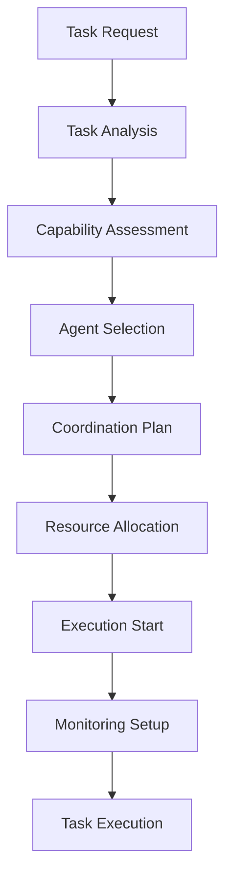
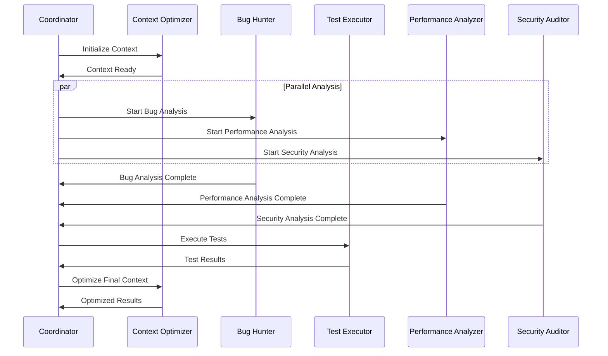
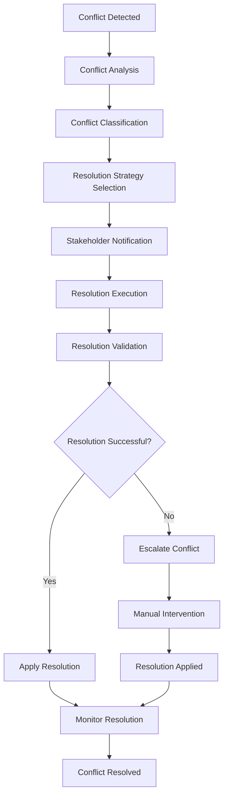
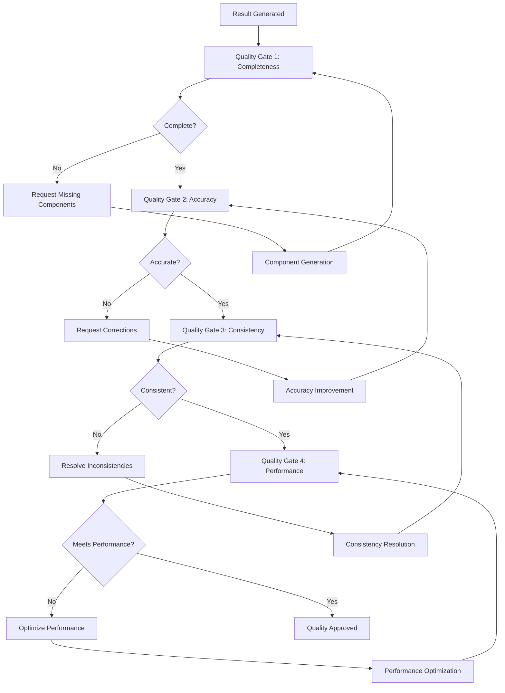

# Coordination Workflow

## 🎯 Workflow Overview

**Purpose**: Define standardized coordination workflows for Sub-Agent collaboration  
**Scope**: Cross-agent task execution, conflict resolution, and result aggregation  
**Integration**: Seamless integration with .god ecosystem and TSDDR 2.0 workflows

## 🔄 Core Coordination Workflows

### 1. Task Initiation Workflow



**Implementation Steps**:

1. **Task Analysis Phase**
   ```typescript
   interface TaskAnalysisResult {
     complexity: ComplexityLevel;
     requiredCapabilities: Capability[];
     estimatedDuration: number;
     dependencies: TaskDependency[];
     priority: Priority;
     riskFactors: RiskFactor[];
   }
   
   async function analyzeTask(task: Task): Promise<TaskAnalysisResult> {
     return {
       complexity: await assessComplexity(task),
       requiredCapabilities: identifyCapabilities(task),
       estimatedDuration: estimateDuration(task),
       dependencies: findDependencies(task),
       priority: determinePriority(task),
       riskFactors: identifyRisks(task)
     };
   }
   ```

2. **Agent Selection Phase**
   ```typescript
   interface AgentSelectionCriteria {
     capabilities: Capability[];
     availability: boolean;
     performance: PerformanceMetrics;
     workload: number;
     specialization: string[];
   }
   
   async function selectOptimalAgents(
     requirements: TaskAnalysisResult
   ): Promise<SubAgent[]> {
     const availableAgents = await getAvailableAgents();
     const scoredAgents = await scoreAgents(availableAgents, requirements);
     return selectTopAgents(scoredAgents, requirements.requiredCapabilities);
   }
   ```

3. **Coordination Plan Creation**
   ```typescript
   interface CoordinationPlan {
     id: string;
     task: Task;
     agents: AgentAssignment[];
     strategy: CoordinationStrategy;
     timeline: ExecutionTimeline;
     dependencies: PlanDependency[];
     fallbackPlans: FallbackPlan[];
   }
   
   async function createCoordinationPlan(
     task: Task,
     agents: SubAgent[]
   ): Promise<CoordinationPlan> {
     const strategy = selectCoordinationStrategy(task, agents);
     const timeline = createExecutionTimeline(task, agents, strategy);
     const dependencies = mapDependencies(task, agents);
     
     return {
       id: generatePlanId(),
       task,
       agents: assignAgentRoles(agents, task),
       strategy,
       timeline,
       dependencies,
       fallbackPlans: createFallbackPlans(task, agents)
     };
   }
   ```

### 2. Execution Coordination Workflow



**Execution Phases**:

1. **Initialization Phase**
   ```typescript
   async function initializeExecution(plan: CoordinationPlan): Promise<ExecutionContext> {
     // Set up shared context
     const sharedContext = await createSharedContext(plan.task);
     
     // Initialize agents
     const initializedAgents = await Promise.all(
       plan.agents.map(assignment => 
         initializeAgent(assignment.agent, assignment.role, sharedContext)
       )
     );
     
     // Set up communication channels
     const communicationChannels = await setupCommunicationChannels(initializedAgents);
     
     // Create execution context
     return new ExecutionContext({
       plan,
       agents: initializedAgents,
       sharedContext,
       communicationChannels,
       startTime: Date.now()
     });
   }
   ```

2. **Coordination Execution**
   ```typescript
   async function executeCoordination(context: ExecutionContext): Promise<CoordinationResult> {
     const { plan, agents } = context;
     
     try {
       // Execute based on coordination strategy
       switch (plan.strategy) {
         case CoordinationStrategy.SEQUENTIAL:
           return await executeSequential(context);
         case CoordinationStrategy.PARALLEL:
           return await executeParallel(context);
         case CoordinationStrategy.PIPELINE:
           return await executePipeline(context);
         case CoordinationStrategy.HYBRID:
           return await executeHybrid(context);
         default:
           throw new Error(`Unknown coordination strategy: ${plan.strategy}`);
       }
     } catch (error) {
       // Handle execution errors
       return await handleExecutionError(context, error);
     }
   }
   ```

3. **Result Aggregation**
   ```typescript
   async function aggregateResults(
     agentResults: AgentResult[]
   ): Promise<CoordinationResult> {
     // Validate individual results
     const validatedResults = await Promise.all(
       agentResults.map(result => validateAgentResult(result))
     );
     
     // Merge results
     const mergedResult = await mergeAgentResults(validatedResults);
     
     // Apply quality checks
     const qualityChecks = await runQualityChecks(mergedResult);
     
     // Generate final result
     return {
       success: qualityChecks.passed,
       result: mergedResult,
       qualityMetrics: qualityChecks.metrics,
       agentContributions: mapAgentContributions(validatedResults),
       executionMetrics: calculateExecutionMetrics(validatedResults)
     };
   }
   ```

### 3. Conflict Resolution Workflow



**Conflict Types & Resolutions**:

1. **Resource Contention**
   ```typescript
   class ResourceContentionResolver implements ConflictResolver {
     async resolve(conflict: ResourceContentionConflict): Promise<Resolution> {
       // Analyze resource usage patterns
       const usage = await analyzeResourceUsage(conflict.resource);
       
       // Determine optimal allocation
       const allocation = await optimizeResourceAllocation(
         conflict.contendingAgents,
         usage
       );
       
       // Create resolution plan
       return new Resolution({
         type: ResolutionType.RESOURCE_REALLOCATION,
         plan: allocation,
         affectedAgents: conflict.contendingAgents,
         implementation: async () => {
           await reallocateResource(conflict.resource, allocation);
         }
       });
     }
   }
   ```

2. **Conflicting Recommendations**
   ```typescript
   class RecommendationConflictResolver implements ConflictResolver {
     async resolve(conflict: RecommendationConflict): Promise<Resolution> {
       // Analyze recommendation quality
       const qualityScores = await Promise.all(
         conflict.recommendations.map(rec => 
           this.assessRecommendationQuality(rec)
         )
       );
       
       // Find consensus or select best recommendation
       const resolution = await this.findConsensusOrSelectBest(
         conflict.recommendations,
         qualityScores
       );
       
       return new Resolution({
         type: ResolutionType.RECOMMENDATION_SELECTION,
         selectedRecommendation: resolution.recommendation,
         reasoning: resolution.reasoning,
         confidence: resolution.confidence
       });
     }
   }
   ```

3. **Priority Conflicts**
   ```typescript
   class PriorityConflictResolver implements ConflictResolver {
     async resolve(conflict: PriorityConflict): Promise<Resolution> {
       // Apply priority resolution matrix
       const matrix = await this.loadPriorityMatrix();
       const resolution = matrix.resolve(conflict.conflictingPriorities);
       
       // Create execution order
       const executionOrder = await this.createExecutionOrder(
         conflict.tasks,
         resolution.priorityOrder
       );
       
       return new Resolution({
         type: ResolutionType.PRIORITY_REORDERING,
         executionOrder,
         reasoning: resolution.reasoning
       });
     }
   }
   ```

### 4. Quality Assurance Workflow



**Quality Gates Implementation**:

```typescript
class QualityAssuranceWorkflow {
  private qualityGates: QualityGate[];
  
  constructor() {
    this.qualityGates = [
      new CompletenessGate(),
      new AccuracyGate(),
      new ConsistencyGate(),
      new PerformanceGate(),
      new SecurityGate()
    ];
  }
  
  async validateResult(result: CoordinationResult): Promise<QualityValidationResult> {
    const validationResults: GateResult[] = [];
    
    for (const gate of this.qualityGates) {
      const gateResult = await gate.validate(result);
      validationResults.push(gateResult);
      
      if (!gateResult.passed && gate.isBlocking) {
        // Handle blocking quality gate failure
        await this.handleQualityGateFailure(gate, gateResult, result);
      }
    }
    
    return {
      overallPassed: validationResults.every(r => r.passed),
      gateResults: validationResults,
      qualityScore: this.calculateQualityScore(validationResults),
      recommendations: this.generateQualityRecommendations(validationResults)
    };
  }
  
  private async handleQualityGateFailure(
    gate: QualityGate,
    result: GateResult,
    coordinationResult: CoordinationResult
  ): Promise<void> {
    // Attempt automatic remediation
    const remediation = await gate.generateRemediation(result);
    
    if (remediation.canAutoRemediate) {
      await remediation.execute(coordinationResult);
    } else {
      // Escalate for manual intervention
      await this.escalateQualityIssue(gate, result, coordinationResult);
    }
  }
}
```

## 🔧 Coordination Strategies

### 1. Sequential Strategy

```typescript
class SequentialCoordinationStrategy implements CoordinationStrategy {
  async execute(context: ExecutionContext): Promise<CoordinationResult> {
    const { plan } = context;
    const results: AgentResult[] = [];
    let currentContext = context.sharedContext;
    
    for (const assignment of plan.agents) {
      // Update agent context
      await assignment.agent.updateContext(currentContext);
      
      // Execute agent task
      const agentResult = await assignment.agent.executeTask(assignment.task);
      
      // Validate result
      await this.validateAgentResult(agentResult);
      
      // Update shared context
      currentContext = await this.mergeContext(currentContext, agentResult.context);
      
      results.push(agentResult);
    }
    
    return await this.aggregateResults(results);
  }
}
```

### 2. Parallel Strategy

```typescript
class ParallelCoordinationStrategy implements CoordinationStrategy {
  async execute(context: ExecutionContext): Promise<CoordinationResult> {
    const { plan } = context;
    
    // Group agents by independence
    const independentGroups = this.groupIndependentAgents(plan.agents);
    const allResults: AgentResult[] = [];
    
    for (const group of independentGroups) {
      // Execute group in parallel
      const groupPromises = group.map(async (assignment) => {
        await assignment.agent.updateContext(context.sharedContext);
        return assignment.agent.executeTask(assignment.task);
      });
      
      const groupResults = await Promise.all(groupPromises);
      
      // Validate group results
      await this.validateGroupResults(groupResults);
      
      allResults.push(...groupResults);
      
      // Update shared context with group results
      context.sharedContext = await this.mergeGroupContext(
        context.sharedContext,
        groupResults
      );
    }
    
    return await this.aggregateResults(allResults);
  }
}
```

### 3. Pipeline Strategy

```typescript
class PipelineCoordinationStrategy implements CoordinationStrategy {
  async execute(context: ExecutionContext): Promise<CoordinationResult> {
    const { plan } = context;
    const pipeline = this.createPipeline(plan.agents);
    
    // Set up pipeline stages
    const stages = pipeline.stages.map(stage => {
      return new PipelineStage({
        agent: stage.agent,
        task: stage.task,
        onOutput: (output) => {
          const nextStage = pipeline.getNextStage(stage);
          if (nextStage) {
            nextStage.processInput(output);
          }
        },
        onError: (error) => {
          this.handlePipelineError(stage, error);
        }
      });
    });
    
    // Start pipeline execution
    const firstStage = stages[0];
    firstStage.processInput(plan.task.input);
    
    // Monitor pipeline execution
    const monitor = new PipelineMonitor(stages);
    monitor.start();
    
    // Wait for completion
    const result = await pipeline.waitForCompletion();
    monitor.stop();
    
    return result;
  }
}
```

## 📊 Monitoring & Analytics

### Real-time Monitoring

```typescript
class CoordinationMonitor {
  private metrics: Map<string, MetricCollector>;
  private alerts: AlertManager;
  
  async startMonitoring(context: ExecutionContext): Promise<void> {
    // Set up metric collectors
    this.setupMetricCollectors(context);
    
    // Start real-time monitoring
    const monitoringInterval = setInterval(async () => {
      await this.collectMetrics(context);
      await this.checkAlertConditions(context);
    }, 5000); // Every 5 seconds
    
    // Clean up on completion
    context.onComplete(() => {
      clearInterval(monitoringInterval);
      this.generateMonitoringReport(context);
    });
  }
  
  private setupMetricCollectors(context: ExecutionContext): void {
    this.metrics.set('agent_utilization', new AgentUtilizationCollector());
    this.metrics.set('coordination_efficiency', new CoordinationEfficiencyCollector());
    this.metrics.set('conflict_rate', new ConflictRateCollector());
    this.metrics.set('quality_score', new QualityScoreCollector());
    this.metrics.set('execution_time', new ExecutionTimeCollector());
  }
  
  private async collectMetrics(context: ExecutionContext): Promise<void> {
    for (const [name, collector] of this.metrics) {
      const value = await collector.collect(context);
      await this.storeMetric(name, value, Date.now());
    }
  }
}
```

### Performance Analytics

```typescript
class CoordinationAnalytics {
  async generatePerformanceReport(
    sessions: CoordinationSession[]
  ): Promise<PerformanceReport> {
    return {
      summary: await this.generateSummary(sessions),
      agentPerformance: await this.analyzeAgentPerformance(sessions),
      coordinationEfficiency: await this.analyzeCoordinationEfficiency(sessions),
      conflictAnalysis: await this.analyzeConflicts(sessions),
      qualityMetrics: await this.analyzeQualityMetrics(sessions),
      recommendations: await this.generateRecommendations(sessions)
    };
  }
  
  private async analyzeAgentPerformance(
    sessions: CoordinationSession[]
  ): Promise<AgentPerformanceAnalysis> {
    const agentMetrics = new Map<string, AgentMetrics>();
    
    for (const session of sessions) {
      for (const agent of session.agents) {
        if (!agentMetrics.has(agent.id)) {
          agentMetrics.set(agent.id, new AgentMetrics());
        }
        
        const metrics = agentMetrics.get(agent.id)!;
        metrics.addSession(session, agent);
      }
    }
    
    return {
      agentRankings: this.rankAgentsByPerformance(agentMetrics),
      performanceTrends: this.analyzePerformanceTrends(agentMetrics),
      improvementAreas: this.identifyImprovementAreas(agentMetrics)
    };
  }
}
```

---

**Integration Points**:
- **Sub-Agents**: Complete integration framework
- **Quality Gates**: Automated quality assurance
- **Monitoring**: Real-time performance tracking
- **Analytics**: Comprehensive performance analysis
- **Conflict Resolution**: Intelligent conflict handling

**Performance Targets**:
- **Coordination Success Rate**: >95%
- **Average Coordination Time**: <2 minutes
- **Conflict Resolution Rate**: >90%
- **Quality Gate Pass Rate**: >98%