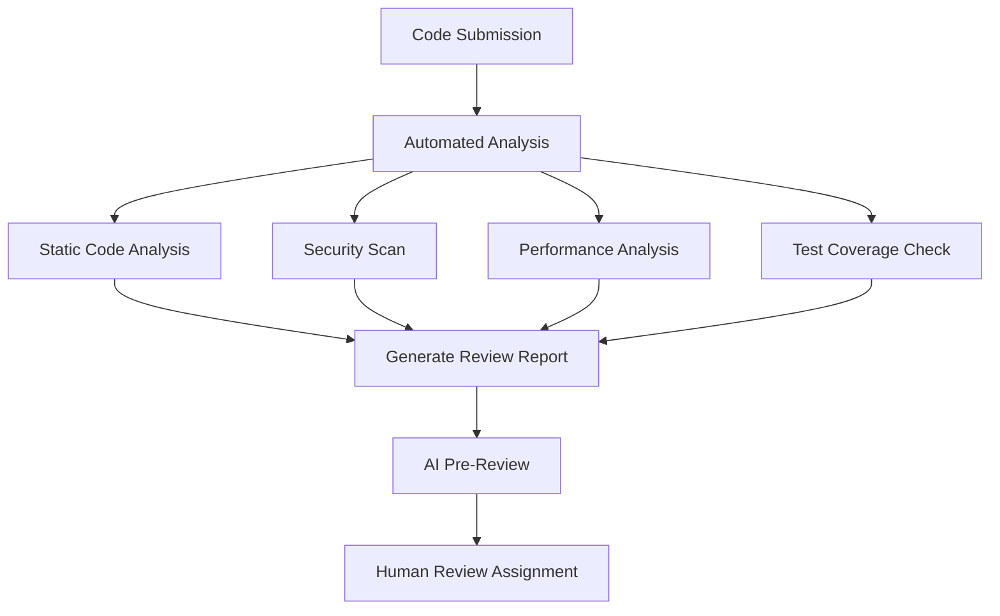
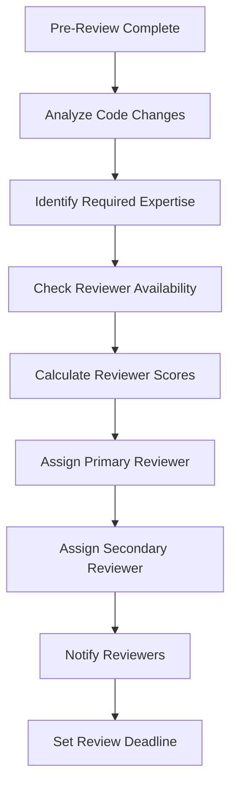
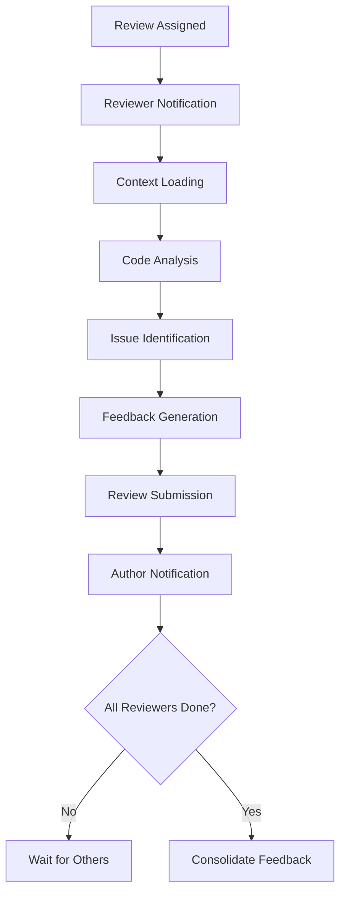
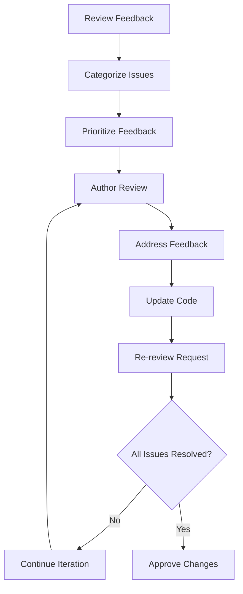
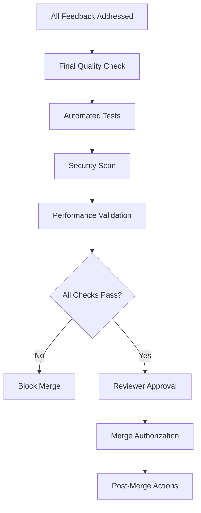

# 🔍 Code Review Workflow

> **🎯 Intelligent Code Review System**  
> Automated and human-driven code quality assurance with AI assistance

---

## 📋 Workflow Overview

### Purpose
Ensure code quality, knowledge sharing, and best practices adherence through systematic code review processes with AI-powered assistance and human expertise.

### Scope
- Automated code analysis and pre-review
- Human code review coordination
- Quality gate enforcement
- Knowledge transfer and mentoring
- Continuous improvement feedback

### Success Criteria
- **Code Quality Score**: >8.5/10
- **Review Coverage**: 100% of production code
- **Review Turnaround**: <24 hours
- **Defect Detection Rate**: >90%
- **Knowledge Transfer Score**: >8.0/10

---

## 🔄 Review Process

### Phase 1: Pre-Review Analysis


#### 1.1 Automated Code Analysis
```javascript
class AutomatedCodeAnalyzer {
  constructor() {
    this.analyzers = {
      syntax: new SyntaxAnalyzer(),
      style: new StyleAnalyzer(),
      complexity: new ComplexityAnalyzer(),
      security: new SecurityAnalyzer(),
      performance: new PerformanceAnalyzer(),
      maintainability: new MaintainabilityAnalyzer()
    };
  }
  
  async analyze(codeChanges) {
    const results = {};
    
    for (const [name, analyzer] of Object.entries(this.analyzers)) {
      try {
        results[name] = await analyzer.analyze(codeChanges);
      } catch (error) {
        results[name] = {
          status: 'error',
          message: error.message
        };
      }
    }
    
    return {
      overall: this.calculateOverallScore(results),
      details: results,
      recommendations: this.generateRecommendations(results)
    };
  }
  
  calculateOverallScore(results) {
    const scores = Object.values(results)
      .filter(result => result.score !== undefined)
      .map(result => result.score);
    
    return scores.length > 0 
      ? scores.reduce((sum, score) => sum + score, 0) / scores.length
      : 0;
  }
}
```

#### 1.2 AI Pre-Review
```javascript
class AIPreReviewer {
  constructor() {
    this.models = {
      codeQuality: new CodeQualityModel(),
      bestPractices: new BestPracticesModel(),
      bugDetection: new BugDetectionModel(),
      performance: new PerformanceModel()
    };
  }
  
  async preReview(codeChanges, context) {
    const analysis = await Promise.all([
      this.analyzeCodeQuality(codeChanges),
      this.checkBestPractices(codeChanges, context),
      this.detectPotentialBugs(codeChanges),
      this.assessPerformanceImpact(codeChanges)
    ]);
    
    return {
      summary: this.generateSummary(analysis),
      issues: this.categorizeIssues(analysis),
      suggestions: this.generateSuggestions(analysis),
      confidence: this.calculateConfidence(analysis)
    };
  }
  
  async analyzeCodeQuality(codeChanges) {
    return this.models.codeQuality.analyze({
      changes: codeChanges,
      metrics: ['readability', 'maintainability', 'testability']
    });
  }
}
```

#### 1.3 Quality Gates
```yaml
qualityGates:
  blocking:
    - name: "Syntax Errors"
      threshold: 0
      severity: "critical"
    
    - name: "Security Vulnerabilities"
      threshold: 0
      severity: "critical"
    
    - name: "Test Coverage"
      threshold: 80
      severity: "high"
    
    - name: "Code Complexity"
      threshold: 10
      severity: "high"
  
  warning:
    - name: "Code Duplication"
      threshold: 5
      severity: "medium"
    
    - name: "Documentation Coverage"
      threshold: 70
      severity: "medium"
    
    - name: "Performance Impact"
      threshold: 15
      severity: "medium"
```

### Phase 2: Reviewer Assignment


#### 2.1 Reviewer Selection Algorithm
```javascript
class ReviewerSelector {
  constructor() {
    this.reviewers = new ReviewerRegistry();
    this.workloadManager = new ReviewerWorkloadManager();
  }
  
  selectReviewers(codeChanges, requiredCount = 2) {
    const requirements = this.analyzeRequirements(codeChanges);
    const candidates = this.findCandidates(requirements);
    
    return candidates
      .map(reviewer => ({
        reviewer,
        score: this.calculateReviewerScore(reviewer, requirements)
      }))
      .sort((a, b) => b.score - a.score)
      .slice(0, requiredCount)
      .map(item => item.reviewer);
  }
  
  calculateReviewerScore(reviewer, requirements) {
    return (
      this.getExpertiseScore(reviewer, requirements) * 0.4 +
      this.getAvailabilityScore(reviewer) * 0.3 +
      this.getPerformanceScore(reviewer) * 0.2 +
      this.getDiversityScore(reviewer, requirements) * 0.1
    );
  }
  
  getExpertiseScore(reviewer, requirements) {
    const expertiseMatch = requirements.technologies
      .map(tech => reviewer.expertise[tech] || 0)
      .reduce((sum, score) => sum + score, 0) / requirements.technologies.length;
    
    return Math.min(expertiseMatch, 10);
  }
}
```

#### 2.2 Workload Balancing
```javascript
class ReviewerWorkloadManager {
  constructor() {
    this.activeReviews = new Map();
    this.maxConcurrentReviews = 5;
    this.maxWeeklyReviews = 20;
  }
  
  canAssignReview(reviewerId, complexity) {
    const currentWorkload = this.getCurrentWorkload(reviewerId);
    const weeklyCount = this.getWeeklyReviewCount(reviewerId);
    
    return (
      currentWorkload.count < this.maxConcurrentReviews &&
      currentWorkload.complexity + complexity <= 25 &&
      weeklyCount < this.maxWeeklyReviews
    );
  }
  
  assignReview(reviewerId, reviewRequest) {
    if (!this.canAssignReview(reviewerId, reviewRequest.complexity)) {
      throw new Error('Reviewer workload capacity exceeded');
    }
    
    const workload = this.activeReviews.get(reviewerId) || [];
    workload.push(reviewRequest);
    this.activeReviews.set(reviewerId, workload);
  }
}
```

### Phase 3: Review Execution


#### 3.1 Review Context
```javascript
class ReviewContext {
  constructor(pullRequest) {
    this.pullRequest = pullRequest;
    this.codeChanges = pullRequest.changes;
    this.metadata = this.extractMetadata();
    this.history = this.loadHistory();
  }
  
  extractMetadata() {
    return {
      author: this.pullRequest.author,
      branch: this.pullRequest.branch,
      target: this.pullRequest.target,
      description: this.pullRequest.description,
      linkedIssues: this.extractLinkedIssues(),
      affectedModules: this.identifyAffectedModules(),
      riskLevel: this.assessRiskLevel()
    };
  }
  
  loadHistory() {
    return {
      authorHistory: this.getAuthorHistory(),
      moduleHistory: this.getModuleHistory(),
      similarChanges: this.findSimilarChanges()
    };
  }
}
```

#### 3.2 Review Guidelines
```yaml
reviewGuidelines:
  codeQuality:
    - readability: "Code should be self-documenting and easy to understand"
    - maintainability: "Changes should not increase technical debt"
    - testability: "Code should be easily testable with clear interfaces"
    - performance: "Consider performance implications of changes"
  
  bestPractices:
    - naming: "Use clear, descriptive names for variables and functions"
    - structure: "Follow established architectural patterns"
    - documentation: "Document complex logic and public APIs"
    - errorHandling: "Implement proper error handling and logging"
  
  security:
    - inputValidation: "Validate all user inputs"
    - authentication: "Ensure proper authentication and authorization"
    - dataProtection: "Protect sensitive data and credentials"
    - dependencies: "Review third-party dependencies for vulnerabilities"
```

#### 3.3 Feedback Framework
```javascript
class ReviewFeedback {
  constructor() {
    this.categories = {
      critical: { priority: 1, blocking: true },
      major: { priority: 2, blocking: true },
      minor: { priority: 3, blocking: false },
      suggestion: { priority: 4, blocking: false },
      praise: { priority: 5, blocking: false }
    };
  }
  
  createFeedback(type, category, message, location, suggestion = null) {
    return {
      id: this.generateId(),
      type,
      category,
      message,
      location,
      suggestion,
      timestamp: Date.now(),
      priority: this.categories[category].priority,
      blocking: this.categories[category].blocking
    };
  }
  
  categorizeFeedback(feedback) {
    return {
      blocking: feedback.filter(f => f.blocking),
      nonBlocking: feedback.filter(f => !f.blocking),
      suggestions: feedback.filter(f => f.category === 'suggestion'),
      praise: feedback.filter(f => f.category === 'praise')
    };
  }
}
```

### Phase 4: Feedback Processing


#### 4.1 Feedback Consolidation
```javascript
class FeedbackConsolidator {
  constructor() {
    this.conflictResolver = new ConflictResolver();
    this.prioritizer = new FeedbackPrioritizer();
  }
  
  consolidate(reviewerFeedbacks) {
    const allFeedback = this.mergeFeedback(reviewerFeedbacks);
    const conflicts = this.identifyConflicts(allFeedback);
    const resolved = this.conflictResolver.resolve(conflicts);
    
    return {
      consolidated: this.prioritizer.prioritize(resolved),
      summary: this.generateSummary(resolved),
      actionItems: this.extractActionItems(resolved)
    };
  }
  
  identifyConflicts(feedback) {
    const conflicts = [];
    const groupedByLocation = this.groupByLocation(feedback);
    
    for (const [location, items] of groupedByLocation) {
      if (items.length > 1) {
        const conflicting = this.findConflictingFeedback(items);
        if (conflicting.length > 0) {
          conflicts.push({ location, items: conflicting });
        }
      }
    }
    
    return conflicts;
  }
}
```

#### 4.2 Resolution Tracking
```javascript
class ResolutionTracker {
  constructor(reviewId) {
    this.reviewId = reviewId;
    this.resolutions = new Map();
    this.iterations = [];
  }
  
  trackResolution(feedbackId, resolution) {
    this.resolutions.set(feedbackId, {
      ...resolution,
      timestamp: Date.now(),
      iteration: this.getCurrentIteration()
    });
  }
  
  getResolutionStatus() {
    const total = this.resolutions.size;
    const resolved = Array.from(this.resolutions.values())
      .filter(r => r.status === 'resolved').length;
    
    return {
      total,
      resolved,
      pending: total - resolved,
      percentage: total > 0 ? (resolved / total) * 100 : 0
    };
  }
}
```

### Phase 5: Approval & Merge


#### 5.1 Final Validation
```javascript
class FinalValidator {
  constructor() {
    this.validators = {
      quality: new QualityValidator(),
      security: new SecurityValidator(),
      performance: new PerformanceValidator(),
      compliance: new ComplianceValidator()
    };
  }
  
  async validate(codeChanges) {
    const results = {};
    
    for (const [name, validator] of Object.entries(this.validators)) {
      results[name] = await validator.validate(codeChanges);
    }
    
    const overallResult = this.calculateOverallResult(results);
    
    return {
      passed: overallResult.passed,
      score: overallResult.score,
      details: results,
      blockers: this.identifyBlockers(results)
    };
  }
  
  identifyBlockers(results) {
    return Object.entries(results)
      .filter(([name, result]) => !result.passed && result.blocking)
      .map(([name, result]) => ({ validator: name, issues: result.issues }));
  }
}
```

#### 5.2 Approval Workflow
```javascript
class ApprovalWorkflow {
  constructor() {
    this.approvalRules = {
      minReviewers: 2,
      requireOwnerApproval: true,
      requireSecurityApproval: false, // For security-sensitive changes
      requireArchitectApproval: false // For architectural changes
    };
  }
  
  checkApprovalRequirements(pullRequest) {
    const requirements = this.determineRequirements(pullRequest);
    const currentApprovals = this.getCurrentApprovals(pullRequest);
    
    return {
      met: this.areRequirementsMet(requirements, currentApprovals),
      missing: this.getMissingApprovals(requirements, currentApprovals),
      requirements
    };
  }
  
  determineRequirements(pullRequest) {
    const requirements = {
      minReviewers: this.approvalRules.minReviewers,
      specialApprovals: []
    };
    
    if (this.isSecuritySensitive(pullRequest)) {
      requirements.specialApprovals.push('security');
    }
    
    if (this.isArchitecturalChange(pullRequest)) {
      requirements.specialApprovals.push('architect');
    }
    
    return requirements;
  }
}
```

---

## 📊 Review Analytics

### Performance Metrics
```javascript
class ReviewAnalytics {
  constructor() {
    this.metrics = {
      efficiency: new EfficiencyMetrics(),
      quality: new QualityMetrics(),
      knowledge: new KnowledgeTransferMetrics(),
      satisfaction: new SatisfactionMetrics()
    };
  }
  
  generateReport(timeframe = '30d') {
    return {
      summary: this.getSummaryMetrics(timeframe),
      trends: this.getTrendAnalysis(timeframe),
      reviewerPerformance: this.getReviewerPerformance(timeframe),
      recommendations: this.getRecommendations(timeframe)
    };
  }
  
  getSummaryMetrics(timeframe) {
    return {
      totalReviews: this.metrics.efficiency.getTotalReviews(timeframe),
      averageReviewTime: this.metrics.efficiency.getAverageReviewTime(timeframe),
      defectDetectionRate: this.metrics.quality.getDefectDetectionRate(timeframe),
      knowledgeTransferScore: this.metrics.knowledge.getTransferScore(timeframe)
    };
  }
}
```

### Quality Insights
```javascript
function generateQualityInsights(reviews) {
  return {
    commonIssues: identifyCommonIssues(reviews),
    qualityTrends: analyzeQualityTrends(reviews),
    reviewerEffectiveness: assessReviewerEffectiveness(reviews),
    improvementAreas: identifyImprovementAreas(reviews)
  };
}

function identifyCommonIssues(reviews) {
  const issueFrequency = {};
  
  reviews.forEach(review => {
    review.feedback.forEach(feedback => {
      const category = feedback.category;
      issueFrequency[category] = (issueFrequency[category] || 0) + 1;
    });
  });
  
  return Object.entries(issueFrequency)
    .sort(([,a], [,b]) => b - a)
    .slice(0, 10);
}
```

---

## 🔧 Configuration

### Review Settings
```yaml
reviewSettings:
  # Assignment settings
  minReviewers: 2
  maxReviewers: 4
  autoAssignment: true
  expertiseMatching: true
  
  # Quality gates
  blockingIssues: ['critical', 'major']
  qualityThreshold: 8.0
  coverageThreshold: 80
  
  # Timing settings
  reviewDeadline: 24h
  escalationTime: 48h
  reminderInterval: 12h
  
  # AI assistance
  aiPreReview: true
  aiSuggestions: true
  aiConflictResolution: false
```

### Integration Configuration
```javascript
const integrations = {
  // Version control
  github: {
    webhooks: ['pull_request', 'push', 'review'],
    autoAssignment: true,
    statusChecks: true
  },
  
  // Communication
  slack: {
    notifications: true,
    channels: ['#code-review', '#dev-team'],
    mentions: true
  },
  
  // Quality tools
  sonarqube: {
    qualityGates: true,
    securityHotspots: true,
    codeSmells: true
  }
};
```

---

## 🚀 Continuous Improvement

### Learning System
```javascript
class ReviewLearningSystem {
  constructor() {
    this.patterns = new PatternRecognition();
    this.optimizer = new ReviewOptimizer();
    this.predictor = new DefectPredictor();
  }
  
  learn(completedReviews) {
    // Identify effective review patterns
    const effectivePatterns = this.patterns.identifyEffectivePatterns(completedReviews);
    
    // Optimize reviewer assignment
    this.optimizer.updateAssignmentRules(effectivePatterns);
    
    // Improve defect prediction
    this.predictor.updatePredictionModel(completedReviews);
    
    // Enhance feedback quality
    this.optimizer.updateFeedbackGuidelines(completedReviews);
  }
}
```

### Feedback Loop
```javascript
function processReviewFeedback(reviewId, feedback) {
  const review = getReview(reviewId);
  
  // Update reviewer performance metrics
  updateReviewerMetrics(review.reviewers, feedback);
  
  // Adjust quality prediction models
  adjustQualityModels(review, feedback);
  
  // Improve assignment algorithms
  updateAssignmentAlgorithms(review, feedback);
  
  // Enhance AI models
  updateAIModels(review, feedback);
}
```

---

**🔍 Comprehensive code review system ensuring high-quality code delivery through intelligent automation and human expertise.**