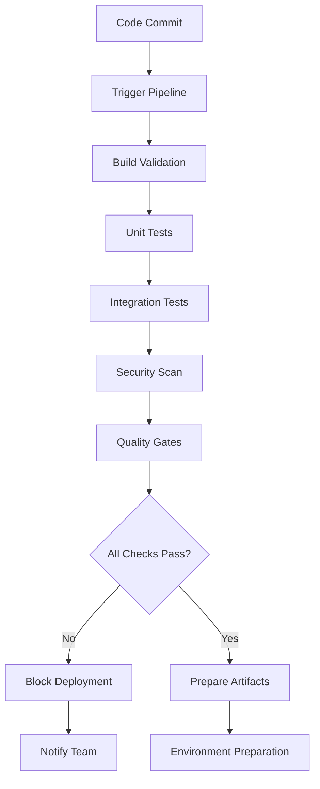
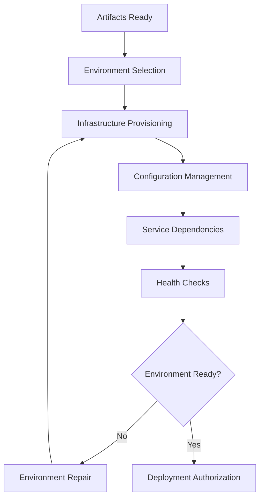
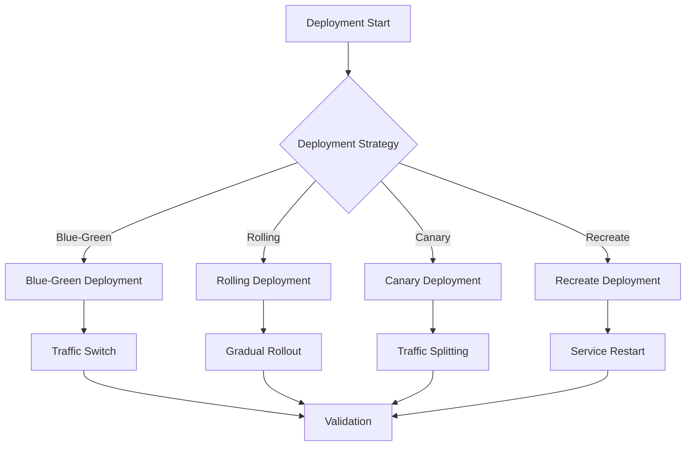
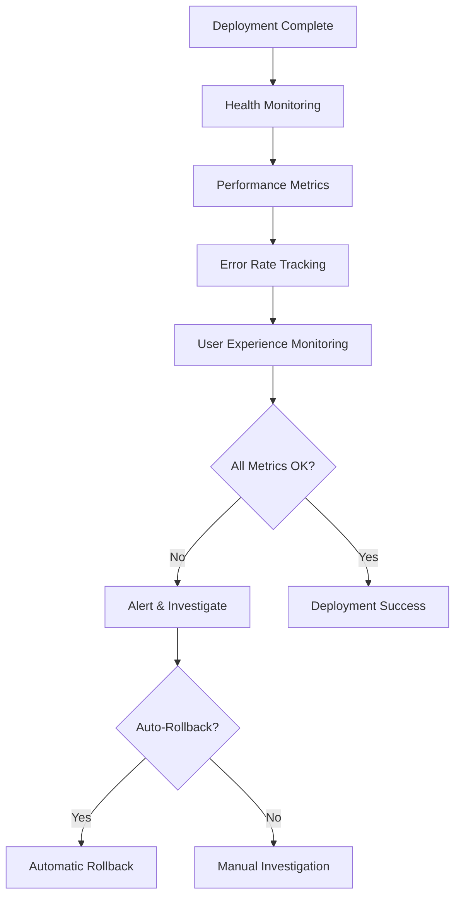
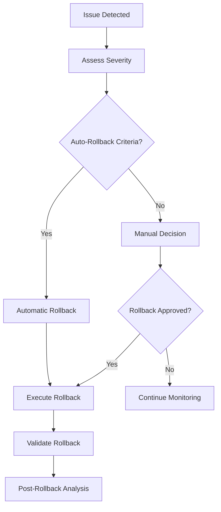

# 🚀 Deployment Automation Workflow

> **🎯 Intelligent Deployment Pipeline**  
> Automated, secure, and reliable deployment with zero-downtime strategies

---

## 📋 Workflow Overview

### Purpose
Automate the entire deployment process from code commit to production with intelligent rollback capabilities, security validation, and performance monitoring.

### Scope
- Continuous Integration/Continuous Deployment (CI/CD)
- Environment management and promotion
- Security scanning and compliance
- Performance validation and monitoring
- Rollback and disaster recovery
- Infrastructure as Code (IaC)

### Success Criteria
- **Deployment Success Rate**: >99%
- **Deployment Time**: <15 minutes
- **Zero Downtime**: 100% uptime during deployments
- **Security Compliance**: 100% scan coverage
- **Rollback Time**: <5 minutes

---

## 🔄 Deployment Pipeline

### Phase 1: Pre-Deployment Validation


#### 1.1 Build Validation
```javascript
class BuildValidator {
  constructor() {
    this.validators = {
      syntax: new SyntaxValidator(),
      dependencies: new DependencyValidator(),
      configuration: new ConfigurationValidator(),
      assets: new AssetValidator()
    };
  }
  
  async validate(buildContext) {
    const results = {};
    
    for (const [name, validator] of Object.entries(this.validators)) {
      try {
        results[name] = await validator.validate(buildContext);
      } catch (error) {
        results[name] = {
          passed: false,
          error: error.message,
          severity: 'critical'
        };
      }
    }
    
    return {
      passed: Object.values(results).every(r => r.passed),
      results,
      summary: this.generateSummary(results)
    };
  }
  
  generateSummary(results) {
    const total = Object.keys(results).length;
    const passed = Object.values(results).filter(r => r.passed).length;
    const critical = Object.values(results).filter(r => 
      !r.passed && r.severity === 'critical'
    ).length;
    
    return { total, passed, failed: total - passed, critical };
  }
}
```

#### 1.2 Security Scanning
```javascript
class SecurityScanner {
  constructor() {
    this.scanners = {
      vulnerabilities: new VulnerabilityScanner(),
      secrets: new SecretScanner(),
      dependencies: new DependencySecurityScanner(),
      compliance: new ComplianceScanner(),
      container: new ContainerSecurityScanner()
    };
  }
  
  async scan(artifacts) {
    const scanResults = {};
    
    for (const [scanType, scanner] of Object.entries(this.scanners)) {
      scanResults[scanType] = await scanner.scan(artifacts);
    }
    
    return {
      overall: this.calculateSecurityScore(scanResults),
      details: scanResults,
      blockers: this.identifyBlockers(scanResults),
      recommendations: this.generateRecommendations(scanResults)
    };
  }
  
  identifyBlockers(scanResults) {
    const blockers = [];
    
    Object.entries(scanResults).forEach(([scanType, result]) => {
      if (result.criticalIssues && result.criticalIssues.length > 0) {
        blockers.push({
          scanner: scanType,
          issues: result.criticalIssues,
          severity: 'critical'
        });
      }
    });
    
    return blockers;
  }
}
```

#### 1.3 Quality Gates
```yaml
qualityGates:
  build:
    - name: "Build Success"
      threshold: 100
      blocking: true
    
    - name: "Unit Test Coverage"
      threshold: 80
      blocking: true
    
    - name: "Integration Test Pass Rate"
      threshold: 95
      blocking: true
  
  security:
    - name: "Critical Vulnerabilities"
      threshold: 0
      blocking: true
    
    - name: "High Vulnerabilities"
      threshold: 5
      blocking: true
    
    - name: "Secret Detection"
      threshold: 0
      blocking: true
  
  performance:
    - name: "Build Time"
      threshold: 600 # 10 minutes
      blocking: false
    
    - name: "Artifact Size"
      threshold: 500 # MB
      blocking: false
```

### Phase 2: Environment Management


#### 2.1 Environment Configuration
```javascript
class EnvironmentManager {
  constructor() {
    this.environments = {
      development: new DevelopmentEnvironment(),
      staging: new StagingEnvironment(),
      production: new ProductionEnvironment()
    };
    this.provisioner = new InfrastructureProvisioner();
  }
  
  async prepareEnvironment(environmentName, deploymentConfig) {
    const environment = this.environments[environmentName];
    
    if (!environment) {
      throw new Error(`Unknown environment: ${environmentName}`);
    }
    
    // Provision infrastructure
    await this.provisioner.provision(environment.getInfrastructureSpec());
    
    // Configure services
    await environment.configure(deploymentConfig);
    
    // Validate readiness
    const healthCheck = await environment.healthCheck();
    
    if (!healthCheck.healthy) {
      throw new Error(`Environment not ready: ${healthCheck.issues.join(', ')}`);
    }
    
    return environment;
  }
}
```

#### 2.2 Infrastructure as Code
```yaml
# terraform/main.tf equivalent in YAML for documentation
infrastructure:
  provider: aws
  region: us-west-2
  
  compute:
    - type: ec2
      instance_type: t3.medium
      count: 3
      auto_scaling:
        min: 2
        max: 10
        target_cpu: 70
    
    - type: ecs
      cluster_name: app-cluster
      services:
        - name: web-service
          desired_count: 3
          cpu: 512
          memory: 1024
  
  networking:
    vpc:
      cidr: 10.0.0.0/16
    subnets:
      - type: public
        cidr: 10.0.1.0/24
      - type: private
        cidr: 10.0.2.0/24
    
    load_balancer:
      type: application
      scheme: internet-facing
      health_check:
        path: /health
        interval: 30
  
  storage:
    database:
      type: rds
      engine: postgresql
      instance_class: db.t3.micro
      multi_az: true
      backup_retention: 7
    
    cache:
      type: elasticache
      engine: redis
      node_type: cache.t3.micro
```

### Phase 3: Deployment Strategies


#### 3.1 Blue-Green Deployment
```javascript
class BlueGreenDeployment {
  constructor(environment) {
    this.environment = environment;
    this.loadBalancer = environment.getLoadBalancer();
    this.healthChecker = new HealthChecker();
  }
  
  async deploy(newVersion) {
    // Step 1: Deploy to green environment
    const greenEnvironment = await this.prepareGreenEnvironment();
    await greenEnvironment.deploy(newVersion);
    
    // Step 2: Health check green environment
    const healthCheck = await this.healthChecker.check(greenEnvironment);
    if (!healthCheck.healthy) {
      throw new Error('Green environment health check failed');
    }
    
    // Step 3: Switch traffic
    await this.loadBalancer.switchTraffic(greenEnvironment);
    
    // Step 4: Validate production traffic
    await this.validateProductionTraffic(greenEnvironment);
    
    // Step 5: Cleanup blue environment
    await this.cleanupBlueEnvironment();
    
    return {
      strategy: 'blue-green',
      version: newVersion,
      switchTime: Date.now(),
      rollbackPlan: this.generateRollbackPlan()
    };
  }
  
  async rollback() {
    // Quick rollback by switching traffic back
    await this.loadBalancer.switchTraffic(this.blueEnvironment);
    return { rollbackTime: Date.now() };
  }
}
```

#### 3.2 Canary Deployment
```javascript
class CanaryDeployment {
  constructor(environment) {
    this.environment = environment;
    this.trafficSplitter = new TrafficSplitter();
    this.metricsCollector = new MetricsCollector();
  }
  
  async deploy(newVersion, canaryConfig = {}) {
    const config = {
      initialTraffic: 5,
      maxTraffic: 100,
      incrementStep: 10,
      evaluationPeriod: 300, // 5 minutes
      successThreshold: 99.5,
      ...canaryConfig
    };
    
    // Deploy canary version
    const canaryEnvironment = await this.deployCanary(newVersion);
    
    // Gradual traffic increase
    for (let traffic = config.initialTraffic; traffic <= config.maxTraffic; traffic += config.incrementStep) {
      await this.trafficSplitter.setTrafficPercentage(canaryEnvironment, traffic);
      
      // Wait for evaluation period
      await this.wait(config.evaluationPeriod * 1000);
      
      // Evaluate metrics
      const metrics = await this.metricsCollector.collect(canaryEnvironment);
      const evaluation = this.evaluateMetrics(metrics, config.successThreshold);
      
      if (!evaluation.success) {
        await this.rollback();
        throw new Error(`Canary deployment failed: ${evaluation.reason}`);
      }
    }
    
    return {
      strategy: 'canary',
      version: newVersion,
      finalTraffic: config.maxTraffic,
      evaluationResults: this.getEvaluationHistory()
    };
  }
}
```

#### 3.3 Rolling Deployment
```javascript
class RollingDeployment {
  constructor(environment) {
    this.environment = environment;
    this.instances = environment.getInstances();
    this.maxUnavailable = Math.floor(this.instances.length * 0.25); // 25% max unavailable
  }
  
  async deploy(newVersion) {
    const batches = this.createBatches(this.instances, this.maxUnavailable);
    const deploymentResults = [];
    
    for (const batch of batches) {
      // Deploy to batch
      const batchResult = await this.deployBatch(batch, newVersion);
      deploymentResults.push(batchResult);
      
      // Validate batch health
      const healthCheck = await this.validateBatchHealth(batch);
      if (!healthCheck.healthy) {
        await this.rollbackBatch(batch);
        throw new Error(`Batch deployment failed: ${healthCheck.issues.join(', ')}`);
      }
      
      // Wait before next batch
      await this.wait(30000); // 30 seconds
    }
    
    return {
      strategy: 'rolling',
      version: newVersion,
      batches: deploymentResults.length,
      totalInstances: this.instances.length
    };
  }
  
  createBatches(instances, maxUnavailable) {
    const batchSize = Math.min(maxUnavailable, Math.ceil(instances.length / 4));
    const batches = [];
    
    for (let i = 0; i < instances.length; i += batchSize) {
      batches.push(instances.slice(i, i + batchSize));
    }
    
    return batches;
  }
}
```

### Phase 4: Monitoring & Validation


#### 4.1 Health Monitoring
```javascript
class DeploymentMonitor {
  constructor() {
    this.monitors = {
      health: new HealthMonitor(),
      performance: new PerformanceMonitor(),
      errors: new ErrorMonitor(),
      business: new BusinessMetricsMonitor()
    };
    this.alertManager = new AlertManager();
  }
  
  async startMonitoring(deployment) {
    const monitoringSession = {
      deploymentId: deployment.id,
      startTime: Date.now(),
      metrics: {},
      alerts: []
    };
    
    // Start all monitors
    for (const [name, monitor] of Object.entries(this.monitors)) {
      monitor.start(deployment, (metrics) => {
        monitoringSession.metrics[name] = metrics;
        this.evaluateMetrics(monitoringSession);
      });
    }
    
    return monitoringSession;
  }
  
  evaluateMetrics(session) {
    const evaluation = {
      healthy: true,
      issues: [],
      score: 0
    };
    
    // Evaluate each metric category
    Object.entries(session.metrics).forEach(([category, metrics]) => {
      const categoryEvaluation = this.evaluateCategory(category, metrics);
      
      if (!categoryEvaluation.healthy) {
        evaluation.healthy = false;
        evaluation.issues.push(...categoryEvaluation.issues);
      }
      
      evaluation.score += categoryEvaluation.score;
    });
    
    evaluation.score /= Object.keys(session.metrics).length;
    
    // Trigger alerts if needed
    if (!evaluation.healthy) {
      this.alertManager.triggerAlert(session.deploymentId, evaluation);
    }
    
    return evaluation;
  }
}
```

#### 4.2 Performance Validation
```javascript
class PerformanceValidator {
  constructor() {
    this.thresholds = {
      responseTime: {
        p50: 200, // ms
        p95: 500,
        p99: 1000
      },
      throughput: {
        min: 1000, // requests/minute
        target: 5000
      },
      errorRate: {
        max: 0.1 // 0.1%
      },
      availability: {
        min: 99.9 // 99.9%
      }
    };
  }
  
  async validate(deployment, duration = 300000) { // 5 minutes
    const startTime = Date.now();
    const endTime = startTime + duration;
    const metrics = [];
    
    while (Date.now() < endTime) {
      const currentMetrics = await this.collectMetrics(deployment);
      metrics.push(currentMetrics);
      
      // Check if metrics are within thresholds
      const validation = this.validateMetrics(currentMetrics);
      if (!validation.passed) {
        return {
          passed: false,
          reason: validation.reason,
          metrics: currentMetrics,
          duration: Date.now() - startTime
        };
      }
      
      await this.wait(10000); // Check every 10 seconds
    }
    
    return {
      passed: true,
      metrics: this.aggregateMetrics(metrics),
      duration: Date.now() - startTime
    };
  }
}
```

### Phase 5: Rollback & Recovery


#### 5.1 Rollback Automation
```javascript
class RollbackManager {
  constructor() {
    this.rollbackStrategies = {
      'blue-green': new BlueGreenRollback(),
      'canary': new CanaryRollback(),
      'rolling': new RollingRollback()
    };
    this.criteria = new RollbackCriteria();
  }
  
  async evaluateRollback(deployment, metrics) {
    const evaluation = this.criteria.evaluate(metrics);
    
    if (evaluation.shouldRollback) {
      if (evaluation.automatic) {
        return await this.executeRollback(deployment, 'automatic');
      } else {
        return await this.requestManualRollback(deployment, evaluation.reason);
      }
    }
    
    return { rollbackRequired: false };
  }
  
  async executeRollback(deployment, trigger) {
    const strategy = this.rollbackStrategies[deployment.strategy];
    
    if (!strategy) {
      throw new Error(`No rollback strategy for: ${deployment.strategy}`);
    }
    
    const rollbackStart = Date.now();
    
    try {
      await strategy.rollback(deployment);
      
      const rollbackDuration = Date.now() - rollbackStart;
      
      return {
        success: true,
        trigger,
        duration: rollbackDuration,
        timestamp: rollbackStart
      };
    } catch (error) {
      return {
        success: false,
        error: error.message,
        trigger,
        duration: Date.now() - rollbackStart
      };
    }
  }
}
```

#### 5.2 Rollback Criteria
```yaml
rollbackCriteria:
  automatic:
    - metric: "error_rate"
      threshold: 5.0
      duration: 60 # seconds
      severity: "critical"
    
    - metric: "response_time_p99"
      threshold: 5000 # ms
      duration: 120
      severity: "critical"
    
    - metric: "availability"
      threshold: 95.0
      duration: 30
      severity: "critical"
  
  manual:
    - metric: "error_rate"
      threshold: 2.0
      duration: 300
      severity: "high"
    
    - metric: "response_time_p95"
      threshold: 2000
      duration: 300
      severity: "medium"
    
    - metric: "business_metric_conversion"
      threshold: -10 # 10% decrease
      duration: 600
      severity: "high"
```

---

## 📊 Deployment Analytics

### Performance Metrics
```javascript
class DeploymentAnalytics {
  constructor() {
    this.metrics = {
      frequency: new DeploymentFrequencyMetrics(),
      leadTime: new LeadTimeMetrics(),
      reliability: new ReliabilityMetrics(),
      recovery: new RecoveryMetrics()
    };
  }
  
  generateReport(timeframe = '30d') {
    return {
      dora: this.getDORAMetrics(timeframe),
      trends: this.getTrendAnalysis(timeframe),
      reliability: this.getReliabilityReport(timeframe),
      recommendations: this.getRecommendations(timeframe)
    };
  }
  
  getDORAMetrics(timeframe) {
    return {
      deploymentFrequency: this.metrics.frequency.calculate(timeframe),
      leadTimeForChanges: this.metrics.leadTime.calculate(timeframe),
      changeFailureRate: this.metrics.reliability.getFailureRate(timeframe),
      timeToRestore: this.metrics.recovery.getAverageTime(timeframe)
    };
  }
}
```

---

## 🔧 Configuration

### Pipeline Configuration
```yaml
deploymentPipeline:
  # Build settings
  build:
    timeout: 600 # 10 minutes
    parallelJobs: 4
    cacheEnabled: true
    artifactRetention: 30d
  
  # Testing settings
  testing:
    unitTests:
      timeout: 300
      coverage: 80
      parallel: true
    
    integrationTests:
      timeout: 900
      environments: ["test"]
      dataSeeding: true
  
  # Security settings
  security:
    vulnerabilityScanning: true
    secretDetection: true
    complianceChecks: true
    containerScanning: true
  
  # Deployment settings
  deployment:
    strategy: "blue-green" # blue-green, canary, rolling
    environments:
      - name: "staging"
        autoPromote: true
        approvalRequired: false
      
      - name: "production"
        autoPromote: false
        approvalRequired: true
        approvers: ["team-lead", "devops"]
  
  # Monitoring settings
  monitoring:
    healthChecks: true
    performanceValidation: true
    businessMetrics: true
    alerting: true
```

---

## 🚀 Continuous Improvement

### Pipeline Optimization
```javascript
class PipelineOptimizer {
  constructor() {
    this.analyzer = new PipelineAnalyzer();
    this.optimizer = new PerformanceOptimizer();
  }
  
  async optimize(pipelineHistory) {
    const analysis = await this.analyzer.analyze(pipelineHistory);
    
    const optimizations = {
      buildOptimization: this.optimizeBuildSteps(analysis.buildMetrics),
      testOptimization: this.optimizeTestExecution(analysis.testMetrics),
      deploymentOptimization: this.optimizeDeploymentStrategy(analysis.deploymentMetrics)
    };
    
    return {
      currentPerformance: analysis.summary,
      optimizations,
      expectedImprovements: this.calculateImprovements(optimizations)
    };
  }
}
```

---

**🚀 Comprehensive deployment automation system ensuring reliable, secure, and efficient software delivery with intelligent monitoring and rollback capabilities.**