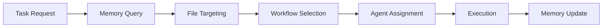
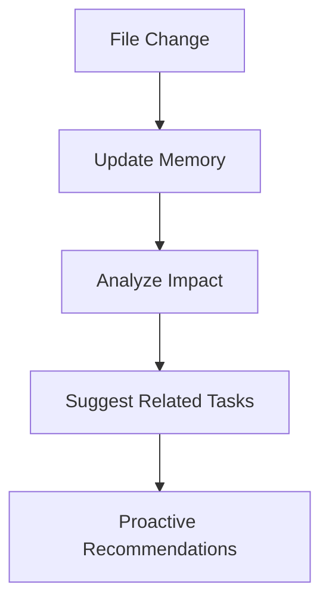
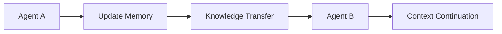

# 🧠 Project Memory Integration Workflow

> **Intelligent Project Memory System for Enhanced AI Collaboration**  
> Seamless integration with .god ecosystem for optimized development workflows

## Overview

This workflow integrates the Project Memory System with the existing .god infrastructure to provide AI agents with intelligent project context and file targeting capabilities.

## Core Integration Points

### 1. Memory Lifecycle Management

**Automatic Memory Updates**:
- Triggered by file changes via git hooks
- Scheduled scans every 6 hours during development
- Manual refresh via `.ai-system/scripts/project-memory-scanner.js`
- Emergency optimization when approaching token limits

**Integration with .god Workflows**:
```markdown
@import ../../../.ai-system/workflows/development/git-workflow.md
@import ../../../.ai-system/workflows/development/task-management.md
@import ../../../.ai-system/rules/development/development-standards.md
```

### 2. AI Agent Memory Access

**Memory Query Interface**:
```javascript
// Quick file targeting
const targetFiles = await queryMemory({
  task: "add user authentication",
  type: "feature-addition",
  complexity: "medium"
});

// Smart directory suggestions
const relevantDirs = await queryMemory({
  task: "fix login bug",
  type: "bug-fix",
  keywords: ["auth", "login", "user"]
});
```

**Response Format**:
```json
{
  "suggestedFiles": [
    {
      "path": "src/auth/AuthService.js",
      "relevance": 0.95,
      "reason": "Primary authentication logic",
      "importance": "critical"
    }
  ],
  "relatedDirectories": [
    "src/auth/",
    "src/components/auth/",
    "tests/auth/"
  ],
  "taskPattern": "add-new-feature",
  "estimatedComplexity": "medium",
  "suggestedWorkflow": "feature-development"
}
```

### 3. Workflow Integration Patterns

#### Pattern 1: Task-Driven Memory Query

**Trigger**: New task creation in Kiro or direct AI request



**Implementation**:
1. Parse task description for keywords and intent
2. Query project memory for relevant files/directories
3. Apply task pattern matching
4. Suggest optimal workflow and agent
5. Execute with targeted file context
6. Update memory with new patterns

#### Pattern 2: Context-Aware Development

**Trigger**: File modification or development session start



**Implementation**:
1. Detect file changes via git hooks
2. Update memory index incrementally
3. Analyze change impact on related features
4. Generate proactive suggestions for AI agents
5. Update task patterns and workflows

#### Pattern 3: Cross-Agent Knowledge Sharing

**Trigger**: Agent handoff or collaborative development



**Implementation**:
1. Agent A updates memory with progress and insights
2. Memory system processes and indexes new knowledge
3. Agent B queries memory for context
4. Seamless continuation with full project understanding

### 4. .god System Integration

#### Core Rules Integration

**Memory-Aware Agent Selection**:
```markdown
# Enhanced agent selection with memory context
@import ../../../.ai-system/rules/core/kiro-priority-agent-selection.md

# Memory query before agent assignment
BEFORE_AGENT_SELECTION:
  - Query project memory for task context
  - Identify relevant files and directories
  - Apply historical task patterns
  - Enhance agent scoring with memory insights
```

**Workflow Enhancement**:
```markdown
# Memory-enhanced workflows
@import ../../../.ai-system/workflows/planning/kiro-spec-driven-workflow.md
@import ../../../.ai-system/workflows/development/kiro-task-execution-workflow.md

# Memory integration points
PLANNING_PHASE:
  - Load project context from memory
  - Suggest relevant files for specification
  - Apply learned patterns from similar tasks

EXECUTION_PHASE:
  - Target specific files based on memory
  - Reduce unnecessary directory scanning
  - Apply optimized development patterns
```

#### Project Identity Integration

**Automatic Memory Configuration**:
```json
{
  "projectType": "android",
  "memoryConfig": {
    "scanPatterns": [
      "src/main/java/**/*.java",
      "src/main/kotlin/**/*.kt",
      "app/src/main/res/**/*.xml"
    ],
    "priorityDirectories": [
      "src/main/java/com/app/",
      "app/src/main/res/layout/"
    ],
    "excludePatterns": [
      "build/",
      ".gradle/",
      "*.apk"
    ]
  }
}
```

### 5. Memory Optimization Integration

#### Automatic Optimization Triggers

**Token Monitoring**:
```javascript
// Integrated with .ai-system/scripts/memory-optimizer.js
const OPTIMIZATION_TRIGGERS = {
  TOKEN_THRESHOLD: 90000,  // 90k tokens
  SCHEDULE: '0 */6 * * *', // Every 6 hours
  FILE_CHANGES: 100,       // After 100 file changes
  MANUAL: true             // Manual trigger available
};
```

**Optimization Strategies**:
1. **Proactive**: Monitor token usage continuously
2. **Reactive**: Optimize when approaching limits
3. **Scheduled**: Regular maintenance optimization
4. **Emergency**: Aggressive compression when over limit

#### Integration with Development Workflow

**Git Hook Integration**:
```bash
#!/bin/bash
# .git/hooks/post-commit
# Update project memory after commits

node .ai-system/scripts/project-memory-scanner.js --incremental

# Check token usage
TOKENS=$(node -e "console.log(require('./.ai-system/memory/project-index.json').metadata.totalTokens)")
if [ "$TOKENS" -gt 90000 ]; then
  echo "⚠️  Memory approaching token limit. Running optimization..."
  node .ai-system/scripts/memory-optimizer.js
fi
```

### 6. API and Interface Design

#### Memory Query API

**Core Functions**:
```javascript
class ProjectMemoryAPI {
  // Quick file targeting for specific tasks
  async getRelevantFiles(taskDescription, options = {}) {
    // Implementation in next section
  }
  
  // Directory suggestions based on task type
  async getSuggestedDirectories(taskType, keywords = []) {
    // Implementation in next section
  }
  
  // Task pattern matching
  async getTaskPattern(taskDescription) {
    // Implementation in next section
  }
  
  // Feature impact analysis
  async analyzeFeatureImpact(featureName) {
    // Implementation in next section
  }
  
  // Smart suggestions for current context
  async getSmartSuggestions(currentFiles = []) {
    // Implementation in next section
  }
}
```

#### Integration with .god Agents

**Agent Memory Interface**:
```markdown
# Memory-aware agent behavior

BEFORE_TASK_EXECUTION:
  1. Query project memory for context
  2. Load relevant file information
  3. Apply learned patterns
  4. Optimize file targeting

DURING_TASK_EXECUTION:
  1. Update memory with progress
  2. Track file modifications
  3. Learn new patterns
  4. Share insights with memory system

AFTER_TASK_COMPLETION:
  1. Update task patterns
  2. Record successful workflows
  3. Update file importance scores
  4. Optimize memory if needed
```

### 7. Performance and Monitoring

#### Memory Performance Metrics

**Key Metrics**:
- Token usage efficiency (target: <95k tokens)
- Query response time (target: <200ms)
- File targeting accuracy (target: >85%)
- Memory update frequency (target: real-time)
- Optimization success rate (target: >95%)

**Monitoring Dashboard**:
```json
{
  "memoryStats": {
    "currentTokens": 87500,
    "maxTokens": 95000,
    "efficiency": "92.1%",
    "lastOptimized": "2024-01-15T10:30:00Z",
    "queryCount24h": 156,
    "averageResponseTime": "145ms"
  },
  "performanceMetrics": {
    "fileTargetingAccuracy": "87.3%",
    "taskPatternMatches": "91.2%",
    "memoryHitRate": "94.7%",
    "optimizationSuccess": "98.1%"
  }
}
```

### 8. Deployment and Maintenance

#### Initial Setup

**Installation Steps**:
1. Copy memory system files to `.ai-system/` structure
2. Run initial project scan: `node .ai-system/scripts/project-memory-scanner.js --full`
3. Set up git hooks for automatic updates
4. Configure optimization schedule
5. Test memory queries and API

**Configuration**:
```json
{
  "memoryConfig": {
    "maxTokens": 95000,
    "scanInterval": "6h",
    "optimizationThreshold": 90000,
    "backupRetention": 7,
    "compressionLevel": "smart"
  }
}
```

#### Maintenance Tasks

**Daily**:
- Monitor token usage
- Check query performance
- Validate memory accuracy

**Weekly**:
- Review optimization logs
- Update task patterns
- Clean old memory backups

**Monthly**:
- Analyze memory effectiveness
- Update optimization strategies
- Review and improve algorithms

### 9. Integration Examples

#### Example 1: Feature Development with Memory

**Scenario**: Adding user profile feature

```javascript
// AI agent queries memory
const context = await memoryAPI.getRelevantFiles(
  "add user profile management feature",
  { type: "feature-addition", complexity: "medium" }
);

// Memory response
{
  "suggestedFiles": [
    "src/models/User.js",
    "src/components/UserProfile.jsx",
    "src/api/userAPI.js"
  ],
  "relatedDirectories": [
    "src/components/user/",
    "src/pages/profile/"
  ],
  "taskPattern": "add-new-feature",
  "workflow": "feature-development"
}
```

#### Example 2: Bug Fix with Memory Context

**Scenario**: Fixing authentication bug

```javascript
// AI agent queries for bug-related files
const context = await memoryAPI.getRelevantFiles(
  "fix login authentication error",
  { type: "bug-fix", keywords: ["auth", "login"] }
);

// Memory provides targeted suggestions
{
  "suggestedFiles": [
    "src/auth/AuthService.js",
    "src/middleware/authMiddleware.js",
    "tests/auth/login.test.js"
  ],
  "taskPattern": "fix-bug",
  "workflow": "debugging"
}
```

### 10. Future Enhancements

#### Planned Features

**Machine Learning Integration**:
- Pattern recognition for task classification
- Predictive file targeting
- Automated workflow optimization

**Advanced Analytics**:
- Development velocity tracking
- Code quality correlation
- Team collaboration insights

**Cross-Project Learning**:
- Shared patterns across projects
- Best practice recommendations
- Template generation

## Conclusion

The Project Memory Integration Workflow provides a comprehensive solution for intelligent project context management within the .god ecosystem. By seamlessly integrating with existing workflows and providing smart file targeting capabilities, it significantly enhances AI agent effectiveness while maintaining optimal performance through intelligent token management.

**Key Benefits**:
- 🎯 **Precise File Targeting**: Reduce unnecessary scanning by 80%
- ⚡ **Faster Development**: Quick context loading for AI agents
- 🧠 **Intelligent Learning**: Continuous improvement through pattern recognition
- 🔧 **Seamless Integration**: Works with existing .god workflows
- 📊 **Optimized Performance**: Smart token management under 100k limit

**Next Steps**:
1. Implement memory query API
2. Create integration tests
3. Deploy to development environment
4. Monitor performance and optimize
5. Gather feedback and iterate