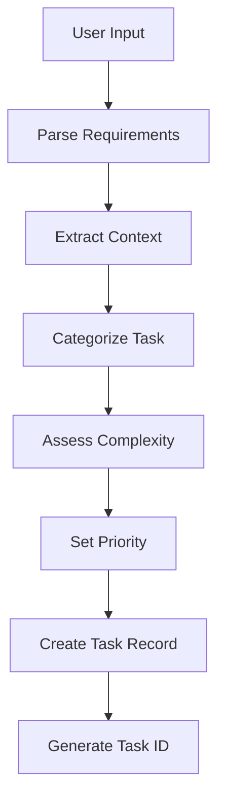
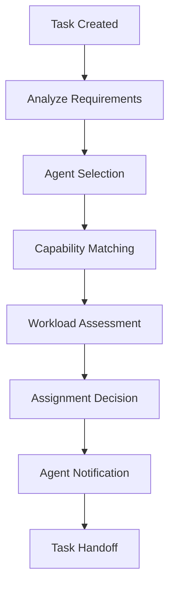
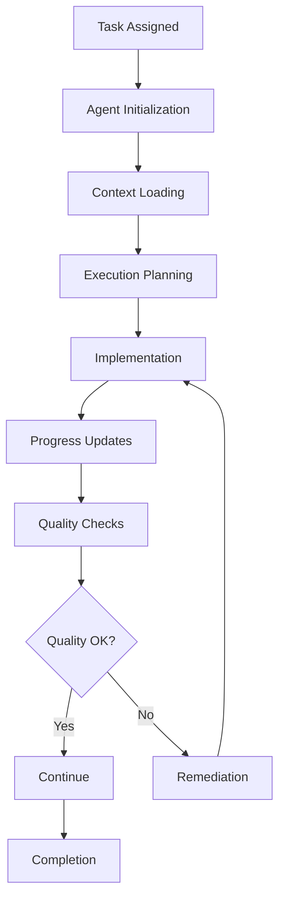
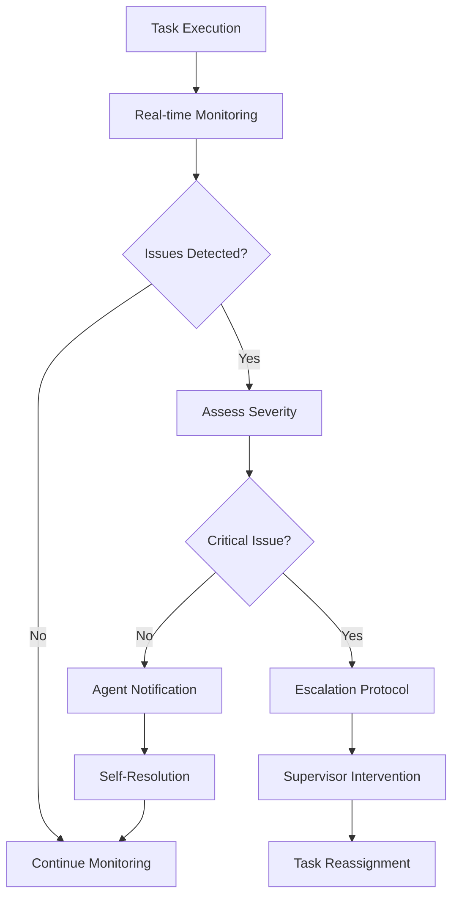
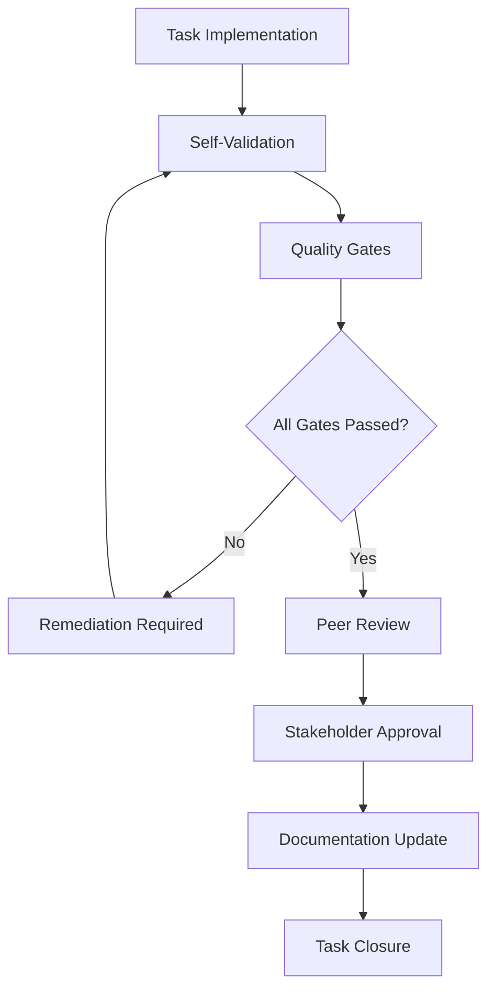

# 📋 Task Management Workflow

> **🎯 Comprehensive Task Lifecycle Management**  
> From creation to completion with intelligent tracking and optimization

---

## 📋 Workflow Overview

### Purpose
Manage the complete lifecycle of development tasks including creation, assignment, execution, monitoring, and completion with intelligent automation and quality assurance.

### Scope
- Task creation and categorization
- Priority and complexity assessment
- Agent assignment and handoff
- Progress tracking and monitoring
- Quality validation and completion
- Performance analytics and optimization

### Success Criteria
- **Task Completion Rate**: >90%
- **Quality Score**: >8.5/10
- **On-time Delivery**: >85%
- **User Satisfaction**: >4.5/5

---

## 🔄 Task Lifecycle

### Phase 1: Task Creation


#### 1.1 Requirement Parsing
```javascript
function parseTaskRequirements(userInput) {
  return {
    // Core requirements
    objective: extractObjective(userInput),
    deliverables: extractDeliverables(userInput),
    constraints: extractConstraints(userInput),
    
    // Context information
    technology: extractTechnology(userInput),
    domain: extractDomain(userInput),
    files: extractFileReferences(userInput),
    
    // Metadata
    urgency: extractUrgency(userInput),
    complexity: assessComplexity(userInput),
    estimatedEffort: estimateEffort(userInput)
  };
}
```

#### 1.2 Task Categorization
```yaml
taskCategories:
  development:
    - feature-implementation
    - bug-fix
    - refactoring
    - optimization
    - testing
  
  design:
    - ui-design
    - ux-research
    - prototyping
    - design-system
  
  infrastructure:
    - deployment
    - configuration
    - monitoring
    - security
  
  documentation:
    - api-docs
    - user-guides
    - technical-specs
    - code-comments
  
  analysis:
    - requirements
    - research
    - investigation
    - planning
```

#### 1.3 Complexity Assessment
```javascript
function assessTaskComplexity(task) {
  let complexity = 0;
  
  // Technical complexity
  complexity += assessTechnicalComplexity(task.technology);
  
  // Scope complexity
  complexity += assessScopeComplexity(task.deliverables);
  
  // Integration complexity
  complexity += assessIntegrationComplexity(task.dependencies);
  
  // Time complexity
  complexity += assessTimeComplexity(task.estimatedEffort);
  
  return {
    score: complexity,
    level: getComplexityLevel(complexity),
    factors: getComplexityFactors(task)
  };
}

function getComplexityLevel(score) {
  if (score <= 3) return 'simple';
  if (score <= 6) return 'moderate';
  if (score <= 8) return 'complex';
  return 'expert';
}
```

#### 1.4 Priority Matrix
```javascript
const priorityMatrix = {
  critical: {
    urgency: 'high',
    impact: 'high',
    sla: '2 hours',
    escalation: 'immediate'
  },
  high: {
    urgency: 'high',
    impact: 'medium',
    sla: '4 hours',
    escalation: '1 hour'
  },
  medium: {
    urgency: 'medium',
    impact: 'medium',
    sla: '1 day',
    escalation: '4 hours'
  },
  low: {
    urgency: 'low',
    impact: 'low',
    sla: '3 days',
    escalation: '1 day'
  }
};
```

### Phase 2: Task Assignment


#### 2.1 Agent Selection Criteria
```javascript
function selectOptimalAgent(task) {
  const candidates = getEligibleAgents(task);
  
  return candidates
    .map(agent => ({
      agent,
      score: calculateAgentScore(agent, task)
    }))
    .sort((a, b) => b.score - a.score)
    .map(item => item.agent)[0];
}

function calculateAgentScore(agent, task) {
  return (
    agent.expertiseMatch(task) * 0.4 +
    agent.availabilityScore() * 0.3 +
    agent.performanceHistory() * 0.2 +
    agent.workloadCapacity() * 0.1
  );
}
```

#### 2.2 Workload Balancing
```javascript
class WorkloadManager {
  constructor() {
    this.agentWorkloads = new Map();
    this.maxConcurrentTasks = 3;
  }
  
  canAssignTask(agentId, taskComplexity) {
    const currentWorkload = this.agentWorkloads.get(agentId) || [];
    const totalComplexity = currentWorkload.reduce((sum, task) => 
      sum + task.complexity, 0
    );
    
    return (
      currentWorkload.length < this.maxConcurrentTasks &&
      totalComplexity + taskComplexity <= 10
    );
  }
  
  assignTask(agentId, task) {
    if (!this.canAssignTask(agentId, task.complexity)) {
      throw new Error('Agent workload capacity exceeded');
    }
    
    const workload = this.agentWorkloads.get(agentId) || [];
    workload.push(task);
    this.agentWorkloads.set(agentId, workload);
  }
}
```

### Phase 3: Task Execution


#### 3.1 Execution Context
```javascript
class TaskExecutionContext {
  constructor(task, agent) {
    this.task = task;
    this.agent = agent;
    this.startTime = Date.now();
    this.checkpoints = [];
    this.artifacts = [];
    this.metrics = new TaskMetrics();
  }
  
  addCheckpoint(description, status) {
    this.checkpoints.push({
      timestamp: Date.now(),
      description,
      status,
      duration: Date.now() - this.startTime
    });
  }
  
  addArtifact(type, path, metadata = {}) {
    this.artifacts.push({
      type,
      path,
      metadata,
      timestamp: Date.now()
    });
  }
}
```

#### 3.2 Progress Tracking
```javascript
class ProgressTracker {
  constructor(taskId) {
    this.taskId = taskId;
    this.milestones = [];
    this.currentPhase = 'initialization';
    this.completionPercentage = 0;
  }
  
  updateProgress(phase, percentage, details) {
    this.currentPhase = phase;
    this.completionPercentage = percentage;
    
    this.milestones.push({
      phase,
      percentage,
      details,
      timestamp: Date.now()
    });
    
    this.notifyStakeholders();
  }
  
  notifyStakeholders() {
    // Send progress updates to interested parties
    EventBus.emit('task-progress', {
      taskId: this.taskId,
      phase: this.currentPhase,
      completion: this.completionPercentage
    });
  }
}
```

#### 3.3 Quality Gates
```javascript
const qualityGates = {
  codeQuality: {
    checks: ['syntax', 'style', 'complexity', 'security'],
    threshold: 8.0,
    blocking: true
  },
  
  functionality: {
    checks: ['unit-tests', 'integration-tests', 'manual-testing'],
    threshold: 9.0,
    blocking: true
  },
  
  performance: {
    checks: ['load-time', 'memory-usage', 'cpu-usage'],
    threshold: 7.5,
    blocking: false
  },
  
  documentation: {
    checks: ['code-comments', 'api-docs', 'user-docs'],
    threshold: 7.0,
    blocking: false
  }
};

function validateQualityGates(task, artifacts) {
  const results = {};
  
  for (const [gateName, gate] of Object.entries(qualityGates)) {
    const score = evaluateQualityGate(gate, artifacts);
    results[gateName] = {
      score,
      passed: score >= gate.threshold,
      blocking: gate.blocking
    };
  }
  
  return results;
}
```

### Phase 4: Monitoring & Escalation


#### 4.1 Monitoring Metrics
```javascript
class TaskMonitor {
  constructor(taskId) {
    this.taskId = taskId;
    this.metrics = {
      performance: new PerformanceMetrics(),
      quality: new QualityMetrics(),
      progress: new ProgressMetrics(),
      resource: new ResourceMetrics()
    };
    this.alerts = [];
  }
  
  checkHealth() {
    const health = {
      performance: this.metrics.performance.getScore(),
      quality: this.metrics.quality.getScore(),
      progress: this.metrics.progress.getScore(),
      resource: this.metrics.resource.getScore()
    };
    
    const overallHealth = Object.values(health).reduce((sum, score) => 
      sum + score, 0
    ) / Object.keys(health).length;
    
    if (overallHealth < 7.0) {
      this.triggerAlert('health-degradation', health);
    }
    
    return health;
  }
}
```

#### 4.2 Escalation Rules
```yaml
escalationRules:
  performance:
    - trigger: "response_time > 10s"
      action: "notify_agent"
      severity: "medium"
    
    - trigger: "error_rate > 5%"
      action: "escalate_supervisor"
      severity: "high"
  
  quality:
    - trigger: "code_quality < 6.0"
      action: "request_review"
      severity: "medium"
    
    - trigger: "test_coverage < 70%"
      action: "block_completion"
      severity: "high"
  
  timeline:
    - trigger: "progress_delay > 25%"
      action: "notify_stakeholders"
      severity: "medium"
    
    - trigger: "deadline_risk > 80%"
      action: "escalate_manager"
      severity: "critical"
```

### Phase 5: Completion & Validation


#### 5.1 Completion Checklist
```javascript
const completionChecklist = {
  implementation: {
    codeComplete: false,
    testsWritten: false,
    documentationUpdated: false,
    codeReviewed: false
  },
  
  quality: {
    qualityGatesPassed: false,
    performanceValidated: false,
    securityChecked: false,
    accessibilityValidated: false
  },
  
  delivery: {
    artifactsDelivered: false,
    stakeholderApproval: false,
    deploymentReady: false,
    handoverComplete: false
  }
};

function validateCompletion(task) {
  const validation = {};
  
  for (const [category, checks] of Object.entries(completionChecklist)) {
    validation[category] = validateCategory(task, checks);
  }
  
  const isComplete = Object.values(validation).every(category => 
    Object.values(category).every(check => check === true)
  );
  
  return { isComplete, validation };
}
```

#### 5.2 Deliverable Validation
```javascript
class DeliverableValidator {
  constructor(task) {
    this.task = task;
    this.validators = this.getValidators(task.type);
  }
  
  async validate() {
    const results = {};
    
    for (const validator of this.validators) {
      try {
        results[validator.name] = await validator.validate(this.task);
      } catch (error) {
        results[validator.name] = {
          passed: false,
          error: error.message
        };
      }
    }
    
    return results;
  }
  
  getValidators(taskType) {
    const validatorMap = {
      'feature-implementation': [
        new FunctionalityValidator(),
        new CodeQualityValidator(),
        new TestCoverageValidator()
      ],
      'bug-fix': [
        new RegressionValidator(),
        new FixVerificationValidator()
      ],
      'ui-design': [
        new DesignConsistencyValidator(),
        new AccessibilityValidator()
      ]
    };
    
    return validatorMap[taskType] || [];
  }
}
```

---

## 📊 Task Analytics

### Performance Metrics
```javascript
class TaskAnalytics {
  constructor() {
    this.metrics = {
      completion: new CompletionMetrics(),
      quality: new QualityMetrics(),
      efficiency: new EfficiencyMetrics(),
      satisfaction: new SatisfactionMetrics()
    };
  }
  
  generateReport(timeframe = '30d') {
    return {
      summary: this.getSummaryMetrics(timeframe),
      trends: this.getTrendAnalysis(timeframe),
      insights: this.getInsights(timeframe),
      recommendations: this.getRecommendations(timeframe)
    };
  }
  
  getSummaryMetrics(timeframe) {
    return {
      totalTasks: this.metrics.completion.getTotalTasks(timeframe),
      completionRate: this.metrics.completion.getCompletionRate(timeframe),
      averageQuality: this.metrics.quality.getAverageScore(timeframe),
      averageEfficiency: this.metrics.efficiency.getAverageScore(timeframe),
      userSatisfaction: this.metrics.satisfaction.getAverageRating(timeframe)
    };
  }
}
```

### Trend Analysis
```javascript
function analyzeTrends(tasks, timeframe) {
  const trends = {
    completion: analyzeCompletionTrend(tasks),
    quality: analyzeQualityTrend(tasks),
    complexity: analyzeComplexityTrend(tasks),
    agent: analyzeAgentPerformance(tasks)
  };
  
  return {
    trends,
    predictions: generatePredictions(trends),
    alerts: identifyAnomalies(trends)
  };
}
```

---

## 🔧 Configuration

### Task Management Settings
```yaml
taskManagement:
  # Creation settings
  autoAssignment: true
  complexityThreshold: 8
  priorityEscalation: true
  
  # Execution settings
  maxConcurrentTasks: 3
  progressUpdateInterval: 15m
  qualityGateEnforcement: true
  
  # Monitoring settings
  realTimeMonitoring: true
  alertThresholds:
    performance: 7.0
    quality: 8.0
    progress: 75
  
  # Completion settings
  peerReviewRequired: true
  stakeholderApproval: true
  documentationMandatory: true
```

### Integration Points
```javascript
const integrations = {
  // Project management
  jira: new JiraIntegration(),
  asana: new AsanaIntegration(),
  
  // Communication
  slack: new SlackIntegration(),
  teams: new TeamsIntegration(),
  
  // Development tools
  github: new GitHubIntegration(),
  gitlab: new GitLabIntegration(),
  
  // Quality tools
  sonarqube: new SonarQubeIntegration(),
  codeclimate: new CodeClimateIntegration()
};
```

---

## 🚀 Continuous Improvement

### Learning Algorithm
```javascript
class TaskLearningSystem {
  constructor() {
    this.patterns = new PatternRecognition();
    this.optimizer = new TaskOptimizer();
    this.predictor = new TaskPredictor();
  }
  
  learn(completedTasks) {
    // Identify successful patterns
    const successPatterns = this.patterns.identifySuccessPatterns(completedTasks);
    
    // Optimize task assignment
    this.optimizer.updateAssignmentRules(successPatterns);
    
    // Improve time estimation
    this.predictor.updateEstimationModel(completedTasks);
    
    // Enhance quality prediction
    this.predictor.updateQualityModel(completedTasks);
  }
}
```

### Feedback Integration
```javascript
function processFeedback(taskId, feedback) {
  const task = getTask(taskId);
  
  // Update agent performance metrics
  updateAgentMetrics(task.assignedAgent, feedback);
  
  // Adjust complexity assessment
  adjustComplexityModel(task, feedback.actualComplexity);
  
  // Improve time estimation
  updateTimeEstimation(task, feedback.actualDuration);
  
  // Enhance quality prediction
  updateQualityPrediction(task, feedback.qualityRating);
}
```

---

**📋 Comprehensive task management system ensuring efficient execution, high quality delivery, and continuous optimization.**