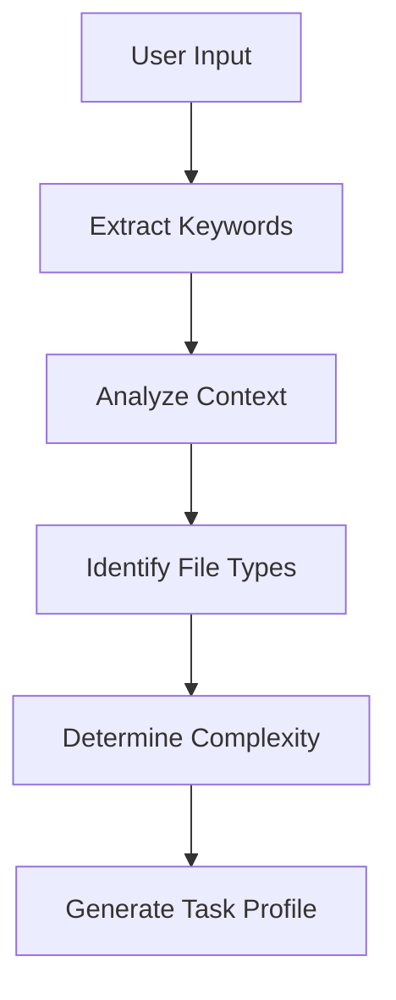
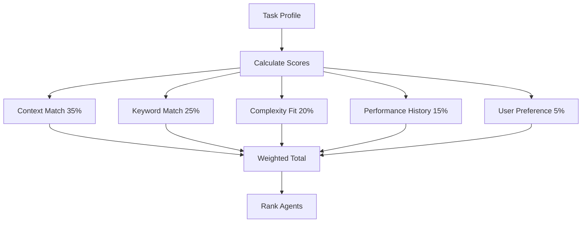
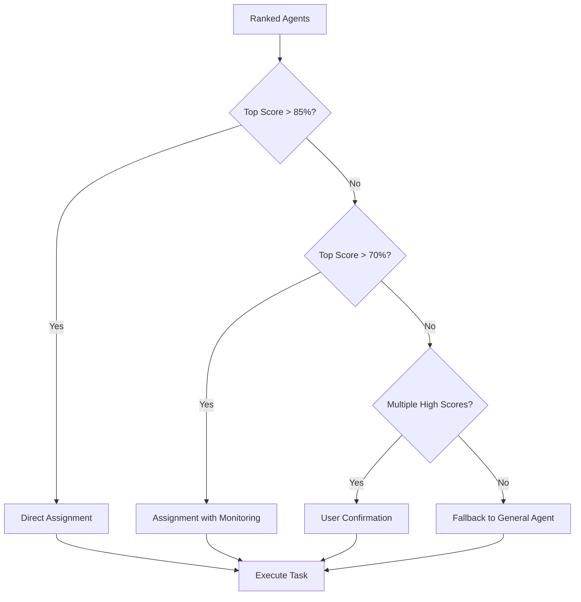
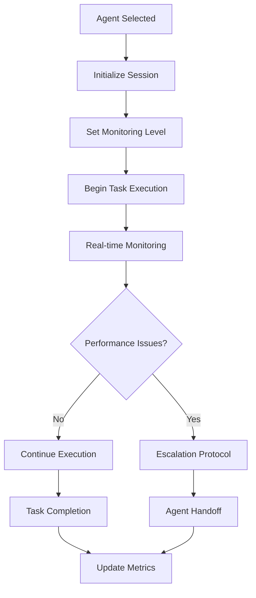

# 🤖 Agent Selection Workflow

> **🎯 Intelligent Agent Selection System**  
> Multi-factor scoring algorithm for optimal agent assignment

---

## 📋 Workflow Overview

### Purpose
Automatically select the most suitable specialized agent based on task requirements, context analysis, and performance metrics.

### Scope
- Task analysis and categorization
- Agent capability matching
- Performance-based selection
- Context-aware decision making
- Fallback and escalation handling

### Success Criteria
- **Selection Accuracy**: >90%
- **Response Time**: <2 seconds
- **User Satisfaction**: >4.5/5
- **Task Completion Rate**: >85%

---

## 🔄 Selection Process

### Phase 1: Input Analysis


#### 1.1 Keyword Extraction
- **Primary Keywords**: Direct technology mentions (react, flutter, api)
- **Secondary Keywords**: Domain-specific terms (mobile, frontend, database)
- **Context Keywords**: Action verbs (create, debug, optimize, test)

#### 1.2 Context Analysis
- **Project Type**: Web, mobile, desktop, API, data science
- **Development Stage**: Planning, development, testing, deployment
- **Complexity Level**: Simple, moderate, complex, enterprise
- **Time Sensitivity**: Low, medium, high, critical

#### 1.3 File Type Detection
```javascript
const fileTypeMapping = {
  // Frontend
  '.jsx': ['frontend-developer', 'fullstack-developer'],
  '.tsx': ['frontend-developer', 'fullstack-developer'],
  '.vue': ['frontend-developer'],
  '.svelte': ['frontend-developer'],
  
  // Mobile
  '.dart': ['mobile-developer', 'flutter-developer'],
  'pubspec.yaml': ['mobile-developer', 'flutter-developer'],
  '.swift': ['ios-developer', 'mobile-developer'],
  '.kt': ['android-developer', 'mobile-developer'],
  
  // Backend
  '.py': ['backend-developer', 'data-scientist'],
  '.js': ['backend-developer', 'fullstack-developer'],
  '.php': ['backend-developer'],
  '.go': ['backend-developer'],
  
  // Database
  '.sql': ['database-administrator', 'backend-developer'],
  'schema.prisma': ['database-administrator', 'fullstack-developer'],
  
  // DevOps
  'Dockerfile': ['devops-engineer'],
  'docker-compose.yml': ['devops-engineer'],
  '.tf': ['devops-engineer'],
  
  // Design
  '.fig': ['ui-ux-designer'],
  '.sketch': ['ui-ux-designer'],
  'design-system/': ['ui-ux-designer'],
  
  // Testing
  '.test.js': ['qa-tester'],
  '.spec.ts': ['qa-tester'],
  'cypress/': ['qa-tester'],
  
  // Security
  'security/': ['security-specialist'],
  '.env.example': ['security-specialist', 'devops-engineer']
};
```

### Phase 2: Agent Scoring


#### 2.1 Context Matching (35%)
```javascript
function calculateContextScore(agent, taskContext) {
  let score = 0;
  
  // Project type alignment
  if (agent.primaryDomains.includes(taskContext.projectType)) {
    score += 40;
  } else if (agent.secondaryDomains.includes(taskContext.projectType)) {
    score += 25;
  }
  
  // Development stage fit
  if (agent.stageExpertise.includes(taskContext.stage)) {
    score += 30;
  }
  
  // Complexity handling
  if (taskContext.complexity <= agent.maxComplexity) {
    score += 30;
  } else {
    score -= 20; // Penalty for complexity mismatch
  }
  
  return Math.min(score, 100);
}
```

#### 2.2 Keyword Matching (25%)
```javascript
function calculateKeywordScore(agent, keywords) {
  let score = 0;
  const totalKeywords = keywords.length;
  
  keywords.forEach(keyword => {
    if (agent.primaryKeywords.includes(keyword)) {
      score += 10;
    } else if (agent.secondaryKeywords.includes(keyword)) {
      score += 6;
    } else if (agent.contextKeywords.includes(keyword)) {
      score += 3;
    }
  });
  
  return Math.min((score / totalKeywords) * 10, 100);
}
```

#### 2.3 Complexity Assessment (20%)
```javascript
function calculateComplexityScore(agent, taskComplexity) {
  const agentCapability = agent.complexityRating;
  
  if (taskComplexity <= agentCapability) {
    return 100; // Perfect fit
  } else if (taskComplexity <= agentCapability + 1) {
    return 70; // Manageable stretch
  } else {
    return 30; // Significant challenge
  }
}
```

#### 2.4 Performance History (15%)
```javascript
function calculatePerformanceScore(agent) {
  const metrics = agent.performanceMetrics;
  
  return (
    metrics.successRate * 0.4 +
    metrics.qualityScore * 0.3 +
    metrics.userSatisfaction * 0.2 +
    metrics.responseTime * 0.1
  );
}
```

#### 2.5 User Preference (5%)
```javascript
function calculatePreferenceScore(agent, userHistory) {
  const recentSelections = userHistory.last10Selections;
  const agentFrequency = recentSelections.filter(s => s === agent.id).length;
  
  return Math.min(agentFrequency * 20, 100);
}
```

### Phase 3: Decision Making


#### 3.1 Confidence Thresholds
- **High Confidence (>85%)**: Automatic assignment
- **Medium Confidence (70-85%)**: Assignment with enhanced monitoring
- **Low Confidence (<70%)**: User confirmation or fallback

#### 3.2 Tie-Breaking Rules
1. **Performance History**: Higher success rate wins
2. **Specialization Depth**: More specialized agent preferred
3. **Recent Activity**: More recently active agent
4. **User Preference**: Historical user selections

### Phase 4: Assignment & Monitoring


#### 4.1 Monitoring Levels
- **Standard**: Basic progress tracking
- **Enhanced**: Detailed performance monitoring
- **Intensive**: Real-time quality assessment

#### 4.2 Escalation Triggers
- Task complexity exceeds agent capability
- Performance metrics drop below threshold
- User expresses dissatisfaction
- Technical blockers encountered

---

## 🎯 Agent Profiles

### Frontend Developer
```yaml
id: frontend-developer
confidenceThreshold: 88%
primaryDomains: [web, spa, pwa]
secondaryDomains: [mobile-web, desktop-web]
primaryKeywords: [react, vue, angular, typescript, css, html]
secondaryKeywords: [frontend, ui, component, responsive]
contextKeywords: [build, optimize, style, animate]
complexityRating: 8
stageExpertise: [development, testing, optimization]
performanceMetrics:
  successRate: 88%
  qualityScore: 8.8
  userSatisfaction: 4.4
  responseTime: 3.2s
```

### Mobile Developer
```yaml
id: mobile-developer
confidenceThreshold: 86%
primaryDomains: [mobile, cross-platform]
secondaryDomains: [web, desktop]
primaryKeywords: [flutter, react-native, dart, mobile]
secondaryKeywords: [app, ios, android, native]
contextKeywords: [build, deploy, publish, optimize]
complexityRating: 8
stageExpertise: [development, testing, deployment]
performanceMetrics:
  successRate: 86%
  qualityScore: 8.8
  userSatisfaction: 4.5
  responseTime: 4.1s
```

### Backend Developer
```yaml
id: backend-developer
confidenceThreshold: 87%
primaryDomains: [api, server, microservices]
secondaryDomains: [database, cloud]
primaryKeywords: [nodejs, python, api, server, database]
secondaryKeywords: [backend, microservice, rest, graphql]
contextKeywords: [deploy, scale, optimize, secure]
complexityRating: 9
stageExpertise: [architecture, development, deployment]
performanceMetrics:
  successRate: 87%
  qualityScore: 8.7
  userSatisfaction: 4.3
  responseTime: 3.8s
```

---

## 🚀 YOLO Mode

### Fast-Track Selection
For urgent tasks requiring immediate action:

```javascript
function yoloModeSelection(taskProfile) {
  // Simplified scoring with reduced thresholds
  const candidates = agents.filter(agent => 
    agent.primaryKeywords.some(keyword => 
      taskProfile.keywords.includes(keyword)
    )
  );
  
  if (candidates.length === 0) {
    return 'fullstack-developer'; // Default fallback
  }
  
  // Quick performance-based selection
  return candidates.reduce((best, current) => 
    current.performanceMetrics.successRate > best.performanceMetrics.successRate 
      ? current : best
  );
}
```

### YOLO Triggers
- Keywords: "yolo", "quick", "fast", "asap", "urgent"
- Time constraints: Explicit deadlines
- Simple tasks: Low complexity rating
- User preference: Historical YOLO usage

---

## 📊 Performance Tracking

### Real-time Metrics
```javascript
const performanceTracker = {
  // Selection accuracy
  trackSelection(agentId, taskId, confidence) {
    metrics.selections.push({
      agentId,
      taskId,
      confidence,
      timestamp: Date.now()
    });
  },
  
  // Task completion
  trackCompletion(taskId, success, quality, duration) {
    metrics.completions.push({
      taskId,
      success,
      quality,
      duration,
      timestamp: Date.now()
    });
  },
  
  // User feedback
  trackFeedback(taskId, rating, comments) {
    metrics.feedback.push({
      taskId,
      rating,
      comments,
      timestamp: Date.now()
    });
  }
};
```

### Analytics Dashboard
- **Selection Accuracy**: Percentage of correct agent selections
- **Performance Trends**: Agent performance over time
- **User Satisfaction**: Feedback scores and trends
- **Efficiency Metrics**: Response time and completion rates

---

## 🔧 Configuration

### Tuning Parameters
```yaml
selectionConfig:
  # Scoring weights
  contextWeight: 0.35
  keywordWeight: 0.25
  complexityWeight: 0.20
  performanceWeight: 0.15
  preferenceWeight: 0.05
  
  # Confidence thresholds
  highConfidence: 85
  mediumConfidence: 70
  lowConfidence: 50
  
  # Performance tracking
  metricsRetention: 30d
  feedbackRequired: true
  realTimeMonitoring: true
  
  # YOLO mode
  yoloEnabled: true
  yoloThreshold: 60
  yoloFallback: 'fullstack-developer'
```

### Agent Registration
```javascript
function registerAgent(agentConfig) {
  // Validate agent configuration
  validateAgentConfig(agentConfig);
  
  // Register with selection system
  agentRegistry.add(agentConfig);
  
  // Initialize performance tracking
  performanceTracker.initializeAgent(agentConfig.id);
  
  // Update selection algorithms
  updateSelectionWeights();
}
```

---

## 🚀 Continuous Improvement

### Learning Algorithm
```javascript
function updateAgentScores() {
  const recentPerformance = getRecentPerformance(30); // Last 30 days
  
  agents.forEach(agent => {
    const agentMetrics = recentPerformance.filter(m => m.agentId === agent.id);
    
    // Update success rate
    agent.performanceMetrics.successRate = calculateSuccessRate(agentMetrics);
    
    // Update quality score
    agent.performanceMetrics.qualityScore = calculateQualityScore(agentMetrics);
    
    // Update user satisfaction
    agent.performanceMetrics.userSatisfaction = calculateSatisfaction(agentMetrics);
    
    // Adjust confidence threshold
    adjustConfidenceThreshold(agent);
  });
}
```

### Feedback Loop
1. **Performance Monitoring**: Continuous tracking of agent performance
2. **User Feedback**: Regular collection of user satisfaction data
3. **Algorithm Tuning**: Automatic adjustment of selection weights
4. **Agent Updates**: Regular updates to agent capabilities and profiles

---

**🤖 Intelligent agent selection system ensuring optimal task-agent matching for maximum productivity and user satisfaction.**