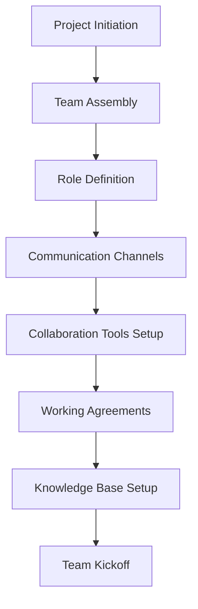
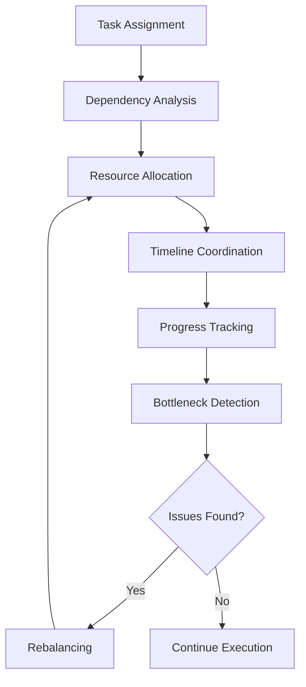
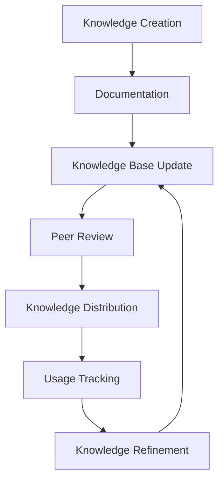
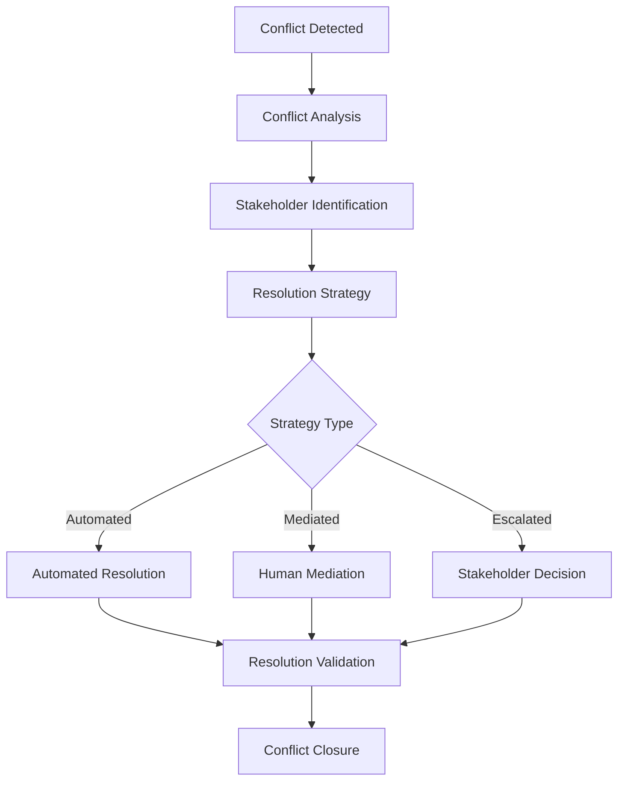
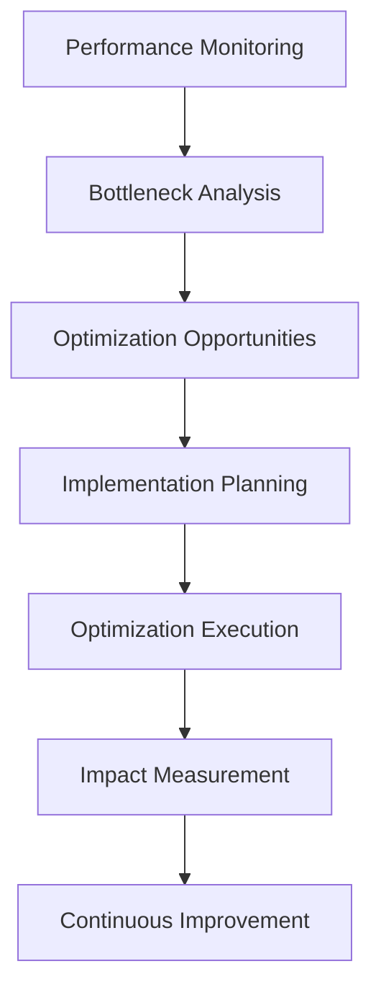

# 🤝 Collaboration Workflow

> **🎯 Intelligent Team Collaboration**  
> Seamless coordination, communication, and knowledge sharing across development teams

---

## 📋 Workflow Overview

### Purpose
Facilitate effective collaboration between team members, agents, and stakeholders through structured communication, knowledge sharing, and coordinated task execution.

### Scope
- Cross-functional team coordination
- Agent-to-agent collaboration
- Human-AI collaboration patterns
- Knowledge sharing and documentation
- Conflict resolution and consensus building
- Real-time communication and updates

### Success Criteria
- **Team Productivity**: >90% task completion rate
- **Communication Efficiency**: <2 hours response time
- **Knowledge Retention**: >85% documentation coverage
- **Conflict Resolution**: <24 hours resolution time
- **Stakeholder Satisfaction**: >4.5/5 rating

---

## 🔄 Collaboration Framework

### Phase 1: Team Formation & Setup


#### 1.1 Team Assembly
```javascript
class TeamAssembler {
  constructor() {
    this.agentRegistry = new AgentRegistry();
    this.skillMatcher = new SkillMatcher();
    this.workloadBalancer = new WorkloadBalancer();
  }
  
  async assembleTeam(projectRequirements) {
    const requiredSkills = this.extractSkills(projectRequirements);
    const availableAgents = await this.agentRegistry.getAvailableAgents();
    
    const teamComposition = {
      lead: this.selectTeamLead(availableAgents, requiredSkills),
      specialists: this.selectSpecialists(availableAgents, requiredSkills),
      support: this.selectSupportAgents(availableAgents, requiredSkills)
    };
    
    // Validate team composition
    const validation = this.validateTeamComposition(teamComposition, requiredSkills);
    if (!validation.valid) {
      throw new Error(`Team composition invalid: ${validation.issues.join(', ')}`);
    }
    
    return {
      team: teamComposition,
      coverage: this.calculateSkillCoverage(teamComposition, requiredSkills),
      workloadDistribution: this.calculateWorkloadDistribution(teamComposition)
    };
  }
  
  selectTeamLead(agents, skills) {
    return agents
      .filter(agent => agent.capabilities.leadership > 8)
      .filter(agent => this.hasRequiredSkills(agent, skills.core))
      .sort((a, b) => b.performance.overall - a.performance.overall)[0];
  }
}
```

#### 1.2 Communication Channels
```yaml
communicationChannels:
  primary:
    - type: "slack"
      channels:
        - name: "#project-general"
          purpose: "General project discussions"
          members: "all"
        
        - name: "#development"
          purpose: "Technical discussions and code reviews"
          members: "developers"
        
        - name: "#alerts"
          purpose: "System alerts and notifications"
          members: "leads"
  
  secondary:
    - type: "email"
      purpose: "Formal communications and reports"
      frequency: "daily"
    
    - type: "video_calls"
      purpose: "Complex discussions and planning"
      schedule: "as_needed"
  
  emergency:
    - type: "phone"
      purpose: "Critical issues and escalations"
      availability: "24/7"
```

#### 1.3 Working Agreements
```javascript
class WorkingAgreements {
  constructor() {
    this.agreements = {
      communication: new CommunicationAgreements(),
      codeReview: new CodeReviewAgreements(),
      meetings: new MeetingAgreements(),
      documentation: new DocumentationAgreements(),
      conflictResolution: new ConflictResolutionAgreements()
    };
  }
  
  generateAgreements(team, project) {
    return {
      communication: {
        responseTime: {
          urgent: "15 minutes",
          normal: "2 hours",
          lowPriority: "24 hours"
        },
        channels: {
          technical: "#development",
          general: "#project-general",
          urgent: "direct message"
        },
        statusUpdates: {
          frequency: "daily",
          format: "standup",
          time: "09:00 UTC"
        }
      },
      
      codeReview: {
        requiredReviewers: 2,
        maxReviewTime: "24 hours",
        approvalCriteria: [
          "functionality verified",
          "tests passing",
          "documentation updated",
          "security reviewed"
        ]
      },
      
      conflictResolution: {
        escalationPath: [
          "direct discussion",
          "team lead mediation",
          "project manager involvement",
          "stakeholder decision"
        ],
        timeouts: {
          directDiscussion: "2 hours",
          teamLeadMediation: "8 hours",
          projectManagerInvolvement: "24 hours"
        }
      }
    };
  }
}
```

### Phase 2: Task Coordination


#### 2.1 Task Coordination Engine
```javascript
class TaskCoordinator {
  constructor() {
    this.dependencyGraph = new DependencyGraph();
    this.resourceManager = new ResourceManager();
    this.progressTracker = new ProgressTracker();
  }
  
  async coordinateTasks(tasks, team) {
    // Build dependency graph
    const dependencies = this.dependencyGraph.build(tasks);
    
    // Optimize task assignment
    const assignment = await this.optimizeAssignment(tasks, team, dependencies);
    
    // Create execution plan
    const executionPlan = this.createExecutionPlan(assignment, dependencies);
    
    // Start coordination
    return await this.executeCoordination(executionPlan);
  }
  
  async optimizeAssignment(tasks, team, dependencies) {
    const assignment = new Map();
    
    // Sort tasks by priority and dependencies
    const sortedTasks = this.topologicalSort(tasks, dependencies);
    
    for (const task of sortedTasks) {
      const bestAgent = await this.findBestAgent(task, team, assignment);
      
      if (!bestAgent) {
        throw new Error(`No suitable agent found for task: ${task.id}`);
      }
      
      assignment.set(task.id, {
        agent: bestAgent,
        estimatedStart: this.calculateStartTime(task, dependencies, assignment),
        estimatedDuration: this.estimateDuration(task, bestAgent),
        dependencies: dependencies.get(task.id) || []
      });
    }
    
    return assignment;
  }
  
  async findBestAgent(task, team, currentAssignment) {
    const candidates = team.filter(agent => 
      this.canHandleTask(agent, task) && 
      this.isAvailable(agent, task, currentAssignment)
    );
    
    if (candidates.length === 0) {
      return null;
    }
    
    // Score candidates
    const scoredCandidates = candidates.map(agent => ({
      agent,
      score: this.scoreAgent(agent, task, currentAssignment)
    }));
    
    // Return best candidate
    return scoredCandidates
      .sort((a, b) => b.score - a.score)[0].agent;
  }
}
```

#### 2.2 Real-time Progress Tracking
```javascript
class ProgressTracker {
  constructor() {
    this.eventBus = new EventBus();
    this.metricsCollector = new MetricsCollector();
    this.alertManager = new AlertManager();
  }
  
  startTracking(executionPlan) {
    const trackingSession = {
      planId: executionPlan.id,
      startTime: Date.now(),
      tasks: new Map(),
      metrics: {},
      alerts: []
    };
    
    // Subscribe to task events
    this.eventBus.subscribe('task.started', (event) => {
      this.handleTaskStarted(trackingSession, event);
    });
    
    this.eventBus.subscribe('task.progress', (event) => {
      this.handleTaskProgress(trackingSession, event);
    });
    
    this.eventBus.subscribe('task.completed', (event) => {
      this.handleTaskCompleted(trackingSession, event);
    });
    
    this.eventBus.subscribe('task.blocked', (event) => {
      this.handleTaskBlocked(trackingSession, event);
    });
    
    return trackingSession;
  }
  
  handleTaskProgress(session, event) {
    const task = session.tasks.get(event.taskId);
    if (!task) return;
    
    task.progress = event.progress;
    task.lastUpdate = Date.now();
    
    // Check for delays
    const delay = this.calculateDelay(task, event);
    if (delay > 0) {
      this.alertManager.createAlert({
        type: 'task_delay',
        taskId: event.taskId,
        delay,
        impact: this.calculateImpact(task, delay)
      });
    }
    
    // Update overall progress
    this.updateOverallProgress(session);
  }
}
```

### Phase 3: Knowledge Sharing


#### 3.1 Knowledge Management System
```javascript
class KnowledgeManager {
  constructor() {
    this.knowledgeBase = new KnowledgeBase();
    this.documentationEngine = new DocumentationEngine();
    this.searchEngine = new SearchEngine();
    this.versionControl = new VersionControl();
  }
  
  async captureKnowledge(source, context) {
    const knowledge = {
      id: this.generateId(),
      source,
      context,
      content: await this.extractKnowledge(source),
      metadata: this.generateMetadata(source, context),
      timestamp: Date.now()
    };
    
    // Process and structure knowledge
    const structuredKnowledge = await this.structureKnowledge(knowledge);
    
    // Store in knowledge base
    await this.knowledgeBase.store(structuredKnowledge);
    
    // Update search index
    await this.searchEngine.index(structuredKnowledge);
    
    // Notify relevant team members
    await this.notifyRelevantMembers(structuredKnowledge);
    
    return structuredKnowledge;
  }
  
  async shareKnowledge(knowledgeId, recipients) {
    const knowledge = await this.knowledgeBase.get(knowledgeId);
    
    if (!knowledge) {
      throw new Error(`Knowledge not found: ${knowledgeId}`);
    }
    
    const sharingPlan = {
      knowledge,
      recipients,
      method: this.determineSharingMethod(knowledge, recipients),
      schedule: this.createSharingSchedule(recipients)
    };
    
    return await this.executeSharingPlan(sharingPlan);
  }
}
```

#### 3.2 Documentation Automation
```javascript
class DocumentationEngine {
  constructor() {
    this.generators = {
      api: new APIDocumentationGenerator(),
      code: new CodeDocumentationGenerator(),
      architecture: new ArchitectureDocumentationGenerator(),
      process: new ProcessDocumentationGenerator()
    };
    this.templates = new DocumentationTemplates();
  }
  
  async generateDocumentation(source, type) {
    const generator = this.generators[type];
    
    if (!generator) {
      throw new Error(`No generator available for type: ${type}`);
    }
    
    const documentation = await generator.generate(source);
    
    // Apply templates and formatting
    const formattedDoc = await this.applyTemplate(documentation, type);
    
    // Validate documentation quality
    const validation = await this.validateDocumentation(formattedDoc);
    
    if (!validation.valid) {
      throw new Error(`Documentation validation failed: ${validation.issues.join(', ')}`);
    }
    
    return formattedDoc;
  }
  
  async validateDocumentation(documentation) {
    const validation = {
      valid: true,
      issues: [],
      score: 0
    };
    
    // Check completeness
    const completeness = this.checkCompleteness(documentation);
    validation.score += completeness.score * 0.4;
    
    if (!completeness.complete) {
      validation.valid = false;
      validation.issues.push(...completeness.issues);
    }
    
    // Check clarity
    const clarity = this.checkClarity(documentation);
    validation.score += clarity.score * 0.3;
    
    // Check accuracy
    const accuracy = this.checkAccuracy(documentation);
    validation.score += accuracy.score * 0.3;
    
    return validation;
  }
}
```

### Phase 4: Conflict Resolution


#### 4.1 Conflict Detection & Resolution
```javascript
class ConflictResolver {
  constructor() {
    this.detector = new ConflictDetector();
    this.analyzer = new ConflictAnalyzer();
    this.mediator = new ConflictMediator();
    this.escalationManager = new EscalationManager();
  }
  
  async resolveConflict(conflict) {
    // Analyze conflict
    const analysis = await this.analyzer.analyze(conflict);
    
    // Determine resolution strategy
    const strategy = this.determineStrategy(analysis);
    
    // Execute resolution
    const resolution = await this.executeResolution(conflict, strategy);
    
    // Validate resolution
    const validation = await this.validateResolution(resolution);
    
    if (!validation.successful) {
      // Escalate if resolution failed
      return await this.escalationManager.escalate(conflict, resolution);
    }
    
    return resolution;
  }
  
  determineStrategy(analysis) {
    const { severity, complexity, stakeholders, impact } = analysis;
    
    if (severity === 'low' && complexity === 'simple') {
      return 'automated';
    }
    
    if (severity === 'medium' && stakeholders.length <= 3) {
      return 'mediated';
    }
    
    if (severity === 'high' || impact === 'critical') {
      return 'escalated';
    }
    
    return 'mediated'; // Default
  }
  
  async executeResolution(conflict, strategy) {
    switch (strategy) {
      case 'automated':
        return await this.executeAutomatedResolution(conflict);
      
      case 'mediated':
        return await this.mediator.mediate(conflict);
      
      case 'escalated':
        return await this.escalationManager.escalate(conflict);
      
      default:
        throw new Error(`Unknown resolution strategy: ${strategy}`);
    }
  }
}
```

#### 4.2 Consensus Building
```javascript
class ConsensusBuilder {
  constructor() {
    this.votingSystem = new VotingSystem();
    this.discussionFacilitator = new DiscussionFacilitator();
    this.decisionTracker = new DecisionTracker();
  }
  
  async buildConsensus(decision, stakeholders) {
    const consensusProcess = {
      decision,
      stakeholders,
      phases: [
        'information_gathering',
        'discussion',
        'proposal_refinement',
        'voting',
        'consensus_validation'
      ],
      currentPhase: 0,
      results: {}
    };
    
    for (const phase of consensusProcess.phases) {
      const phaseResult = await this.executePhase(phase, consensusProcess);
      consensusProcess.results[phase] = phaseResult;
      
      if (!phaseResult.successful) {
        return {
          consensus: false,
          reason: phaseResult.reason,
          process: consensusProcess
        };
      }
    }
    
    return {
      consensus: true,
      decision: consensusProcess.results.voting.finalDecision,
      process: consensusProcess
    };
  }
  
  async executePhase(phase, process) {
    switch (phase) {
      case 'information_gathering':
        return await this.gatherInformation(process);
      
      case 'discussion':
        return await this.discussionFacilitator.facilitate(process);
      
      case 'proposal_refinement':
        return await this.refineProposal(process);
      
      case 'voting':
        return await this.votingSystem.conductVote(process);
      
      case 'consensus_validation':
        return await this.validateConsensus(process);
      
      default:
        throw new Error(`Unknown consensus phase: ${phase}`);
    }
  }
}
```

### Phase 5: Performance Optimization


#### 5.1 Collaboration Analytics
```javascript
class CollaborationAnalytics {
  constructor() {
    this.metricsCollector = new MetricsCollector();
    this.analyzer = new PerformanceAnalyzer();
    this.optimizer = new CollaborationOptimizer();
  }
  
  async analyzeCollaboration(team, timeframe) {
    const metrics = await this.metricsCollector.collect(team, timeframe);
    
    const analysis = {
      communication: this.analyzeCommunication(metrics.communication),
      productivity: this.analyzeProductivity(metrics.productivity),
      knowledge: this.analyzeKnowledgeSharing(metrics.knowledge),
      conflicts: this.analyzeConflicts(metrics.conflicts),
      satisfaction: this.analyzeSatisfaction(metrics.satisfaction)
    };
    
    const insights = this.generateInsights(analysis);
    const recommendations = this.generateRecommendations(insights);
    
    return {
      metrics,
      analysis,
      insights,
      recommendations,
      score: this.calculateOverallScore(analysis)
    };
  }
  
  generateRecommendations(insights) {
    const recommendations = [];
    
    // Communication improvements
    if (insights.communication.responseTime > 4) {
      recommendations.push({
        category: 'communication',
        priority: 'high',
        action: 'Implement automated response acknowledgments',
        expectedImpact: 'Reduce response time by 50%'
      });
    }
    
    // Productivity improvements
    if (insights.productivity.taskCompletionRate < 85) {
      recommendations.push({
        category: 'productivity',
        priority: 'medium',
        action: 'Optimize task assignment algorithm',
        expectedImpact: 'Increase completion rate by 15%'
      });
    }
    
    // Knowledge sharing improvements
    if (insights.knowledge.documentationCoverage < 80) {
      recommendations.push({
        category: 'knowledge',
        priority: 'medium',
        action: 'Implement automated documentation generation',
        expectedImpact: 'Increase documentation coverage by 25%'
      });
    }
    
    return recommendations;
  }
}
```

---

## 📊 Collaboration Metrics

### Key Performance Indicators
```yaml
collaborationKPIs:
  communication:
    - metric: "response_time"
      target: "< 2 hours"
      measurement: "average"
    
    - metric: "message_clarity"
      target: "> 8/10"
      measurement: "AI analysis"
    
    - metric: "information_sharing"
      target: "> 90%"
      measurement: "percentage"
  
  productivity:
    - metric: "task_completion_rate"
      target: "> 90%"
      measurement: "percentage"
    
    - metric: "collaboration_efficiency"
      target: "> 85%"
      measurement: "calculated"
    
    - metric: "knowledge_reuse"
      target: "> 70%"
      measurement: "percentage"
  
  satisfaction:
    - metric: "team_satisfaction"
      target: "> 4.5/5"
      measurement: "survey"
    
    - metric: "stakeholder_satisfaction"
      target: "> 4.0/5"
      measurement: "feedback"
```

---

## 🔧 Configuration

### Collaboration Settings
```yaml
collaborationConfig:
  # Team settings
  team:
    maxSize: 12
    minSize: 3
    optimalSize: 7
    skillOverlapThreshold: 20 # percentage
  
  # Communication settings
  communication:
    channels:
      primary: "slack"
      backup: "email"
      emergency: "phone"
    
    responseTime:
      urgent: 15 # minutes
      normal: 120 # minutes
      lowPriority: 1440 # minutes (24 hours)
    
    statusUpdates:
      frequency: "daily"
      format: "standup"
      duration: 15 # minutes
  
  # Knowledge sharing settings
  knowledge:
    documentationRequired: true
    reviewRequired: true
    retentionPeriod: 365 # days
    searchIndexing: true
  
  # Conflict resolution settings
  conflicts:
    autoDetection: true
    escalationTimeout: 24 # hours
    mediationRequired: true
    resolutionTracking: true
```

---

## 🚀 Continuous Improvement

### Collaboration Evolution
```javascript
class CollaborationEvolution {
  constructor() {
    this.learningEngine = new LearningEngine();
    this.adaptationManager = new AdaptationManager();
    this.feedbackProcessor = new FeedbackProcessor();
  }
  
  async evolveCollaboration(team, performanceData) {
    // Learn from performance data
    const insights = await this.learningEngine.analyze(performanceData);
    
    // Identify improvement opportunities
    const opportunities = this.identifyOpportunities(insights);
    
    // Generate adaptations
    const adaptations = await this.adaptationManager.generateAdaptations(opportunities);
    
    // Implement improvements
    const improvements = await this.implementImprovements(adaptations);
    
    return {
      insights,
      opportunities,
      adaptations,
      improvements,
      expectedImpact: this.calculateExpectedImpact(improvements)
    };
  }
}
```

---

**🤝 Comprehensive collaboration framework enabling seamless teamwork, effective communication, and continuous improvement across all project stakeholders.**