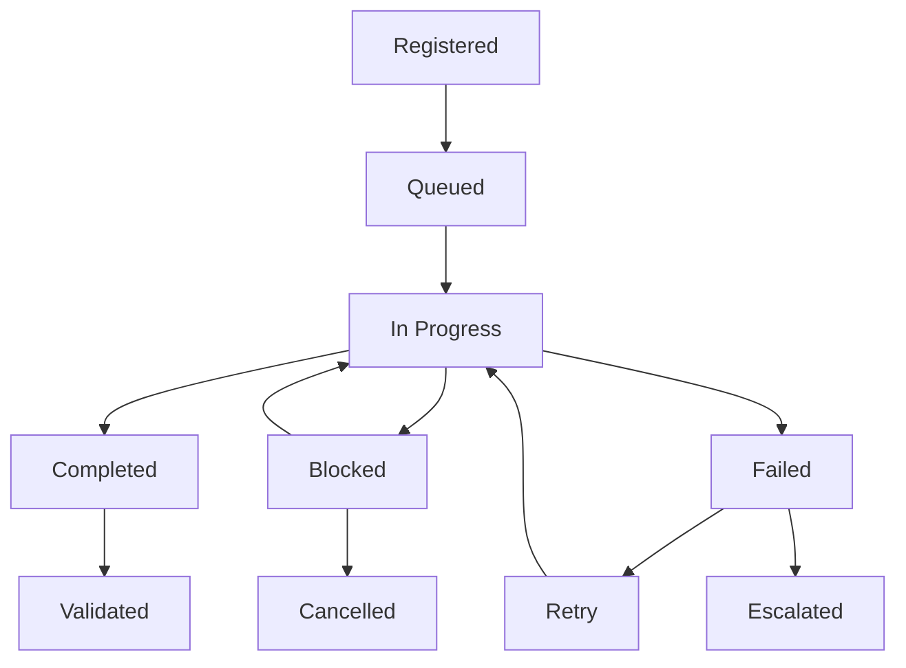

# Task Completion Tracking System with Auto-Reminder

> **🎯 INTELLIGENT TASK COMPLETION MONITORING**  
> Hệ thống theo dõi và nhắc nhở tự động để đảm bảo AI agents không bao giờ quên nhiệm vụ

## System Overview

**Purpose**: Comprehensive task tracking with intelligent reminders and completion validation  
**Method**: Multi-layered monitoring with proactive notifications and blocking mechanisms  
**Scope**: All tasks across .god workflows, agent operations, and user interactions  
**Integration**: Deep integration with project-identity hooks and workflow systems

## 🔴 CORE TRACKING PRINCIPLES

### Zero Task Left Behind Policy

```yaml
Policy: ZERO_TASK_LEFT_BEHIND
Enforcement: MANDATORY
Monitoring: CONTINUOUS
Escalation: AUTOMATIC
```

**Fundamental Rules**:
- ❌ **NO task can be forgotten or abandoned**
- ❌ **NO session can end with incomplete tasks**
- ❌ **NO agent switch without task handoff**
- ❌ **NO silent task failures**
- ✅ **ALL tasks must have explicit completion status**

## Task Lifecycle Management

### 1. Task Registration System

**Automatic Task Detection**:
```python
class TaskRegistrationEngine:
    """
    Automatically detect and register all tasks from multiple sources
    """
    
    def detect_tasks_from_sources(self):
        """Detect tasks from all possible sources"""
        detected_tasks = []
        
        # User explicit requests
        detected_tasks.extend(self.extract_user_requests())
        
        # Workflow-generated tasks
        detected_tasks.extend(self.extract_workflow_tasks())
        
        # Agent-generated subtasks
        detected_tasks.extend(self.extract_agent_subtasks())
        
        # System maintenance tasks
        detected_tasks.extend(self.extract_system_tasks())
        
        # Dependency-driven tasks
        detected_tasks.extend(self.extract_dependency_tasks())
        
        return self.register_all_tasks(detected_tasks)
    
    def register_task(self, task_data):
        """Register a new task with full tracking metadata"""
        task = Task(
            id=generate_unique_task_id(),
            title=task_data.title,
            description=task_data.description,
            priority=self.calculate_priority(task_data),
            estimated_duration=self.estimate_duration(task_data),
            dependencies=self.extract_dependencies(task_data),
            created_at=get_iso_timestamp(),
            created_by=get_current_agent_id(),
            session_id=get_current_session_id(),
            status='registered',
            tracking_metadata=self.generate_tracking_metadata(task_data)
        )
        
        # Register in multiple tracking systems
        self.register_in_project_identity(task)
        self.register_in_workflow_tracker(task)
        self.register_in_reminder_system(task)
        
        return task
```

### 2. Task Status Lifecycle



**Status Definitions**:
- **Registered**: Task detected and logged
- **Queued**: Ready for execution, waiting for resources
- **In Progress**: Actively being worked on
- **Blocked**: Cannot proceed due to dependencies
- **Completed**: Work finished, pending validation
- **Validated**: Completion confirmed and accepted
- **Failed**: Execution failed, requires intervention
- **Cancelled**: Explicitly cancelled by user/system
- **Escalated**: Failed multiple times, needs human intervention

### 3. Intelligent Task Prioritization

```python
class TaskPrioritizationEngine:
    """
    Dynamic task prioritization based on multiple factors
    """
    
    def calculate_priority_score(self, task):
        """Calculate dynamic priority score"""
        score = 0
        
        # User urgency factor (40%)
        score += self.get_user_urgency_score(task) * 0.4
        
        # Dependency impact factor (25%)
        score += self.get_dependency_impact_score(task) * 0.25
        
        # Time sensitivity factor (20%)
        score += self.get_time_sensitivity_score(task) * 0.2
        
        # Resource availability factor (10%)
        score += self.get_resource_availability_score(task) * 0.1
        
        # System health factor (5%)
        score += self.get_system_health_score(task) * 0.05
        
        return min(max(score, 0), 100)  # Normalize to 0-100
    
    def get_user_urgency_score(self, task):
        """Analyze user language for urgency indicators"""
        urgency_keywords = {
            'critical': 100, 'urgent': 90, 'asap': 85,
            'important': 70, 'priority': 65, 'soon': 50,
            'when possible': 30, 'eventually': 20, 'someday': 10
        }
        
        for keyword, score in urgency_keywords.items():
            if keyword in task.description.lower():
                return score
        
        return 50  # Default medium priority
    
    def get_dependency_impact_score(self, task):
        """Calculate impact on other tasks"""
        dependent_tasks = self.get_dependent_tasks(task.id)
        blocking_score = len(dependent_tasks) * 10
        
        # Consider dependency chain depth
        max_chain_depth = self.calculate_max_dependency_chain(task.id)
        chain_score = max_chain_depth * 5
        
        return min(blocking_score + chain_score, 100)
```

## Auto-Reminder System

### 4. Multi-Level Reminder Engine

```python
class AutoReminderEngine:
    """
    Intelligent reminder system with escalating notifications
    """
    
    def __init__(self):
        self.reminder_levels = {
            'gentle': {'interval': 300, 'max_count': 3},      # 5 min, 3 times
            'normal': {'interval': 180, 'max_count': 5},      # 3 min, 5 times
            'urgent': {'interval': 60, 'max_count': 10},      # 1 min, 10 times
            'critical': {'interval': 30, 'max_count': 20}     # 30 sec, 20 times
        }
    
    def schedule_reminders(self, task):
        """Schedule appropriate reminders based on task characteristics"""
        reminder_level = self.determine_reminder_level(task)
        
        # Schedule initial reminder
        self.schedule_reminder(
            task_id=task.id,
            level=reminder_level,
            delay=self.get_initial_delay(task),
            message=self.generate_reminder_message(task, 'initial')
        )
        
        # Schedule progress check reminders
        self.schedule_progress_reminders(task, reminder_level)
        
        # Schedule completion deadline reminders
        self.schedule_deadline_reminders(task, reminder_level)
    
    def determine_reminder_level(self, task):
        """Determine appropriate reminder intensity"""
        priority_score = task.priority_score
        
        if priority_score >= 90:
            return 'critical'
        elif priority_score >= 70:
            return 'urgent'
        elif priority_score >= 50:
            return 'normal'
        else:
            return 'gentle'
    
    def generate_reminder_message(self, task, reminder_type):
        """Generate contextual reminder messages"""
        messages = {
            'initial': [
                f"🔔 Task reminder: {task.title}",
                f"📋 Description: {task.description[:100]}...",
                f"⏰ Created: {task.created_at}",
                f"🎯 Priority: {task.priority_score}/100",
                f"✅ Action needed: Start or update task status"
            ],
            'progress': [
                f"📊 Progress check: {task.title}",
                f"⏱️ In progress for: {self.calculate_duration_in_progress(task)}",
                f"🎯 Expected completion: {task.estimated_completion}",
                f"✅ Action needed: Update progress or mark complete"
            ],
            'overdue': [
                f"🚨 OVERDUE TASK: {task.title}",
                f"⏰ Deadline passed: {task.deadline}",
                f"📈 Impact on other tasks: {len(task.dependent_tasks)}",
                f"🔥 URGENT: Complete immediately or escalate"
            ],
            'abandoned': [
                f"⚠️ POTENTIALLY ABANDONED: {task.title}",
                f"🕐 Last update: {task.last_updated}",
                f"❓ Status unclear for: {self.calculate_time_since_update(task)}",
                f"🔍 Action needed: Confirm status or mark as cancelled"
            ]
        }
        
        return "\n".join(messages.get(reminder_type, messages['initial']))
```

### 5. Smart Reminder Triggers

```python
class SmartReminderTriggers:
    """
    Intelligent triggers for different reminder scenarios
    """
    
    def monitor_task_states(self):
        """Continuously monitor all tasks for reminder triggers"""
        active_tasks = self.get_all_active_tasks()
        
        for task in active_tasks:
            # Check for stale tasks
            if self.is_task_stale(task):
                self.trigger_stale_task_reminder(task)
            
            # Check for overdue tasks
            if self.is_task_overdue(task):
                self.trigger_overdue_reminder(task)
            
            # Check for blocked tasks
            if self.is_task_blocked_too_long(task):
                self.trigger_blocked_task_reminder(task)
            
            # Check for high-priority tasks
            if self.is_high_priority_task_delayed(task):
                self.trigger_priority_reminder(task)
            
            # Check for dependency violations
            if self.has_dependency_violations(task):
                self.trigger_dependency_reminder(task)
    
    def is_task_stale(self, task):
        """Detect tasks that haven't been updated recently"""
        time_since_update = time.time() - task.last_updated
        
        # Different staleness thresholds based on priority
        thresholds = {
            'critical': 300,    # 5 minutes
            'urgent': 600,      # 10 minutes
            'normal': 1800,     # 30 minutes
            'low': 3600         # 1 hour
        }
        
        threshold = thresholds.get(task.priority_level, 1800)
        return time_since_update > threshold
    
    def trigger_stale_task_reminder(self, task):
        """Send reminder for stale tasks"""
        reminder_message = self.generate_stale_task_message(task)
        
        # Send to current agent
        self.send_agent_notification(task.assigned_agent, reminder_message)
        
        # Log in project-identity
        self.log_reminder_in_project_identity(task, 'stale_task')
        
        # Schedule escalation if not addressed
        self.schedule_escalation_reminder(task, delay=600)  # 10 minutes
```

## Task Completion Validation

### 6. Completion Verification Engine

```python
class TaskCompletionValidator:
    """
    Comprehensive validation of task completion
    """
    
    def validate_task_completion(self, task_id, completion_data):
        """Validate that a task is truly completed"""
        task = self.get_task(task_id)
        validation_results = []
        
        # Validate deliverables
        deliverable_validation = self.validate_deliverables(task, completion_data)
        validation_results.append(deliverable_validation)
        
        # Validate acceptance criteria
        criteria_validation = self.validate_acceptance_criteria(task, completion_data)
        validation_results.append(criteria_validation)
        
        # Validate quality standards
        quality_validation = self.validate_quality_standards(task, completion_data)
        validation_results.append(quality_validation)
        
        # Validate dependencies resolution
        dependency_validation = self.validate_dependencies_resolved(task)
        validation_results.append(dependency_validation)
        
        # Calculate overall validation score
        overall_score = self.calculate_validation_score(validation_results)
        
        if overall_score >= 0.8:  # 80% threshold
            return self.mark_task_completed(task, completion_data, validation_results)
        else:
            return self.request_completion_improvements(task, validation_results)
    
    def validate_deliverables(self, task, completion_data):
        """Validate that all expected deliverables are present"""
        expected_deliverables = task.expected_deliverables
        provided_deliverables = completion_data.deliverables
        
        validation_result = {
            'category': 'deliverables',
            'score': 0,
            'details': [],
            'missing_items': [],
            'quality_issues': []
        }
        
        for expected in expected_deliverables:
            if expected.id in provided_deliverables:
                # Validate deliverable quality
                quality_score = self.assess_deliverable_quality(
                    expected, provided_deliverables[expected.id]
                )
                validation_result['details'].append({
                    'deliverable': expected.name,
                    'status': 'provided',
                    'quality_score': quality_score
                })
                
                if quality_score < 0.7:
                    validation_result['quality_issues'].append({
                        'deliverable': expected.name,
                        'issue': 'Quality below threshold',
                        'score': quality_score,
                        'required_score': 0.7
                    })
            else:
                validation_result['missing_items'].append(expected.name)
        
        # Calculate overall deliverables score
        total_expected = len(expected_deliverables)
        provided_count = len(provided_deliverables)
        quality_average = sum(d['quality_score'] for d in validation_result['details']) / max(provided_count, 1)
        
        validation_result['score'] = (provided_count / total_expected) * quality_average
        
        return validation_result
```

### 7. Automated Quality Assessment

```python
class AutomatedQualityAssessment:
    """
    Automated assessment of task completion quality
    """
    
    def assess_code_deliverables(self, code_files):
        """Assess quality of code deliverables"""
        quality_metrics = {
            'code_coverage': self.calculate_code_coverage(code_files),
            'complexity_score': self.calculate_complexity_score(code_files),
            'documentation_score': self.calculate_documentation_score(code_files),
            'security_score': self.calculate_security_score(code_files),
            'performance_score': self.calculate_performance_score(code_files)
        }
        
        # Weight different metrics
        weights = {
            'code_coverage': 0.25,
            'complexity_score': 0.20,
            'documentation_score': 0.20,
            'security_score': 0.20,
            'performance_score': 0.15
        }
        
        overall_score = sum(
            quality_metrics[metric] * weights[metric]
            for metric in quality_metrics
        )
        
        return {
            'overall_score': overall_score,
            'detailed_metrics': quality_metrics,
            'recommendations': self.generate_quality_recommendations(quality_metrics)
        }
    
    def assess_documentation_deliverables(self, doc_files):
        """Assess quality of documentation deliverables"""
        quality_metrics = {
            'completeness': self.assess_documentation_completeness(doc_files),
            'clarity': self.assess_documentation_clarity(doc_files),
            'accuracy': self.assess_documentation_accuracy(doc_files),
            'structure': self.assess_documentation_structure(doc_files)
        }
        
        weights = {'completeness': 0.3, 'clarity': 0.3, 'accuracy': 0.25, 'structure': 0.15}
        
        overall_score = sum(
            quality_metrics[metric] * weights[metric]
            for metric in quality_metrics
        )
        
        return {
            'overall_score': overall_score,
            'detailed_metrics': quality_metrics,
            'improvement_suggestions': self.generate_doc_improvements(quality_metrics)
        }
```

## Escalation and Recovery

### 8. Intelligent Escalation System

```python
class TaskEscalationManager:
    """
    Manage task escalation when normal completion fails
    """
    
    def __init__(self):
        self.escalation_levels = {
            'level_1': {'threshold': 2, 'action': 'agent_notification'},
            'level_2': {'threshold': 5, 'action': 'supervisor_agent'},
            'level_3': {'threshold': 10, 'action': 'user_notification'},
            'level_4': {'threshold': 20, 'action': 'system_intervention'}
        }
    
    def check_escalation_triggers(self, task):
        """Check if task needs escalation"""
        reminder_count = task.reminder_count
        time_overdue = self.calculate_overdue_time(task)
        
        for level, config in self.escalation_levels.items():
            if reminder_count >= config['threshold']:
                self.trigger_escalation(task, level, config['action'])
                break
    
    def trigger_escalation(self, task, level, action):
        """Execute escalation action"""
        escalation_data = {
            'task_id': task.id,
            'level': level,
            'action': action,
            'timestamp': get_iso_timestamp(),
            'reason': self.determine_escalation_reason(task)
        }
        
        if action == 'agent_notification':
            self.send_enhanced_agent_notification(task)
        elif action == 'supervisor_agent':
            self.assign_supervisor_agent(task)
        elif action == 'user_notification':
            self.notify_user_of_stuck_task(task)
        elif action == 'system_intervention':
            self.trigger_system_intervention(task)
        
        # Log escalation
        self.log_escalation(escalation_data)
    
    def assign_supervisor_agent(self, task):
        """Assign a supervisor agent to help with stuck task"""
        supervisor = self.select_best_supervisor_agent(task)
        
        supervisor_context = {
            'original_task': task,
            'stuck_reason': self.analyze_stuck_reason(task),
            'previous_attempts': self.get_previous_attempts(task),
            'suggested_approaches': self.suggest_alternative_approaches(task)
        }
        
        self.assign_task_to_supervisor(supervisor, supervisor_context)
```

### 9. Recovery and Retry Mechanisms

```python
class TaskRecoveryManager:
    """
    Manage task recovery from failures and blocks
    """
    
    def attempt_task_recovery(self, failed_task):
        """Attempt to recover a failed task"""
        failure_analysis = self.analyze_failure_cause(failed_task)
        
        recovery_strategies = {
            'dependency_failure': self.recover_from_dependency_failure,
            'resource_unavailable': self.recover_from_resource_issue,
            'technical_error': self.recover_from_technical_error,
            'agent_capability': self.recover_from_capability_mismatch,
            'user_input_needed': self.recover_from_missing_input
        }
        
        recovery_strategy = recovery_strategies.get(
            failure_analysis.primary_cause,
            self.generic_recovery_attempt
        )
        
        return recovery_strategy(failed_task, failure_analysis)
    
    def recover_from_dependency_failure(self, task, analysis):
        """Recover from dependency-related failures"""
        # Identify failed dependencies
        failed_dependencies = analysis.failed_dependencies
        
        # Attempt to resolve dependencies
        for dependency in failed_dependencies:
            if self.can_resolve_dependency(dependency):
                self.resolve_dependency(dependency)
            else:
                # Find alternative approaches
                alternatives = self.find_dependency_alternatives(dependency)
                if alternatives:
                    self.update_task_with_alternatives(task, dependency, alternatives)
        
        # Retry task with resolved dependencies
        return self.retry_task_with_new_dependencies(task)
    
    def recover_from_capability_mismatch(self, task, analysis):
        """Recover from agent capability mismatches"""
        # Find more suitable agent
        better_agent = self.find_better_suited_agent(task, analysis.required_capabilities)
        
        if better_agent:
            # Transfer task to better agent
            return self.transfer_task_to_agent(task, better_agent)
        else:
            # Break down task into smaller, manageable pieces
            subtasks = self.break_down_complex_task(task)
            return self.execute_subtasks_with_appropriate_agents(subtasks)
```

## Integration with Project Identity

### 10. Project Identity Synchronization

```python
class ProjectIdentityTaskSync:
    """
    Synchronize task tracking with project-identity system
    """
    
    def sync_task_state_to_project_identity(self, task):
        """Sync task state to project-identity"""
        project_identity = load_project_identity()
        
        # Update current task if this is the active task
        if task.status == 'in_progress' and not project_identity.currentTask:
            project_identity.currentTask = {
                'id': task.id,
                'title': task.title,
                'status': task.status,
                'progress': task.progress_percentage,
                'startedAt': task.started_at,
                'estimatedCompletion': task.estimated_completion,
                'assignedAgent': task.assigned_agent
            }
        
        # Update task history
        if task.id not in [t['id'] for t in project_identity.taskHistory]:
            project_identity.taskHistory.append({
                'id': task.id,
                'title': task.title,
                'status': task.status,
                'createdAt': task.created_at,
                'completedAt': task.completed_at,
                'duration': task.actual_duration,
                'qualityScore': task.quality_score
            })
        
        # Update completion statistics
        self.update_completion_statistics(project_identity, task)
        
        # Save updated project identity
        atomic_write_project_identity(project_identity)
    
    def update_completion_statistics(self, project_identity, task):
        """Update project completion statistics"""
        if not hasattr(project_identity, 'taskStatistics'):
            project_identity.taskStatistics = {
                'totalTasks': 0,
                'completedTasks': 0,
                'failedTasks': 0,
                'averageCompletionTime': 0,
                'averageQualityScore': 0
            }
        
        stats = project_identity.taskStatistics
        
        if task.status == 'completed':
            stats['completedTasks'] += 1
            # Update averages
            self.update_completion_averages(stats, task)
        elif task.status == 'failed':
            stats['failedTasks'] += 1
        
        stats['totalTasks'] = len(project_identity.taskHistory)
```

## Performance Monitoring and Analytics

### 11. Task Performance Analytics

```python
class TaskPerformanceAnalytics:
    """
    Analyze task completion patterns and performance
    """
    
    def generate_completion_analytics(self):
        """Generate comprehensive task completion analytics"""
        all_tasks = self.get_all_historical_tasks()
        
        analytics = {
            'completion_rate': self.calculate_completion_rate(all_tasks),
            'average_completion_time': self.calculate_average_completion_time(all_tasks),
            'quality_trends': self.analyze_quality_trends(all_tasks),
            'agent_performance': self.analyze_agent_performance(all_tasks),
            'failure_patterns': self.analyze_failure_patterns(all_tasks),
            'reminder_effectiveness': self.analyze_reminder_effectiveness(all_tasks)
        }
        
        return analytics
    
    def identify_improvement_opportunities(self, analytics):
        """Identify areas for system improvement"""
        opportunities = []
        
        # Low completion rate
        if analytics['completion_rate'] < 0.85:
            opportunities.append({
                'area': 'completion_rate',
                'issue': 'Low task completion rate',
                'recommendation': 'Improve task breakdown and agent assignment'
            })
        
        # High average completion time
        if analytics['average_completion_time'] > self.get_target_completion_time():
            opportunities.append({
                'area': 'efficiency',
                'issue': 'Tasks taking longer than expected',
                'recommendation': 'Optimize workflows and agent capabilities'
            })
        
        # Quality declining
        if analytics['quality_trends']['trend'] == 'declining':
            opportunities.append({
                'area': 'quality',
                'issue': 'Quality scores declining over time',
                'recommendation': 'Enhance quality validation and agent training'
            })
        
        return opportunities
```

---

**Implementation Status**: Ready for immediate deployment  
**Integration Points**: Project-identity hooks, .god workflows, agent systems  
**Monitoring**: Real-time task tracking with comprehensive analytics  
**Maintenance**: Self-optimizing system with continuous improvement