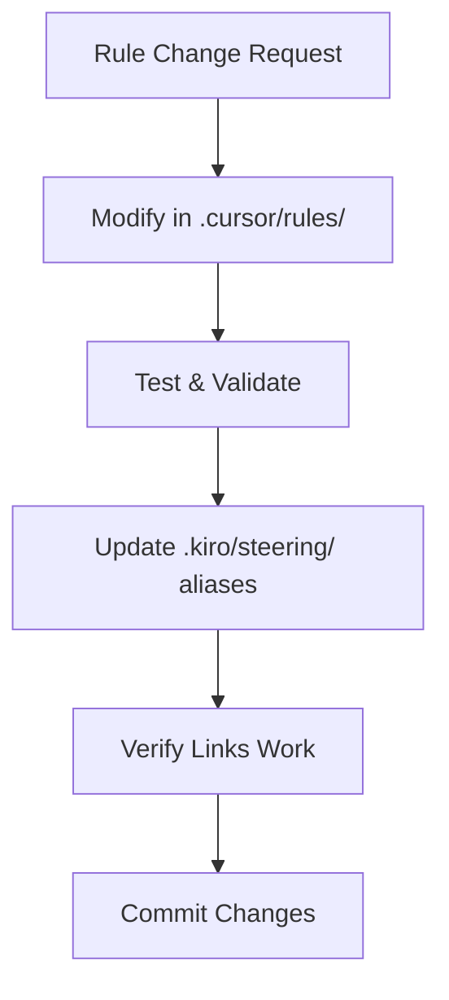

# Kiro AI Steering System - Alias & Synchronization Layer

> **🔗 CRITICAL: This directory serves as an ALIAS LAYER ONLY**  
> All actual rules are maintained in `.cursor/rules/` as the PRIMARY SOURCE

## 📋 Directory Purpose

This `.kiro/steering/` directory functions as:

- **Alias/Link layer** pointing to actual rules in `.cursor/rules/`
- **Synchronization hub** for Kiro AI specific configurations
- **Documentation layer** explaining rule relationships
- **NOT a source of independent rules**

## 🔄 Rules Hierarchy & Priority

```
1. .cursor/rules/     ← PRIMARY SOURCE (Highest Priority)
   ├── All actual rule definitions
   ├── Workflow implementations
   └── Enforcement logic

2. .kiro/steering/    ← Alias Layer (Lowest Priority)
   ├── Alias links to .cursor/rules/
   ├── Synchronization documentation
   └── Kiro-specific configurations
```

## 📁 File Structure & Purpose

### Core Files

- **`project-rules.md`** - Main alias file with links to all `.cursor/rules/`
- **`spec-workflow.md`** - Spec-driven development workflow with aliases
- **`mobile-development.md`** - Mobile workflow coordination with aliases
- **`README.md`** - This documentation file

### Alias Link Format

All rules use file references to ensure proper inclusion:

```markdown
#[[file:../../.cursor/rules/rule-file.mdc]]
```

## ⚠️ CRITICAL ENFORCEMENT RULES

### Mandatory Compliance

1. **BẮT BUỘC** - All rule modifications MUST be done in `.cursor/rules/` first
2. **NGHIÊM CẤM** - Creating independent rules in `.kiro/steering/`
3. **BẮT BUỘC** - Updating alias links when `.cursor/rules/` changes
4. **BẮT BUỘC** - Using file references for all includes

### Synchronization Protocol



## 🎯 Primary Rules Categories

### Core Development

- Base Rules: #[[file:../../.cursor/rules/base-rules.mdc]]
- Development Rules: #[[file:../../.cursor/rules/development-rules.mdc]]
- Development Control Rules: #[[file:../../.cursor/rules/development-control-rules.mdc]]
- File Protection Rules: #[[file:../../.cursor/rules/file-protection-rules.mdc]]

### Mobile Development

- Mobile Utility Workflow: #[[file:../../.cursor/rules/mobile-utility-workflow.mdc]]
- Android Workflow: #[[file:../../.cursor/rules/android-workflow.mdc]]
- iOS Workflow: #[[file:../../.cursor/rules/ios-workflow.mdc]]
- TDD Mobile Workflow: #[[file:../../.cursor/rules/tdd-mobile-workflow.mdc]]

### Project Management

- Planning Workflow: #[[file:../../.cursor/rules/planning-workflow.mdc]]
- Planning Enforcement: #[[file:../../.cursor/rules/planning-enforcement.mdc]]
- Enhanced Brainstorm Workflow: #[[file:../../.cursor/rules/brainstorm-detailed-workflow.mdc]]
- Enhanced Expert Brainstorm: #[[file:../../.cursor/rules/expert-brainstorm-workflow.mdc]]
- Enhanced Integration Protocol: #[[file:../../.cursor/rules/brainstorm-expert-integration.mdc]]

### Code Quality

- Android Code Deduplication: #[[file:../../.cursor/rules/android-code-deduplication.mdc]]
- Universal Code Deduplication: #[[file:../../.cursor/rules/universal-code-deduplication.mdc]]

## 🚨 Violation Consequences

### If Rules Are Created Independently in .kiro/steering/:

- **Immediate synchronization required**
- **Move to .cursor/rules/ and create alias**
- **Update all references**

### If .cursor/rules/ Links Are Broken:

- **Fix file references immediately**
- **Verify all aliases work**
- **Test rule accessibility**

## 🔧 Maintenance Commands

### Check All Links

```bash
# Verify all file references work
find .kiro/steering -name "*.md" -exec grep -l "#\[\[file:.*\.cursor/rules/" {} \;
```

### Sync Verification

```bash
# List all .cursor/rules files
ls -la .cursor/rules/

# Check if aliases exist in .kiro/steering
grep -r "cursor/rules" .kiro/steering/
```

## 📞 Support

For questions about:

- **Rule modifications** → Edit in `.cursor/rules/` first
- **Broken aliases** → Check file references
- **New rules** → Create in `.cursor/rules/`, then alias here
- **Synchronization issues** → Follow the protocol above

---

**Remember: This directory is an ALIAS LAYER. All actual rules live in `.cursor/rules/`**
