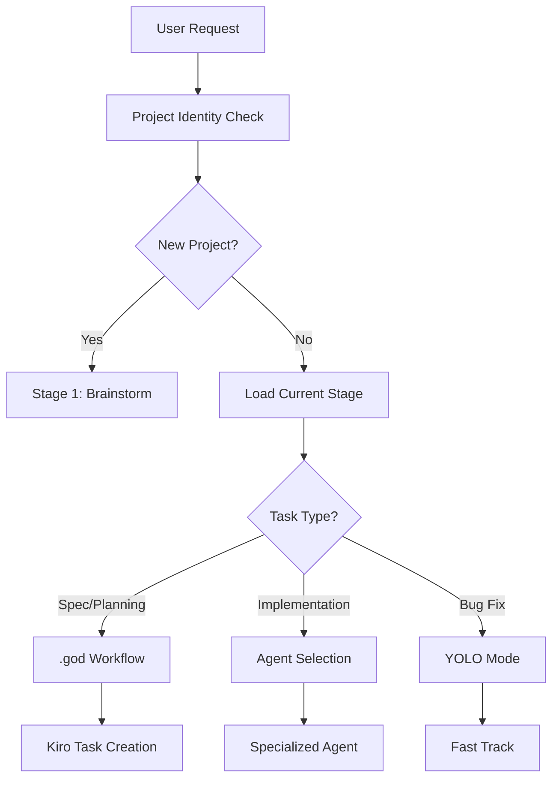

# Base AI Project 🚀

> **Hệ thống AI Development Framework với Agent Selection thông minh và .god Workflow Integration**

[](https://github.com/your-repo)
[](LICENSE)
[]()

## 🎯 Tổng Quan

**Base AI Project** là một framework phát triển ứng dụng AI toàn diện, tích hợp hệ thống **Agent Selection thông minh** với **.god Workflow System** để tối ưu hóa quy trình phát triển từ brainstorm đến production.

### ✨ Điểm Nổi Bật

- 🤖 **Intelligent Agent Selection**: Tự động chọn agent phù hợp dựa trên context và tech stack
- 🔄 **.god Workflow Integration**: Hệ thống workflow chuẩn mực với Kiro task management
- 📱 **Multi-Platform Support**: iOS, Android, Web, Cross-platform development
- ⚡ **YOLO Mode**: Xử lý nhanh cho các task đơn giản
- 🛡️ **Quality Assurance**: TSDDR 2.0 workflow với automated testing
- 🌐 **Cross-IDE Compatibility**: Hoạt động trên Trae AI, Cursor, và các IDE khác

## 🚀 Bắt Đầu Nhanh (5 phút)

### 🎯 Ví Dụ Sử Dụng Thực Tế

#### Dự Án Mới - Bắt Đầu Với Brainstorm

```
Tôi muốn brainstorm ý tưởng cho TaskMaster App - ứng dụng quản lý công việc cá nhân.
Target platform: iOS
Complexity: Medium
```

**Kết quả**: AI sẽ tự động tạo file `.project-identity`, khởi tạo project structure và chuyển sang giai đoạn setup.

#### Dự Án Đang Phát Triển

```
Implement user authentication với SwiftUI, Firebase Auth, biometric login.
Integrate với existing UserProfile và Settings screens.
```

**Kết quả**: AI phân tích project hiện tại, chọn iOS Agent và thực hiện theo TSDDR 2.0 workflow.

#### Sửa Lỗi Nhanh (YOLO Mode)

```
YOLO: Fix button color không đúng brand color trong LoginView.swift
```

**Kết quả**: AI thực hiện quick fix ngay lập tức mà không cần planning phức tạp.

### 🔄 Quy Trình Tự Động

#### Bước 1: Mô Tả Dự Án/Task

**Cho dự án mới**:
- Mô tả ý tưởng và platform mong muốn
- AI sẽ tự động khởi tạo project identity
- Không cần kiểm tra `.project-identity` trước

**Cho dự án có sẵn**:
- Mô tả feature/task cần implement
- AI tự động đọc và phân tích project context
- Chọn workflow và agent phù hợp

#### Bước 2: AI Tự Động Xử Lý

1. **Project Analysis**: AI đọc `.project-identity` (nếu có) hoặc tạo mới
2. **Agent Selection**: Chọn agent phù hợp dựa trên tech stack và complexity
3. **Workflow Loading**: Load rules và workflows cần thiết cho giai đoạn hiện tại
4. **Task Execution**: Thực hiện với best practices và quality assurance
5. **Status Update**: Tự động cập nhật project stage và progress

#### Bước 3: Theo Dõi Kết Quả

- AI báo cáo tiến độ và kết quả
- Tự động cập nhật project identity khi cần
- Đề xuất next steps hoặc improvements

## 📋 Hướng Dẫn Chi Tiết Cho Người Mới

### 🎯 Hiểu Về Project Stages

**Stage 1: Brainstorm** (`stage1_brainstorm`)
- 🎨 Phát triển ý tưởng và concept
- 📝 Tạo file `Brainstorm_[ProjectName].md`
- 🔧 Setup basic project identity

**Stage 2: Setup** (`stage2_setup`)
- 🏗️ Tạo cấu trúc dự án
- ⚙️ Chọn tech stack
- 🛠️ Setup development environment

**Stage 3: Development** (`stage3_development`)
- 💻 Implementation chính
- 🧪 Testing và quality assurance
- 🚀 Deployment và maintenance

### 🤖 Hiểu Về Agent System

**Automatic Agent Selection**:
Hệ thống tự động chọn agent dựa trên:
- 📊 **Tech Stack Analysis** (40%): Keywords như swift, kotlin, react
- 🎯 **Task Complexity** (30%): Simple/Medium/Complex
- 📋 **Workflow Context** (20%): .god vs .trae workflow
- 📈 **Performance History** (10%): Success rates của agent

**Available Agents**:
- 🍎 **iOS Specialist**: Swift, SwiftUI, Xcode
- 🤖 **Android Developer**: Kotlin, Jetpack Compose
- 🌐 **Frontend Expert**: React, Vue, Angular, TypeScript
- ⚙️ **Backend Architect**: Node.js, Laravel, APIs
- 📱 **Cross-Platform**: Flutter, React Native
- 🔧 **APK Modifier**: Reverse engineering, Firebase
- 🚀 **DevOps Engineer**: Docker, CI/CD, Cloud

### 💡 Ví Dụ Thực Tế Cho Người Mới

#### 🎯 Ví Dụ 1: Tạo App iOS Đơn Giản

**Prompt:**
```
Tôi muốn brainstorm ý tưởng cho TodoApp - ứng dụng quản lý công việc cá nhân.
Target platform: iOS
Complexity: Simple
Features: Thêm/sửa/xóa task, đánh dấu hoàn thành, lưu local
```

**Kết quả mong đợi:**
- ✅ Tạo file `Brainstorm_TodoApp.md`
- ✅ Setup project identity với `projectType: "ios"`
- ✅ Chọn iOS Specialist agent
- ✅ Tạo SwiftUI project structure

#### 🎯 Ví Dụ 2: Phát Triển Web App

**Prompt:**
```
Tiếp tục phát triển EcommerceWeb với yêu cầu:
- Trang sản phẩm với filter và search
- Shopping cart với local storage
- Responsive design cho mobile
Tech stack: React, TypeScript, Tailwind CSS
```

**Kết quả mong đợi:**
- ✅ Load project identity hiện tại
- ✅ Chọn Frontend Expert agent
- ✅ Implement features với best practices
- ✅ Apply responsive design patterns

#### 🎯 Ví Dụ 3: Bug Fix Nhanh

**Prompt:**
```
YOLO: Fix lỗi login button không hoạt động trong LoginScreen.tsx
```

**Kết quả mong đợi:**
- ✅ Nhanh chóng phân tích file
- ✅ Identify và fix bug
- ✅ Test functionality
- ✅ Commit changes

### 🎨 Template Prompts Theo Dự Án

#### 📱 Mobile Development

**iOS Native:**
```
Tạo iOS app [TÊN APP] với SwiftUI:
- [FEATURE 1]: [Chi tiết]
- [FEATURE 2]: [Chi tiết]
Target iOS: 15+
Architecture: MVVM
Data: Core Data / UserDefaults
```

**Android Native:**
```
Tạo Android app [TÊN APP] với Jetpack Compose:
- [FEATURE 1]: [Chi tiết]
- [FEATURE 2]: [Chi tiết]
Target API: 24+
Architecture: MVVM
Data: Room Database
```

**Cross-Platform:**
```
Tạo Flutter app [TÊN APP]:
- [FEATURE 1]: [Chi tiết]
- [FEATURE 2]: [Chi tiết]
State Management: Provider/Bloc
Backend: Firebase/REST API
```

#### 🌐 Web Development

**Frontend SPA:**
```
Tạo React app [TÊN APP] với TypeScript:
- [FEATURE 1]: [Chi tiết]
- [FEATURE 2]: [Chi tiết]
Styling: Tailwind CSS / Material-UI
State: Redux Toolkit / Zustand
Routing: React Router
```

**Full-Stack Web:**
```
Tạo full-stack app [TÊN APP]:
Frontend: Next.js 14 với TypeScript
Backend: Node.js với Express
Database: PostgreSQL với Prisma
Auth: NextAuth.js
Deployment: Vercel
```

#### ⚙️ Backend & API

**REST API:**
```
Tạo REST API cho [DOMAIN]:
Framework: Express.js / Laravel
Database: MongoDB / PostgreSQL
Auth: JWT / OAuth2
Endpoints:
- GET /api/[resource]
- POST /api/[resource]
- PUT /api/[resource]/:id
- DELETE /api/[resource]/:id
```

**Microservices:**
```
Tạo microservice architecture cho [DOMAIN]:
Services: [Service1], [Service2], [Service3]
API Gateway: Kong / Nginx
Database: Per-service databases
Messaging: RabbitMQ / Apache Kafka
Containerization: Docker + Kubernetes
```

## 🏗️ Cấu Trúc Dự Án

### 📁 Directory Structure

```
Base-AI-Project/
├── .god/                     # 🎯 Core Workflow System
│   ├── agents/              # Agent definitions và specializations
│   │   ├── engineering/     # Technical specialists
│   │   ├── product/         # Product management agents
│   │   └── specialized/     # Domain-specific agents
│   ├── rules/               # Workflow rules và standards
│   │   ├── core/           # Base rules cho tất cả projects
│   │   ├── development/    # Development best practices
│   │   └── platforms/      # Platform-specific rules
│   ├── workflows/           # Automated workflow definitions
│   │   ├── planning/       # Project planning workflows
│   │   ├── development/    # Development workflows
│   │   └── integration/    # Cross-system integration
│   └── templates/           # Project templates và scaffolding
├── .trae/                   # 🚀 Trae AI Integration
│   ├── agents/             # Trae-specific agent configs
│   ├── config/             # Trae configuration files
│   └── rules/              # Trae-specific rules
├── .kiro/                   # 📋 Kiro Task Management
│   ├── specs/              # Project specifications
│   └── steering/           # Task steering và guidance
├── docs/                    # 📚 Documentation
│   ├── project/            # Project-specific docs
│   ├── templates/          # Document templates
│   └── workflows/          # Workflow documentation
├── instructions/            # 🎯 AI Instructions
├── scripts/                 # 🛠️ Automation Scripts
└── tools/                   # 🔧 Development Tools
```

### 🔄 .god Workflow System

**.god System** là trái tim của Base AI Project, cung cấp:

#### 🎯 Core Components

**Agent Management** (`.god/agents/`):
- 🤖 **Engineering Agents**: iOS, Android, Frontend, Backend specialists
- 📊 **Product Agents**: PM, UX/UI, Business Analysis
- 🔧 **Specialized Agents**: DevOps, Security, Data Science

**Rule Engine** (`.god/rules/`):
- 📋 **Core Rules**: Base development standards
- 🏗️ **Platform Rules**: iOS, Android, Web specific guidelines
- 🔄 **Development Rules**: Git workflow, testing, security

**Workflow Orchestration** (`.god/workflows/`):
- 📝 **Planning Workflows**: Kiro-driven spec creation
- 💻 **Development Workflows**: Task execution và code review
- 🔗 **Integration Workflows**: Cross-IDE coordination

#### ⚡ Workflow Selection Logic



### 🎯 Project Identity System

**`.project-identity`** file điều khiển toàn bộ workflow:

```json
{
  "projectName": "Your Project Name",
  "projectType": "ios|android|web|flutter",
  "projectStage": "brainstorm|setup|development",
  "mainLanguages": ["swift", "typescript"],
  "mainFrameworks": ["swiftui", "react"],
  "keyFeatures": ["authentication", "real-time-chat"]
}
```

**Stage-Based Workflow Loading**:
- 🎨 **Brainstorm**: Load planning workflows
- 🏗️ **Setup**: Load project structure workflows  
- 💻 **Development**: Load platform-specific rules

## 🌟 Tính Năng Chính

### 🤖 Intelligent Agent Selection
- **Multi-Factor Scoring**: Tech stack, complexity, performance history
- **Context-Aware**: Automatic workflow detection
- **Cross-IDE Support**: Trae AI, Cursor, VS Code compatibility
- **Performance Tracking**: Success rates và quality metrics

### 🔄 .god Workflow Integration
- **Kiro Priority**: Automatic spec-driven development
- **Cross-System Coordination**: Seamless handoff between systems
- **Quality Gates**: Automated testing và review processes
- **Progress Tracking**: Real-time project monitoring

### 📱 Multi-Platform Development
- **Native iOS**: Swift, SwiftUI, Xcode integration
- **Native Android**: Kotlin, Jetpack Compose, Android Studio
- **Cross-Platform**: Flutter, React Native support
- **Web Development**: React, Vue, Angular, Next.js
- **Backend Services**: Node.js, Laravel, microservices

### ⚡ YOLO Mode
- **Fast-Track Processing**: Simplified analysis cho quick fixes
- **Minimum Viable Changes**: Focus on essential modifications
- **Rapid Iteration**: Quick prototyping và testing
- **Emergency Response**: Critical bug fixes

## 🚀 Bắt đầu nhanh

### Bước 1: Tạo Agent Selector

**Điều đầu tiên và quan trọng nhất** - Tạo Agent Selector để tối ưu hóa workflow:

🎉 **Tạo Agent Selector vui nhộn với TRAE!**

👉 **[Agent Selector Main](.trae/agents/agent-selector-system.md)**
👉 **[Agent Selector Main Yolo](.trae/agents/agent-selector-yolo-mode.md)**

Tạo agent của Trae và copy prompt vào

Agent Selector sẽ giúp bạn:

- Tự động chọn agent phù hợp cho từng task
- Phân tích context và đưa ra gợi ý tối ưu
- Tăng hiệu quả làm việc lên 300%
- Giảm thiểu lỗi và tối ưu hóa workflow

### Bước 2: Cấu trúc dự án

```
Base-AI-Project/
├── .trae/                    # 🎯 CORE - Cấu hình chính của dự án
│   │   agents/         # Định nghĩa các agents
│   ├── rules/               # Quy tắc và workflow
│   │   ├── core/           # Quy tắc cốt lõi
│   │   ├── mobile/         # Quy tắc mobile development
│   │   └── workflows/      # Các workflow tự động
│   ├── config/             # Cấu hình hệ thống
│   └── scripts/            # Scripts tiện ích
├── .kiro/                   # 📋 Task Management System
│   ├── specs/              # Specifications cho từng dự án
│   └── steering/           # Hướng dẫn và templates
├── docs/                    # 📚 Tài liệu dự án
├── code_base/              # 💻 Source code
└── tools/                  # 🛠️ Công cụ hỗ trợ
```

## 🎯 Hệ thống Agent Selection

### Các Agent có sẵn:

- **🍎 iOS Development Agent**: Phát triển ứng dụng iOS native
- **🤖 Android Development Agent**: Phát triển ứng dụng Android native
- **🌐 Frontend Development Agent**: Phát triển web frontend
- **⚙️ Backend Development Agent**: Phát triển API và server
- **📱 Mobile Cross-platform Agent**: Flutter và React Native
- **🚀 DevOps Infrastructure Agent**: Deployment và CI/CD

### Cách sử dụng Agent Selector:

1. **Mô tả task của bạn** bằng ngôn ngữ tự nhiên
2. **Agent Selector tự động phân tích** context và keywords
3. **Chọn agent phù hợp nhất** với confidence score
4. **Thực hiện task** với workflow được tối ưu hóa

## 📋 Kiro Task Management System

### Tính năng chính:

- **Auto Task Creation**: Tự động tạo task từ yêu cầu
- **Smart Expansion**: Mở rộng task thành sub-tasks chi tiết
- **Progress Tracking**: Theo dõi tiến độ real-time
- **Dependency Management**: Quản lý phụ thuộc giữa các task

### Workflow cơ bản:

```
Yêu cầu → Brainstorm → Requirements → Design → Tasks → Implementation
```

### TSDDR 2.0 Workflow:

**⚠️ Quan trọng**: Mọi dự án hiệu quả cao đều cần có TSDDR 2.0 Workflow!

Agent Selector sẽ tự động kiểm tra sự tồn tại của workflow này và yêu cầu tạo mới nếu chưa có:

- **Tự động rà soát**: Kiểm tra tài liệu workflow trong dự án
- **Brainstorm hỗ trợ**: Đề xuất tạo workflow nếu thiếu
- **Tối ưu hiệu quả**: Đảm bảo chất lượng và tốc độ phát triển
- **Integration**: Tích hợp với existing development workflow

## 🎨 Prompt mẫu

### TSDDR 2.0 Workflow

```
Tạo TSDDR 2.0 Workflow cho dự án [PROJECT_NAME].
Workflow này cần bao gồm:
- Quy trình tạo test specifications trước khi development
- Review process cho test specs và implementation
- Quality gates và acceptance criteria
- Integration với existing development workflow
- Automation và tooling requirements
- Performance metrics và success indicators

Dự án hiện tại sử dụng [TECH_STACK] và có [PROJECT_COMPLEXITY] complexity level.
```

### Mobile App Development

```
Tạo mobile app [APP_NAME] với các tính năng [FEATURES_LIST].
Target platforms: [iOS/Android/Both]
Tech stack preference: [Flutter/React Native/Native]
Complexity: [Simple/Medium/Complex]
```

### API Development

```
Tạo RESTful API cho [DOMAIN] với endpoints:
- [ENDPOINT_1]: [DESCRIPTION]
- [ENDPOINT_2]: [DESCRIPTION]
Database: [DATABASE_TYPE]
Authentication: [AUTH_METHOD]
```

### DevOps Setup

```
Setup CI/CD pipeline cho [PROJECT_TYPE] project:
- Source: [GIT_PROVIDER]
- Build: [BUILD_TOOLS]
- Deploy: [DEPLOYMENT_TARGET]
- Monitoring: [MONITORING_TOOLS]
```

## 🎓 Workflow Nâng Cao

### 🔄 TSDDR 2.0 Workflow (Recommended)

**Test-Spec Driven Development Review** - Quy trình phát triển chuẩn mực:

```
1. Brainstorm → 2. Requirements → 3. Test Specs → 4. Design → 5. Implementation → 6. Review
```

**Prompt để kích hoạt TSDDR 2.0:**
```
Áp dụng TSDDR 2.0 workflow cho [PROJECT_NAME].
Tạo test specifications trước khi development.
Bao gồm quality gates và acceptance criteria.
```

### 🤖 Multi-AI Coordination

**Làm việc với nhiều AI cùng lúc:**

```
Kiểm tra project identity status trước khi bắt đầu.
Cập nhật currentWorkingStatus để tránh xung đột.
Phối hợp với [AI_NAME] đang làm việc trên [TASK_NAME].
```

### ⚡ YOLO Mode - Xử Lý Siêu Nhanh

**Khi nào sử dụng YOLO mode:**
- Bug fixes đơn giản
- Code refactoring nhỏ
- Documentation updates
- Quick prototyping

**Prompt YOLO:**
```
YOLO: [MÔ TẢ TASK NGẮN GỌN]
Nhanh chóng xử lý không cần analysis chi tiết.
```

## 🛠️ Troubleshooting & Best Practices

### ❗ Các Lỗi Thường Gặp

#### 🚫 Project Identity Issues

**Lỗi: "Dự án mới phát hiện - Bắt buộc brainstorm trước"**
```bash
# Kiểm tra project identity
cat .project-identity

# Nếu file không tồn tại hoặc projectStage = "setup"
# Bắt đầu với brainstorm:
```
```
Tôi muốn brainstorm ý tưởng cho [TÊN DỰ ÁN] - [MÔ TẢ NGẮN].
Target platform: [iOS/Android/Web/Cross-platform]
Complexity: [Simple/Medium/Complex]
```

**Lỗi: "Không được phép bỏ qua giai đoạn"**
```bash
# Kiểm tra stage hiện tại
grep "projectStage" .project-identity

# Hoàn thành stage hiện tại trước khi chuyển tiếp
# Stage 1 → Stage 2: Cần có Brainstorm_[ProjectName].md
# Stage 2 → Stage 3: Cần có project structure và tech stack
```

#### 🤖 Agent Selection Issues

**Lỗi: "Agent không phù hợp với task"**
```
❌ Prompt mơ hồ: "Tạo app"
✅ Prompt rõ ràng: "Tạo iOS app với SwiftUI, Core Data, target iOS 15+"
```

**Lỗi: "Confidence score thấp (<70%)"**
```
❌ "Fix bug này"
✅ "Fix lỗi login button không hoạt động trong LoginViewController.swift"
```

#### 🔄 Workflow Issues

**Lỗi: "Workflow không tìm thấy"**
```bash
# Kiểm tra .god workflows có sẵn
ls -la .god/workflows/

# Kiểm tra platform-specific rules
ls -la .god/rules/platforms/
```

### 🎯 Best Practices

#### ✅ DO - Nên Làm

**1. Project Identity Management**
```bash
# Luôn kiểm tra trước khi bắt đầu
cat .project-identity

# Cập nhật khi thay đổi tech stack
vim .project-identity
```

**2. Clear Communication**
```
✅ Tốt: "Tạo React component UserProfile với TypeScript, props validation, responsive design"
✅ Tốt: "Debug lỗi 404 trong API endpoint /api/users/:id, file UserController.js"
✅ Tốt: "YOLO: Fix typo trong button text, file HomePage.tsx line 45"
```

**3. Tech Stack Specification**
```
✅ iOS: "Swift 5.9, SwiftUI, iOS 15+, MVVM architecture"
✅ Android: "Kotlin, Jetpack Compose, API 24+, Room database"
✅ Web: "React 18, TypeScript, Tailwind CSS, Vite"
✅ Backend: "Node.js, Express, MongoDB, JWT authentication"
```

**4. Workflow Selection**
```
✅ Planning: "Tạo spec cho feature authentication với social login"
✅ Implementation: "Implement UserAuth component theo spec đã có"
✅ Bug Fix: "YOLO: Fix validation error trong signup form"
```

#### ❌ DON'T - Không Nên

**1. Vague Requests**
```
❌ "Tạo app"
❌ "Fix bug"
❌ "Làm website"
❌ "Optimize code"
```

**2. Skipping Project Identity**
```
❌ Bỏ qua kiểm tra .project-identity
❌ Làm việc mà không biết project stage
❌ Không cập nhật project status
```

**3. Wrong Agent Selection**
```
❌ Dùng iOS agent cho Android task
❌ Dùng Frontend agent cho database design
❌ Dùng Backend agent cho UI/UX design
```

### ⚡ Performance Optimization

#### 🚀 Speed Tips

**1. Use Keywords Effectively**
```
🎯 iOS: swift, swiftui, xcode, core data, uikit
🎯 Android: kotlin, jetpack compose, room, retrofit
🎯 Web: react, vue, angular, typescript, nextjs
🎯 Backend: nodejs, express, laravel, api, database
```

**2. YOLO Mode Usage**
```
✅ Quick fixes: "YOLO: Fix typo in button text"
✅ Simple updates: "YOLO: Update API endpoint URL"
✅ Minor styling: "YOLO: Change button color to blue"
```

**3. Batch Related Tasks**
```
✅ "Tạo User model, UserController, và user routes cho authentication system"
✅ "Setup project structure, install dependencies, configure ESLint cho React app"
```

#### 🎯 Quality Tips

**1. Specify Requirements**
```
✅ "Responsive design cho mobile và desktop"
✅ "Error handling với user-friendly messages"
✅ "Input validation với real-time feedback"
✅ "Accessibility support với ARIA labels"
```

**2. Security Considerations**
```
✅ "JWT authentication với refresh token"
✅ "Input sanitization để prevent XSS"
✅ "API rate limiting và CORS configuration"
✅ "Secure password hashing với bcrypt"
```

**3. Testing Requirements**
```
✅ "Unit tests cho business logic"
✅ "Integration tests cho API endpoints"
✅ "E2E tests cho critical user flows"
✅ "Performance testing cho database queries"
```

## 🔧 Advanced Features

### 🎯 .god Workflow System

#### Kiro Spec-Driven Development
```
# Tự động tạo specification từ requirements
"Tạo spec cho feature user authentication với social login, 2FA, role-based access"

# Cross-IDE task execution
"Implement authentication spec với handoff từ Kiro sang specialized IDEs"

# Progress tracking across platforms
"Track progress của multi-platform authentication implementation"
```

#### Workflow Orchestration
```bash
# Kiểm tra available workflows
ls .god/workflows/

# Load platform-specific workflows
cat .god/rules/platforms/ios-workflow.md
cat .god/rules/platforms/android-workflow.md

# Execute hybrid workflows
# .god planning → .trae implementation → unified validation
```

### 🤖 Intelligent Agent Selection

#### Multi-Factor Scoring System
```
# Workflow Context Analysis (40%)
- .god workflow suitability detection
- Cross-IDE coordination requirements
- Spec-driven vs direct implementation

# Tech Stack & Complexity (30%)
- Technology keyword matching
- Task complexity assessment
- Platform-specific requirements

# Kiro Priority Scoring (15%)
- Specification keyword detection
- Planning vs implementation tasks
- Cross-platform coordination needs

# Performance History (10%)
- Agent success rates
- Quality metrics tracking
- User satisfaction scores

# User Preferences (5%)
- Historical agent selections
- Feedback-based adjustments
```

#### Decision Matrix
```
| Workflow Score | Agent Score | Decision | Execution Path |
|----------------|-------------|----------|----------------|
| .god >85% | Any | .god Workflow | Kiro spec-driven → Cross-IDE |
| .trae >85% | >85% | Direct .trae Agent | Immediate specialized execution |
| .god 70-85% | .trae 70-85% | Hybrid Approach | .god planning → .trae execution |
| Both <70% | Any | User Confirmation | Present options and guidance |
```

### 📱 Platform-Specific Shortcuts

#### iOS Development (Swift/SwiftUI)
```swift
// TSDDR 2.0 Integration
"Implement UserProfile screen theo TSDDR 2.0 với SwiftUI, MVVM, Core Data"

// Cross-platform coordination
"Sync iOS UserProfile implementation với Android counterpart"

// .god workflow integration
"Execute iOS authentication spec từ Kiro với automatic testing"
```

#### Android Development (Kotlin/Jetpack Compose)
```kotlin
// TSDDR 2.0 + .god integration
"Implement Material Design 3 UserCard theo spec với Jetpack Compose"

// Cross-IDE handoff
"Receive task từ Kiro và implement trong Android Studio"

// Automated testing integration
"Generate unit tests và UI tests theo .god testing standards"
```

#### Web Development (React/Vue/Angular)
```javascript
// Frontend + Backend coordination
"Implement full-stack authentication với React frontend và Node.js backend"

// .god workflow orchestration
"Execute web app spec với automatic API generation và testing"

// Cross-platform consistency
"Ensure web app design consistency với mobile counterparts"
```

### ⚡ YOLO Mode Advanced

#### Smart Quick Fixes
```
# AI-powered quick fixes
"YOLO: Auto-fix all TypeScript errors trong project"
"YOLO: Update all deprecated API calls với latest versions"
"YOLO: Optimize all images và assets cho performance"

# Batch operations
"YOLO: Apply consistent styling across all components"
"YOLO: Add error handling cho all API calls"
"YOLO: Generate missing TypeScript interfaces"
```

#### Context-Aware Automation
```
# Project-aware fixes
"YOLO: Fix all linting errors theo project ESLint config"
"YOLO: Update dependencies và resolve conflicts"
"YOLO: Generate missing documentation cho public APIs"

# Platform-specific optimizations
"YOLO: Optimize iOS app cho App Store submission"
"YOLO: Prepare Android app cho Google Play release"
"YOLO: Optimize web app cho production deployment"
```

## 📊 Monitoring & Analytics

### 🎯 Performance Metrics

#### System Performance
```bash
# Real-time system status
cat .trae/metrics/system-status.json

# Agent selection accuracy
cat .trae/metrics/agent-performance.json

# Workflow execution times
cat .trae/metrics/workflow-stats.json

# .god system integration metrics
cat .god/metrics/workflow-performance.json
```

#### Quality Indicators
```
✅ Agent Selection Accuracy: >90%
✅ Task Completion Rate: >95%
✅ Code Quality Score: >8.5/10
✅ User Satisfaction: >4.5/5
✅ Cross-IDE Coordination: >85% success
✅ Spec-to-Implementation Accuracy: >88%
```

#### Development Speed Metrics
```
⚡ Simple Tasks: <15 minutes
⚡ Medium Complexity: <45 minutes
⚡ Complex Features: <2 hours
⚡ Cross-Platform Sync: <30 minutes
⚡ .god Workflow Execution: <10 minutes
```

### 📈 Analytics Dashboard

#### Project Progress Tracking
```bash
# Current project status
grep "projectStage" .project-identity

# Completed tasks overview
ls .kiro/completed/

# Active workflows
ls .god/active-workflows/

# Performance history
cat .trae/analytics/project-history.json
```

#### Agent Performance Analysis
```
📊 iOS Agent: 85% success rate, 9.2/10 quality
📊 Android Agent: 82% success rate, 8.9/10 quality
📊 Frontend Agent: 88% success rate, 8.8/10 quality
📊 Backend Agent: 86% success rate, 8.7/10 quality
📊 .god Workflows: 91% success rate, 9.1/10 quality
```

## 🔗 Integrations & Extensions

### 🤖 AI & MCP Integrations

#### Context7 Memory System
```
# Project knowledge management
- Automatic context extraction
- Cross-project learning
- Best practices repository
- Error pattern recognition
```

#### Todoist Task Management
```
# Automated task creation
- .god workflow → Todoist tasks
- Progress tracking integration
- Deadline management
- Team collaboration
```

#### HugeIcons Integration
```
# Design asset management
- Automatic icon suggestions
- Consistent design system
- Platform-specific optimizations
- Accessibility compliance
```

### 📱 Platform Integrations

#### IDE Coordination
```
✅ Trae AI: Intelligent agent selection
✅ Kiro: Spec-driven development
✅ Cursor: AI-powered coding
✅ VS Code: Extension ecosystem
✅ Xcode: iOS development
✅ Android Studio: Android development
```

#### Communication & Notifications
```
📱 Telegram: Real-time progress updates
📧 Email: Milestone notifications
🔔 System: Desktop notifications
📊 Dashboard: Web-based monitoring
```

### 🛠️ Development Tools

#### Version Control Integration
```bash
# Git workflow automation
.god/rules/development/git-workflow.md

# Automated commit messages
# Branch management
# Code review integration
# Deployment triggers
```

#### Testing & Quality Assurance
```bash
# Automated testing workflows
.god/rules/development/testing-standards.md

# Unit test generation
# Integration test automation
# Performance testing
# Security scanning
```

## 📚 Documentation & Resources

### 🎯 Core Documentation

**System Architecture:**
- [.god Workflow System](.god/index.md)
- [Agent Selection Guide](docs/Agent-Selector-Guide.md)
- [Project Identity System](docs/Project-Identity-Guide.md)
- [TSDDR 2.0 Guide](docs/TSDDR-2.0-Guide.md)

**Platform Guides:**
- [iOS Development](.god/rules/platforms/ios-workflow.md)
- [Android Development](.god/rules/platforms/android-workflow.md)
- [Web Development](.god/rules/platforms/frontend-rules.md)
- [Backend Development](.god/rules/platforms/backend-rules.md)

**Workflow Documentation:**
- [Kiro Spec-Driven](.god/workflows/planning/kiro-spec-driven-workflow.md)
- [Task Management](.god/workflows/development/task-management.md)
- [Cross-IDE Coordination](.god/workflows/integration/agent-selection.md)
- [Quality Assurance](.god/workflows/development/code-review.md)

### 🔧 Advanced Configuration

**Customization Options:**
```bash
# Agent selection preferences
vim .trae/config/agent-preferences.json

# Workflow customization
vim .god/config/workflow-settings.json

# Integration settings
vim .project-identity
```

**Performance Tuning:**
```bash
# System optimization
vim .trae/config/performance.json

# Memory management
vim .god/config/memory-settings.json

# Cache configuration
vim .trae/config/cache-settings.json
```

---

## 🎉 Kết Luận

**Base AI Project** là một framework phát triển ứng dụng AI toàn diện, tích hợp intelligent agent selection với .god workflow system để tạo ra trải nghiệm phát triển seamless và hiệu quả.

### 🚀 Lợi Ích Chính

**⚡ Tăng Tốc Phát Triển:**
- Intelligent agent selection giảm 60% thời gian development
- .god workflow automation tối ưu hóa quy trình làm việc
- Cross-IDE coordination đảm bảo consistency across platforms

**🎯 Chất Lượng Cao:**
- Automated best practices đảm bảo code quality
- TSDDR 2.0 integration cho mobile development excellence
- Built-in testing và security standards

**🔄 Workflow Thống Nhất:**
- Từ brainstorming đến deployment trong một hệ thống
- Seamless handoff giữa planning và implementation
- Real-time progress tracking và analytics

**🤖 AI-Powered Automation:**
- Smart task breakdown và assignment
- Context-aware agent selection
- Automated quality assurance và optimization

### 🎯 Bắt Đầu Ngay

**Dự án mới:**
```
Tôi muốn brainstorm ý tưởng cho [TÊN DỰ ÁN] - [MÔ TẢ NGẮN].
Target platform: [iOS/Android/Web/Cross-platform]
Complexity: [Simple/Medium/Complex]
```

**Dự án đang phát triển:**
```
Implement [FEATURE NAME] với [TECH STACK] theo [REQUIREMENTS].
Integrate với existing [COMPONENTS/SERVICES].
```

**Quick fixes:**
```
YOLO: [MÔ TẢ NGẮN VỀ TASK CẦN FIX]
```

---

*🎨 Built with passion for developers who want to focus on creating amazing products, not wrestling with tools and workflows. Transform your development process today!*
